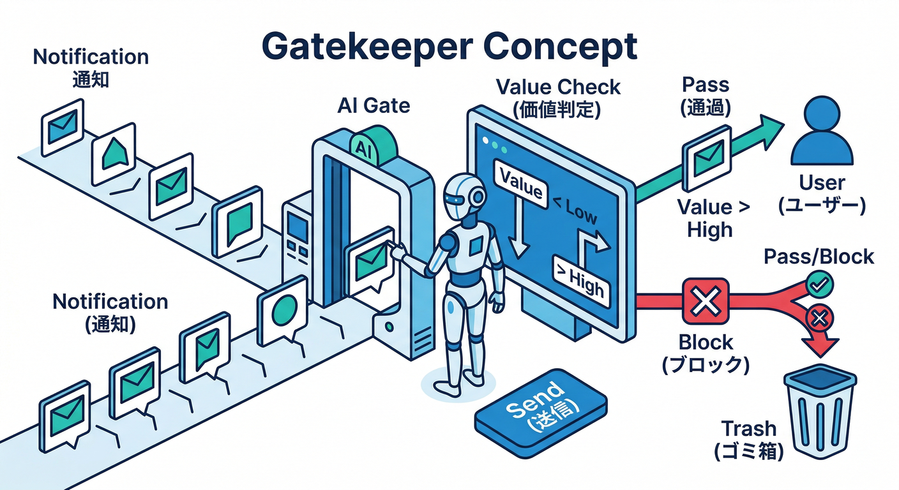
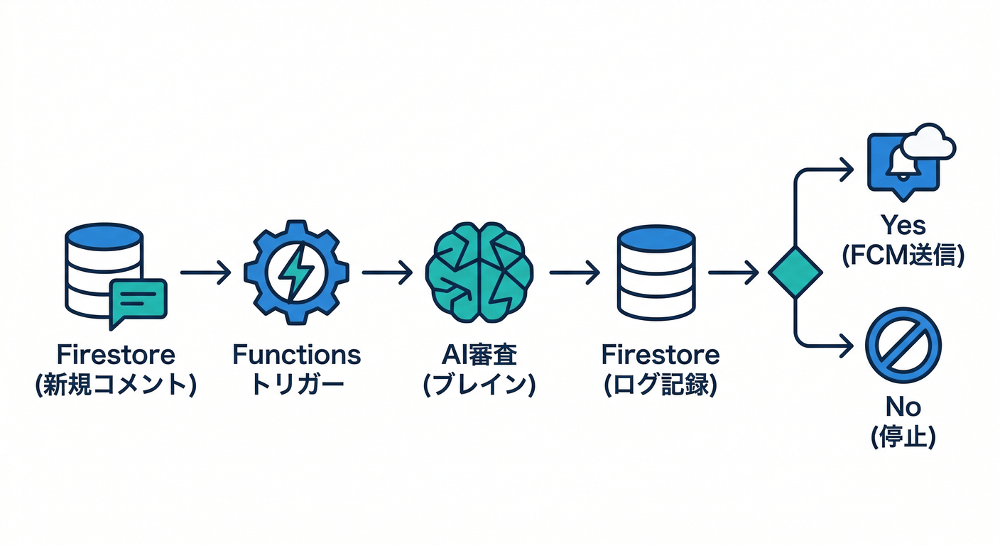
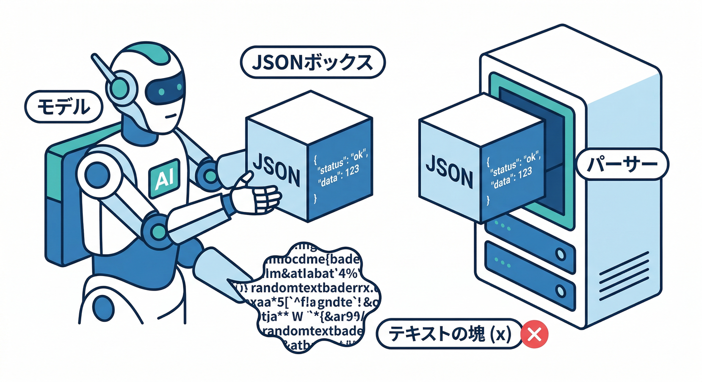
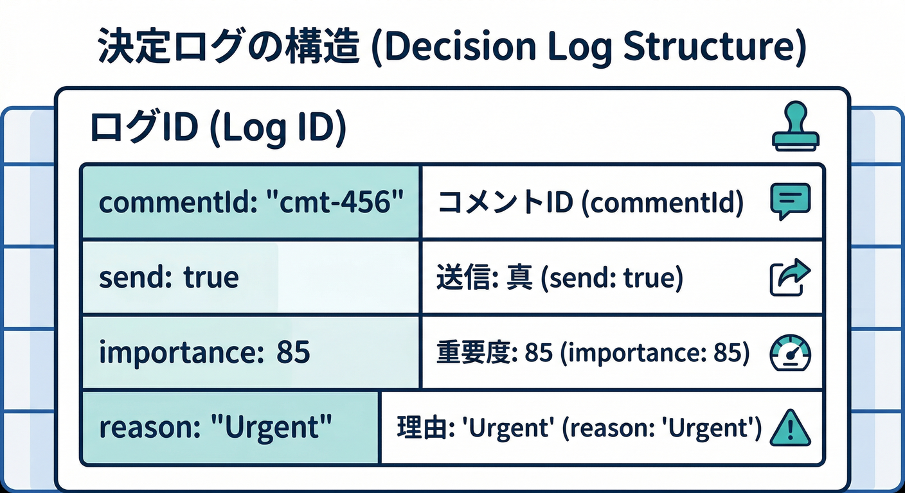
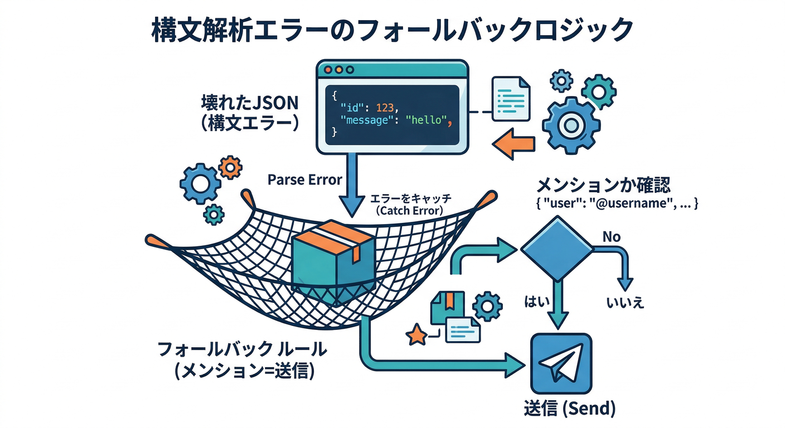
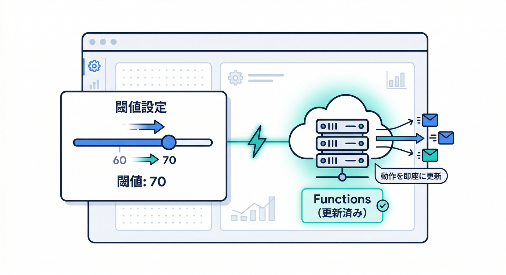

# 第19章：AIで“送る/送らない”判定を賢くする（簡易ワークフロー）🧠🔀

この章はひとことで言うと――
**「通知は“全部送らない”が正解」**を、AIで現実的に実装する回です📣✨
“重要なときだけ”通知できると、アプリが一気に“使われる側”に近づきます🙂📱

---

## 1) まず考え方：通知は「価値がある時だけ」でいい😇🧯



通知って、送る側が気持ちよくても、受ける側が困ると終わりです🥲
だから **送信前にゲート（関所）**を作ります🏯🔐

**ゲートの役割**👇

* ✅ 重要なら送る（見逃したくない）
* ✅ どうでもいいなら送らない（うざくならない）
* ✅ “後でまとめて”が良いなら遅らせる（連投防止）

※ FCM は notification/data の設計次第で体験が変わるので、**payload を小さく・短く**が基本です🧩（サイズ制限も意識）([Firebase][1])

---

## 2) 章のゴール🎯✨

コメントが作成されたときに…

1. **AIで重要度を判定**（0〜100点）🤖🧠
2. **閾値（しきいち）以上だけ通知を送信**🔔
3. **判定理由をログに残す**（後から改善できる）📝🔍

「AIが言ったから」ではなく、**人間があとで検証できる形**にするのがコツです✅

---

## 3) 最小構成の“簡易ワークフロー”図🗺️🧩



* Firestore に `comments/{commentId}` が作られる📝
* Cloud Functions（Firebase）でトリガー⚡
* AIで「送る？送らない？」判定🧠
* 判定ログを Firestore に保存🗃️
* `send=true` のときだけ FCM 送信📣

送信は **信頼できる場所（サーバー側）**からが大原則です🏗️🔐（Admin SDK / HTTP v1 が中心）([Firebase][2])

---

## 4) “AI判定”の設計コツ（初心者向けに超重要）🧠✨

## A. いきなりAIに丸投げしない🙅‍♂️➡️🙆‍♀️


AIの前に、**ルールで落とせるものは落とす**のが安定です🧯

例👇

* 自分が書いたコメントなら通知しない
* 受信者が通知OFFなら送らない
* 直近N分で同じ投稿に通知済みなら抑制（第16章の考え方）

AIは「最後の判断」に使うと強いです💪🤖

## B. AIに渡す情報は“最小限”にする🧼🔒

個人情報っぽいものはマスクしてからAIへ（第18章の流れ）🧽
通知文も同じで、**短く・要点だけ**が正義です📝✨

## C. 出力は「JSONっぽく」ではなく、**JSONで**📦✅



モデルに **厳密JSON**を出させて、サーバーでパースして使います🧩
（パースできない時の保険も必ず用意）🧯

---

## 5) 実装（手を動かす🖱️💻）

ここでは Cloud Functions（Node.js）で「判定→送信」をやります⚡
Cloud Functions の Node.js は **22/20 が選べて、18 は deprecated** になっています（最新の前提として押さえる）([Firebase][3])

> 以降のコードは「わかりやすさ最優先の最小例」です🙌
> （本番ではリトライ/レート制限/監視を足すとより強いです💪）

---

## 5-1) Firestoreに“判定ログ”を置く📚🗃️



例：`notificationDecisions/{commentId}`

* `send: boolean`
* `importance: number`（0-100）
* `reason: string`（短く）
* `model: string`
* `promptVersion: string`
* `createdAt`

ログがあると「AIのせいで通知が来ない」みたいな事故が減ります🧯✨

---

## 5-2) AI判定関数（TypeScript）🤖🧠

ここは Genkit を使うのが作りやすいです🧩
Genkit は Firebase が案内している OSS フレームワークで、**Cloud Functions と一緒に使う導線**も整理されています([Firebase][4])
（※ もちろん他の実装でもOK。でも教材では “道が整ってる”方がラク🙂）

## 例：AIに「判定JSON」を返させる

```ts
// functions/src/ai/notifyGate.ts
type GateResult = {
  send: boolean;
  importance: number; // 0..100
  reason: string;     // なるべく短く
};

const PROMPT_VERSION = "gate-v1";

function safeParseJson(text: string): any | null {
  try {
    return JSON.parse(text);
  } catch {
    return null;
  }
}

export async function judgeNotificationGate(params: {
  commentText: string;
  isMention: boolean;
  isReplyToMyPost: boolean;
}): Promise<{ result: GateResult; promptVersion: string }> {
  // ここは Genkit / Gemini 呼び出し部分（概念が伝わる形で）
  // 重要：モデルに「JSONのみ返す」ルールを強めに言う
  const prompt = `
あなたは通知のゲートです。
以下のコメントについて「通知を送るべきか」を判定してください。

判断基準：
- 受け手にとって価値が高いなら send=true
- どうでもいい/雑談/スタンプだけ/連投気味なら send=false
- 重要度 importance は 0〜100（高いほど送る価値がある）
- reason は短く（日本語で20〜40文字くらい）

入力：
commentText: ${JSON.stringify(params.commentText)}
isMention: ${params.isMention}
isReplyToMyPost: ${params.isReplyToMyPost}

出力は「JSONだけ」を返してください。例：
{"send": true, "importance": 85, "reason": "質問への返信で緊急性が高い"}
`;

  // ★ここはあなたのAI呼び出しに置き換えてOK（Genkitなど）
  const rawText = await callYourModelAndGetText(prompt);

  const obj = safeParseJson(rawText) ?? {};
  const send = Boolean(obj.send);
  const importance = Number.isFinite(obj.importance) ? Number(obj.importance) : 0;
  const reason = typeof obj.reason === "string" ? obj.reason.slice(0, 80) : "parse failed";

  // パース失敗時の保険：安全側（例：メンション/返信なら送る）
  // 
  const fallbackSend = params.isMention || params.isReplyToMyPost;
  const final: GateResult = {
    send: obj.send === undefined ? fallbackSend : send,
    importance: Math.max(0, Math.min(100, importance)),
    reason,
  };

  return { result: final, promptVersion: PROMPT_VERSION };
}

// ダミー：ここを Genkit / Gemini SDK に差し替える
async function callYourModelAndGetText(prompt: string): Promise<string> {
  // 例：Genkit を使うなら googleAI.model('gemini-2.5-flash') 等の形で呼べます
  // （モデル名や呼び方は公式の最新例に合わせてね）
  return '{"send": true, "importance": 70, "reason": "返信で会話が進む価値がある"}';
}
```

ポイントは3つだけ覚えればOKです🙂✨

* ✅ **JSONのみ返せ**を強めに言う
* ✅ **パース失敗の保険**を必ず作る
* ✅ **promptVersion** を持つ（改善サイクルで超効く）

Genkit 側のモデル指定（例：Gemini 2.5 Flash など）は公式例に沿って更新されるので、教材もそれに合わせるのが安心です([Firebase][5])

---

## 5-3) トリガー側：判定→ログ→送信📣🧾🔔

```ts
// functions/src/index.ts
import * as admin from "firebase-admin";
admin.initializeApp();

export const onCommentCreated = async (snap: any, context: any) => {
  const comment = snap.data();
  const commentId = context.params.commentId as string;

  const targetUid = comment.targetUid;
  const authorUid = comment.authorUid;
  if (!targetUid || !authorUid) return;

  // ルールで落とせるものは先に落とす🧯
  if (targetUid === authorUid) return;

  const commentText = String(comment.text ?? "").slice(0, 500);

  // 例：メンション/返信フラグ（あなたの設計に合わせてOK）
  const isMention = Boolean(comment.mentions?.includes(targetUid));
  const isReplyToMyPost = Boolean(comment.replyToOwnerUid === targetUid);

  // AIで判定🧠
  const { result, promptVersion } = await judgeNotificationGate({
    commentText,
    isMention,
    isReplyToMyPost,
  });

  // 判定ログを保存📝（後で改善できる！）
  await admin.firestore()
    .collection("notificationDecisions")
    .doc(commentId)
    .set({
      send: result.send,
      importance: result.importance,
      reason: result.reason,
      promptVersion,
      model: "gemini", // 実際のモデル名を入れる
      createdAt: admin.firestore.FieldValue.serverTimestamp(),
    });

  // 閾値（しきいち）で最終決定🎚️
  const THRESHOLD = 60; // 本番は Remote Config にすると運用ラク✨
  if (!result.send || result.importance < THRESHOLD) return;

  // ここで「第18章のAI整形済み通知文」を使って送ると最強🤖📝🔔
  const title = "新しいコメント💬";
  const body = commentText.slice(0, 80);

  // payloadは短く！（FCM制限や表示体験のため）🧩
  await admin.messaging().send({
    token: "TARGET_DEVICE_TOKEN_HERE", // 実際はFirestoreのトークン一覧から
    notification: { title, body },
    data: { commentId, deepLink: `/posts/${comment.postId}?c=${commentId}` },
  });
};
```

> ※ FCM の payload は設計次第で制限に引っかかるので、**「短く・必要最小限」**を徹底すると事故りにくいです🧯([Firebase][1])

---

## 6) 改善が爆速になる“小技”3つ🚀🧠✨

## 小技①：閾値を Remote Config にする🎚️📦



「60→70」にしたいだけで再デプロイはしんどいので、閾値は Remote Config に逃がすと気持ちいいです🙂✨
さらに **server prompt templates と Remote Config を組み合わせる運用**も公式に推奨されています([Firebase][6])

## 小技②：server prompt templates で “プロンプトの差し替え”を楽にする🧩📝

テンプレIDを使う方式だと「アプリはIDを呼ぶだけ」になって、プロンプト更新が運用しやすいです✨([Firebase][6])
ただし現時点では **“出力をenumに制限”など未対応の要素**もあるので、できる範囲から使うのが安全です🧯([Firebase][7])

## 小技③：Gemini CLIでテストケースを量産する💻✨

「このコメントは送る？送らない？」の例を20個くらい作って、期待値と一緒にテスト材料にすると強いです🎯
Gemini CLI は“ターミナルから調査・修正・テスト生成”の流れが整理されています([Google Cloud Documentation][8])

---

## 7) ミニ課題🎯📝

## ✅課題：判定理由を「改善できる形」にする

`notificationDecisions` に、次の2つを追加してみてください👇

* `inputsSummary`（例：commentTextの先頭50文字だけ）
* `ruleMatched`（例：mention=true / reply=true みたいな）

これで後から「AIが間違った理由」を掘れます🔍✨

---

## 8) チェック✅✅✅

* ✅ AIの判定を **ログ**として残せてる？📝
* ✅ AIが壊れても **保険（fallback）**がある？🧯
* ✅ “全部通知”じゃなく、**価値のある時だけ**になってる？😇
* ✅ payload が肥大化してない？（短い通知文・必要最小限）📦🔔([Firebase][1])

---

## おまけ：.NET / Python で同じことやるなら？🟦🐍✨

この章の“判定→ログ→送信”は、将来 Cloud Run Functions 側に寄せて
**.NET 8 / Python 3.13** みたいな選択肢で組むこともできます（選べるランタイムが広い）([Google Cloud Documentation][9])
第20章の「発展コース」につながるポイントです🚀

---

必要なら、この第19章の続きとして👇も一気に書けます📚✨

* 「Remote Config で THRESHOLD を運用する」実装例🎚️
* 「server prompt templates で gate-v1 / gate-v2 を切り替える」運用例🧩
* 「判定ログからプロンプト改善する“ふりかえり手順”」テンプレ🔁📝

[1]: https://firebase.google.com/docs/cloud-messaging/customize-messages/set-message-type "Firebase Cloud Messaging message types"
[2]: https://firebase.google.com/docs/cloud-messaging/error-codes?utm_source=chatgpt.com "FCM Error Codes | Firebase Cloud Messaging - Google"
[3]: https://firebase.google.com/docs/functions/manage-functions "Manage functions  |  Cloud Functions for Firebase"
[4]: https://firebase.google.com/docs/functions/oncallgenkit "Invoke Genkit flows from your App  |  Cloud Functions for Firebase"
[5]: https://firebase.google.com/docs/ai-logic/app-check "Implement Firebase App Check to protect APIs from unauthorized clients  |  Firebase AI Logic"
[6]: https://firebase.google.com/docs/ai-logic/server-prompt-templates/get-started "Get started with server prompt templates  |  Firebase AI Logic"
[7]: https://firebase.google.com/docs/ai-logic/server-prompt-templates/best-practices-and-considerations "Best practices and considerations for templates  |  Firebase AI Logic"
[8]: https://docs.cloud.google.com/gemini/docs/codeassist/gemini-cli "Gemini CLI  |  Gemini for Google Cloud  |  Google Cloud Documentation"
[9]: https://docs.cloud.google.com/run/docs/runtimes/function-runtimes?hl=ja&utm_source=chatgpt.com "Cloud Run functions ランタイム"
