# 第20章：発展コース .NET/Python送信・運用・次の一手 🚀🟦🐍

ここまでで「Reactで受ける → Firestoreでイベント発火 → Functionsで送る」まで、通知アプリの“背骨”ができました🎉
第20章は **「言語が変わっても通知品質を落とさない」** がテーマです💪✨

---

## この章のゴール 🎯✨

* Node（Functions）中心の構成は保ちつつ、**送信部分だけ** .NET/Pythonに“差し替え可能”にする 🧩🔄
* **抑制（送りすぎ防止）・掃除（無効トークン削除）・ログ（後で直せる）** を、言語が変わっても維持する 🧯🧹📜
* ついでに **AIで通知文の質を上げる & 送る/送らない判断を賢くする** 🤖✨

---

## 読む 📖😄：言語が増えると「壊れやすい場所」はここ

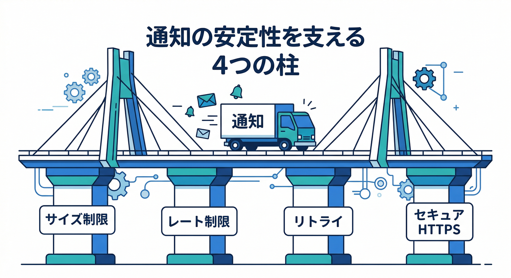

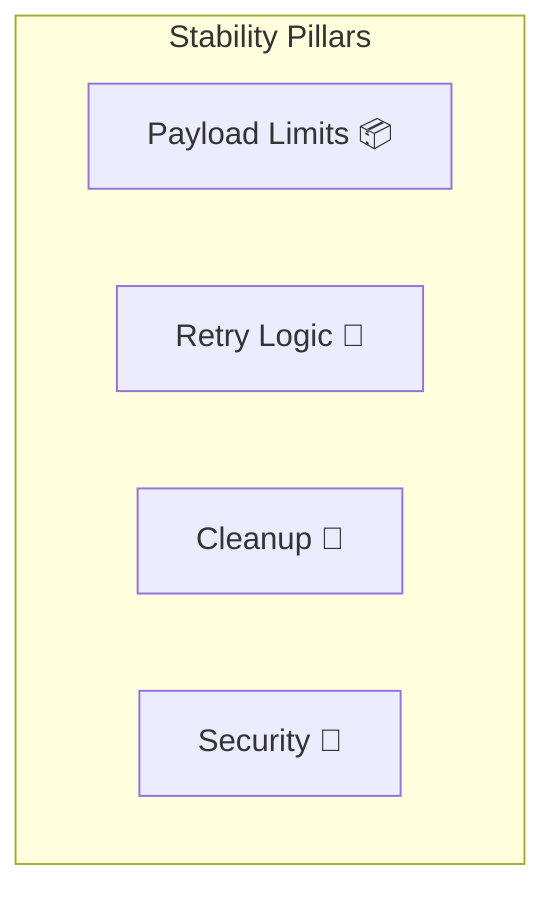

通知で壊れやすいのは、送信コードそのものより **運用の“当たり前”** です😇

* **メッセージサイズ**：通知/データとも基本 4096 bytes（コンソール送信は文字数制限あり）📦⚠️ ([Firebase][1])
* **トピック宛**：サイズ上限が 2048 bytes になったり、レート制限が出たりする 📉🧨 ([Firebase][2])
* **リトライ**：失敗時は指数バックオフが推奨（やけくそ連打はNG）🔁⏳ ([Firebase][3])
* **送信方法**：推奨は Admin SDK、必要なら HTTP v1（どちらも“信頼できる場所”から）🔐📤 ([Firebase][3])

そして、Web Pushは **HTTPS & Service Worker** が前提なので、配信が不安定なときは「そこ」も疑うと速いです🧑‍🚒🌐 ([Firebase][4])

---

## 設計のコツ 🧩：送信を「言語に依存しない契約」にする

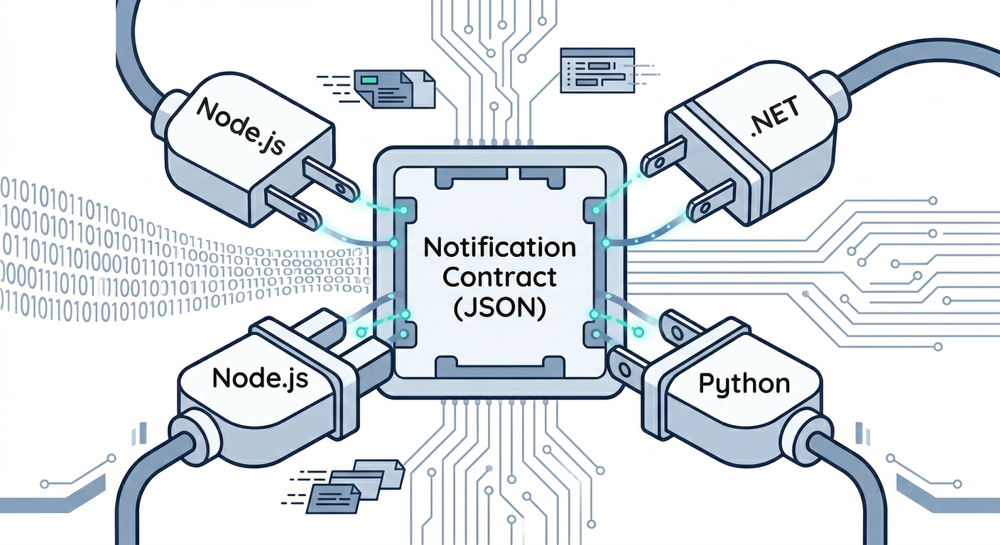

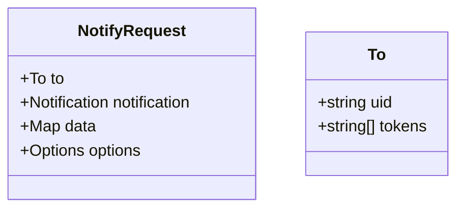

送信処理を移植しやすくする最短ルートは、**送信モジュールの入力を JSON 契約に固定**することです📦✨
（どの言語でも同じ“注文書”で送れるようにする感じ🍔）

## 送信リクエストの例（契約）📮

```ts
// NotifyRequest: どの言語でも同じ形で送れるようにする
export type NotifyRequest = {
  to: { uid: string; tokens: string[] };        // 宛先（複数端末OK）
  notification: { title: string; body: string }; // 表示される本文
  data?: Record<string, string>;                 // 画面遷移用など（文字列で統一）
  options?: {
    ttlSeconds?: number;         // 期限（例: 24h）
    collapseKey?: string;        // まとめるキー（連投抑制）
    dedupeKey?: string;          // 重複排除キー（自前）
    dryRun?: boolean;            // テスト送信用
  };
};
```

ポイントはこれ👇

* **dataは全部 string**：言語差分で壊れにくい 🧱
* **ttl/collapse/dedupe**：第16章の“うざくならない”制御を契約に埋め込む 😇⏳
* **dedupeKey**：通知スパム事故を“構造で”防げる 🧯

---

## 手を動かす 🖱️🔥：3つのルートで「送信エンジン」を作る

ここからは「送信エンジン」を **A/B/C どれでも作れる**ように進めます✨
（迷ったらAが最短。B/Cは“既存資産がある人向け”😄）

---

## ルートA：Cloud Functions（Node）で完成させる ⚡🟩

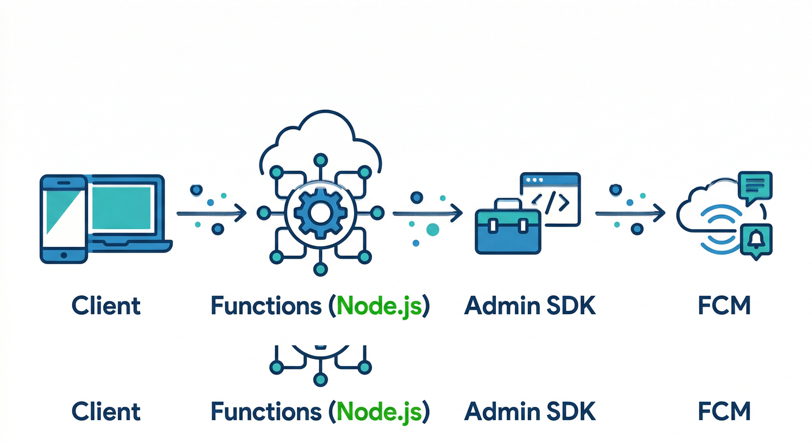

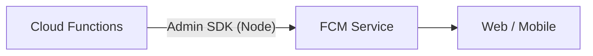

Cloud Functions for Firebase は Node ランタイムを選べます（Node 22/20、Node 18は非推奨扱い）⚙️ ([Firebase][5])
送信は Admin SDK が王道です👑 ([Firebase][3])

**sendEachForMulticast を使うのが今どき**（sendMulticast はdeprecated）⚠️ ([Firebase][6])

```ts
// functions/src/send.ts
import { getMessaging } from "firebase-admin/messaging";

export async function sendToTokens(req: {
  tokens: string[];
  title: string;
  body: string;
  data?: Record<string, string>;
  ttlSeconds?: number;
  collapseKey?: string;
  dryRun?: boolean;
}) {
  const message = {
    tokens: req.tokens,
    notification: { title: req.title, body: req.body },
    data: req.data,
    android: req.ttlSeconds ? { ttl: `${req.ttlSeconds}s` } : undefined,
    webpush: req.ttlSeconds ? { headers: { TTL: String(req.ttlSeconds) } } : undefined,
    // collapseKey 的な“まとめ”はプラットフォーム別に扱いがあるので、
    // まずは dedupeKey を自前で設計するのが安全（第16章の流れ）
  };

  const res = await getMessaging().sendEachForMulticast(message, req.dryRun);
  return res; // successes/failures が入る（第17章の掃除に繋がる）
}
```

✅ ここで重要：失敗レスポンスをログに残して、`registration-token-not-registered` 等は消す 🧹 ([Firebase][2])

---

## ルートB：Cloud Run functions（.NET 8）で送る 🟦✨

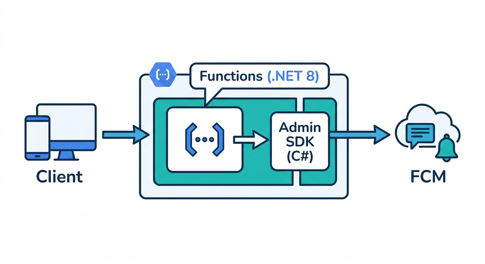

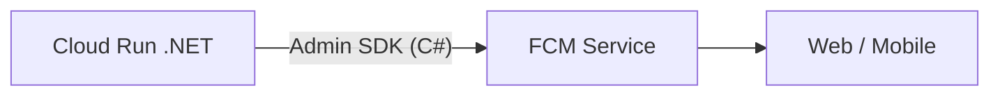

Cloud Run の “functions ランタイム” なら .NET 8 が選べます🟦 ([Google Cloud Documentation][7])
さらに Firebase Admin SDK は **C# も公式にサポート**されています📣 ([Firebase][3])

ざっくり方針：

* HTTPで `NotifyRequest` を受ける
* Admin SDKで送る
* 返り値で失敗トークンを返して、掃除に回す 🧹

```csharp
// .NET 8 (Cloud Run functions / Functions Framework想定の最小イメージ)
// NuGet: FirebaseAdmin, Google.Apis.Auth
using FirebaseAdmin;
using FirebaseAdmin.Messaging;
using Google.Apis.Auth.OAuth2;
using Google.Cloud.Functions.Framework;
using Microsoft.AspNetCore.Http;
using System.Text.Json;

public class SendNotifyFunction : IHttpFunction
{
    static SendNotifyFunction()
    {
        // Cloud Run/Functions の実行サービスアカウントを使うのがラク（鍵ファイル直置きしない🔐）
        FirebaseApp.Create(new AppOptions
        {
            Credential = GoogleCredential.GetApplicationDefault(),
        });
    }

    public async Task HandleAsync(HttpContext context)
    {
        var req = await JsonSerializer.DeserializeAsync<NotifyRequest>(context.Request.Body);
        var msg = new MulticastMessage
        {
            Tokens = req!.to.tokens,
            Notification = new Notification(req.notification.title, req.notification.body),
            Data = req.data
        };

        var res = await FirebaseMessaging.DefaultInstance.SendEachForMulticastAsync(msg, dryRun: req.options?.dryRun ?? false);
        await context.Response.WriteAsJsonAsync(res);
    }

    public record NotifyRequest(To to, Notif notification, Dictionary<string,string>? data, Opt? options);
    public record To(string uid, List<string> tokens);
    public record Notif(string title, string body);
    public record Opt(int? ttlSeconds, string? collapseKey, string? dedupeKey, bool? dryRun);
}
```

---

## ルートC：Cloud Run functions（Python 3.13）で送る 🐍✨

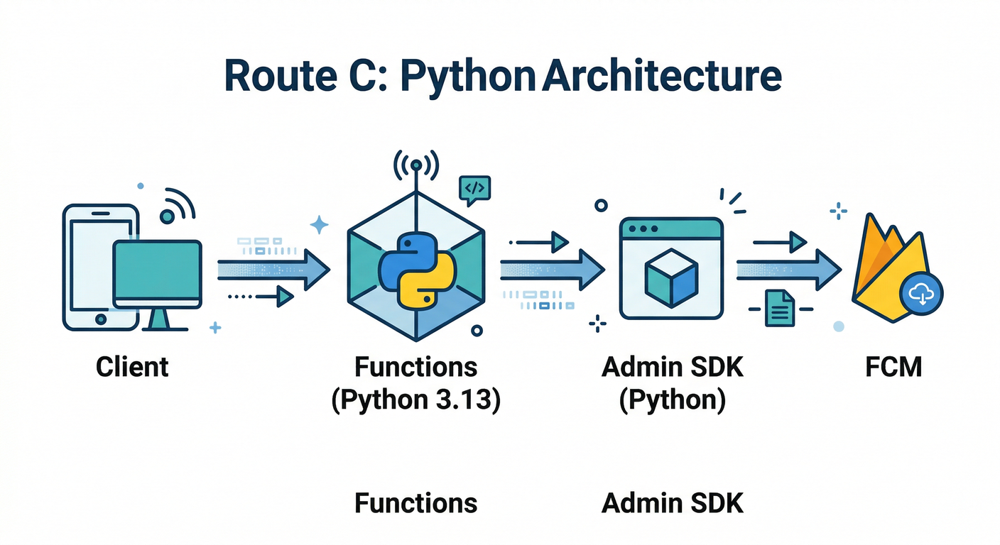

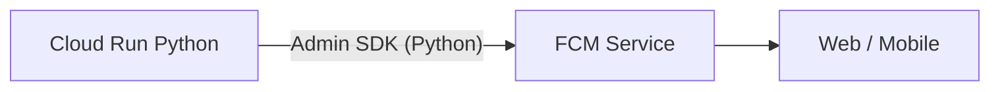

Cloud Run functions ランタイムは Python 3.13 が選べます🐍 ([Google Cloud Documentation][7])
Python も Admin SDK 公式サポート対象です📣 ([Firebase][3])

```py
## Python 3.13 (Cloud Run functions / Functions Framework想定の最小イメージ)
import json
import firebase_admin
from firebase_admin import credentials, messaging
from flask import Request

if not firebase_admin._apps:
    firebase_admin.initialize_app()  # ADC（実行環境の認証）を使うのが安全🔐

def send_notify(request: Request):
    req = request.get_json(force=True)
    tokens = req["to"]["tokens"]
    title = req["notification"]["title"]
    body = req["notification"]["body"]
    data = req.get("data") or {}

    msg = messaging.MulticastMessage(
        tokens=tokens,
        notification=messaging.Notification(title=title, body=body),
        data=data
    )
    res = messaging.send_each_for_multicast(msg, dry_run=req.get("options", {}).get("dryRun", False))
    return (json.dumps(res.__dict__, default=str), 200, {"Content-Type": "application/json"})
```

---

## どれを選ぶ？🤔✨ ざっくり判断

* **最速で教材を完走したい** → ルートA（Node/Functions）⚡
* **会社/既存資産が .NET** → ルートB（.NET 8 / Cloud Run functions）🟦
* **社内ツール/分析/運用が Python** → ルートC（Python 3.13 / Cloud Run functions）🐍

どのルートでも、送信の中身（抑制・掃除・ログ）は **第16〜17章の思想を“契約に埋めて維持”** が勝ちです🏆😄

---

## AIを絡めて“仕上げ”する 🤖📝✨

## 1) 通知文の生成は Firebase AI Logic で「安全に」✨

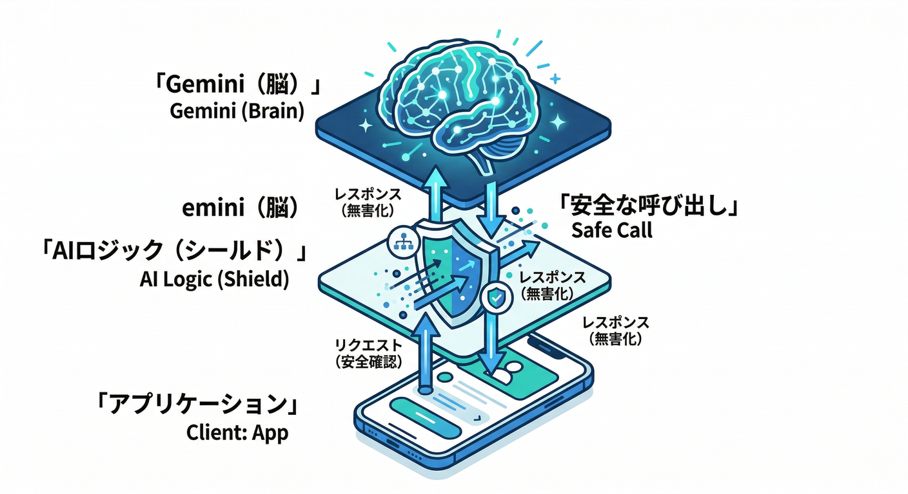

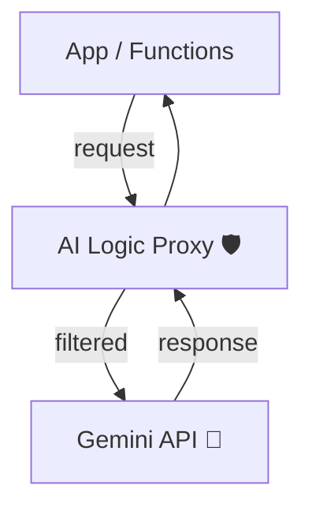

Firebase AI Logic は、アプリから Gemini/Imagen を安全に呼ぶための入口として整理されています🤖🔐 ([Firebase][8])
通知文の生成（短く/丁寧/危ない情報をマスク）と相性バツグンです📝✨

しかもドキュメント上、**Gemini 2.0 Flash / Flash-Lite が 2026-03-31 でretire予定**と明記されています⚠️
なのでモデル名は **Remote Config で差し替え可能**にしておくのが安全です🧯 ([Firebase][8])

## 2) Gemini CLIで「調査→実装→テスト」まで寄せる 💻✨

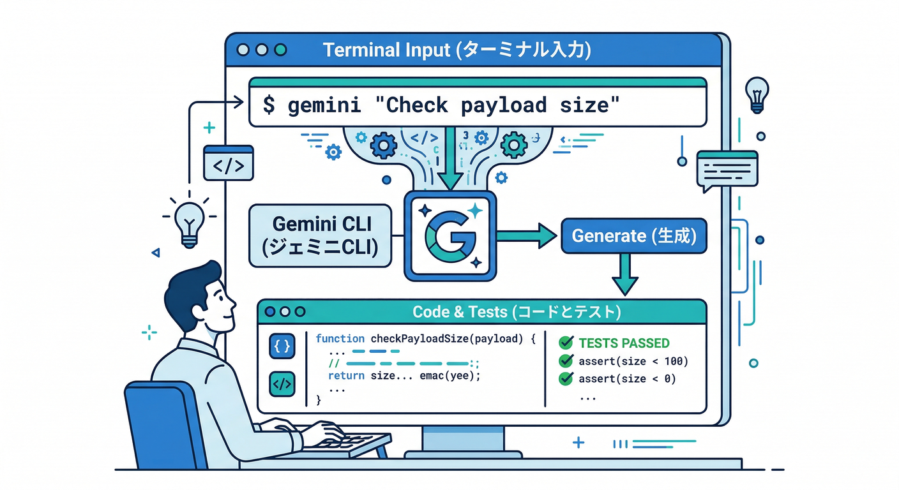

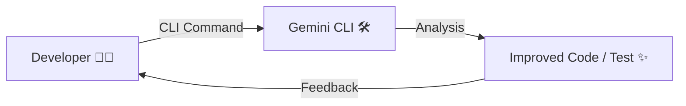

Gemini CLI はターミナルで動くオープンソースのAIエージェントとして整理されています🛠️ ([Google Cloud Documentation][9])
ここでは “通知品質を落とさないチェック” を作らせるのが強いです🔥

例：Gemini CLI に投げる指示（コピペ用）👇

```txt
目的：NotifyRequest 契約を守っているか自動チェックしたい。
- payload size 4096 bytes を超えそうなら警告
- data の value が string 以外ならエラー
- 失敗トークン（not-registered 等）を抽出する関数を生成
テストも作って。
```

## 3) Antigravityで「ミッション型」で固める 🛸🧩

Antigravity は “計画→実装→検証→反復” を回すエージェント基盤として説明されています🛸 ([Google Codelabs][10])
この章みたいに要素が多い回は、**ミッション単位**で進めると迷子になりにくいです😄

ミッション例👇

* Mission 1：NotifyRequest の型を確定 🧾
* Mission 2：送信エンジン（A/B/Cどれか）実装 📤
* Mission 3：失敗トークン抽出→削除まで自動化 🧹
* Mission 4：AI整形（短文化+マスク）を挟む 🤖

---

## ミニ課題 🎯🔥

次のどれか1つだけでOKです（欲張らないのが正解😄）

1. **A/B/C いずれかの送信エンジン**を作り、`dryRun` で疎通 🧪
2. 送信結果から `registration-token-not-registered` を抽出して、Firestoreから削除 🧹 ([Firebase][2])
3. AI Logicで「コメント本文 → 40文字の通知文」生成。危ない文字（メール/電話っぽい）を `***` にする 🤖🧽 ([Firebase][8])

---

## チェック ✅✅✅（これが揃うと“現実アプリ”）

* メッセージタイプ（notification/data）を理解して使い分けできる 🧩 ([Firebase][1])
* payloadサイズ（4096 bytes / トピック2048）を意識している 📦 ([Firebase][1])
* 失敗時は指数バックオフでリトライ（連打しない）🔁⏳ ([Firebase][2])
* 無効トークンは掃除して、失敗が積もらない 🧹 ([Firebase][2])
* WebはHTTPS + Service Worker 前提を押さえている 🌐🧑‍🚒 ([Firebase][4])
* Nodeなら sendEachForMulticast を使っている（deprecated回避）⚠️ ([Firebase][6])
* AIモデルは Remote Config 等で差し替えできる（retire対応）🧯 ([Firebase][8])

---

必要なら、この第20章の「手を動かす」を **あなたの教材テンプレ（読む→手を動かす→ミニ課題→チェック）**に合わせて、**A/B/C のどれか1ルートに絞って**完成版（コピペで動く構成）にして出しますよ😄✨

[1]: https://firebase.google.com/docs/cloud-messaging/customize-messages/set-message-type "Firebase Cloud Messaging message types"
[2]: https://firebase.google.com/docs/cloud-messaging/error-codes "FCM Error Codes  |  Firebase Cloud Messaging"
[3]: https://firebase.google.com/docs/cloud-messaging/server-environment "Your server environment and FCM  |  Firebase Cloud Messaging"
[4]: https://firebase.google.com/docs/cloud-messaging/web/get-started "Get started with Firebase Cloud Messaging in Web apps"
[5]: https://firebase.google.com/docs/functions/manage-functions "Manage functions  |  Cloud Functions for Firebase"
[6]: https://firebase.google.com/support/release-notes/admin/node "Firebase Admin Node.js SDK Release Notes"
[7]: https://docs.cloud.google.com/run/docs/runtimes/function-runtimes?hl=ja "Cloud Run functions ランタイム  |  Google Cloud Documentation"
[8]: https://firebase.google.com/docs/ai-logic "Gemini API using Firebase AI Logic  |  Firebase AI Logic"
[9]: https://docs.cloud.google.com/gemini/docs/codeassist/gemini-cli "Gemini CLI  |  Gemini for Google Cloud  |  Google Cloud Documentation"
[10]: https://codelabs.developers.google.com/getting-started-google-antigravity "Getting Started with Google Antigravity  |  Google Codelabs"
