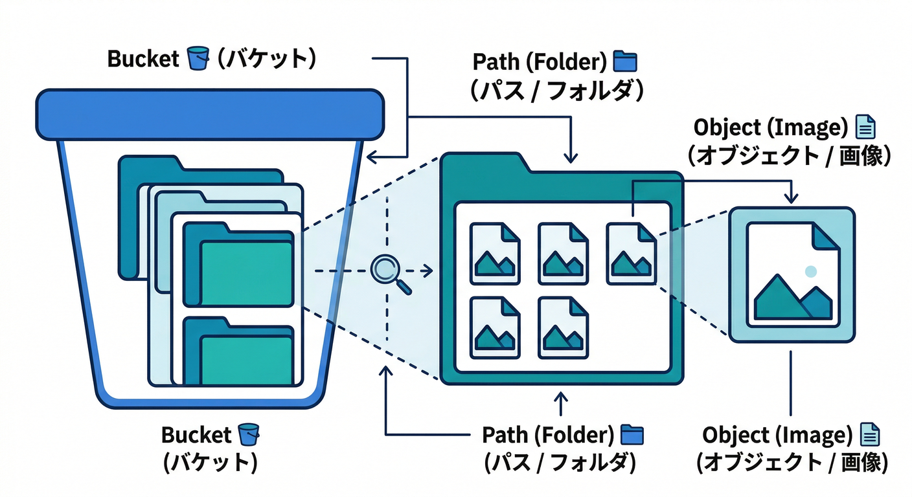
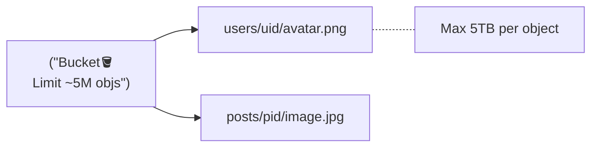
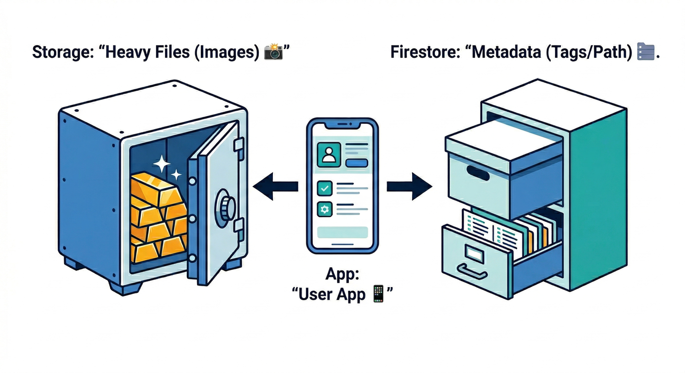
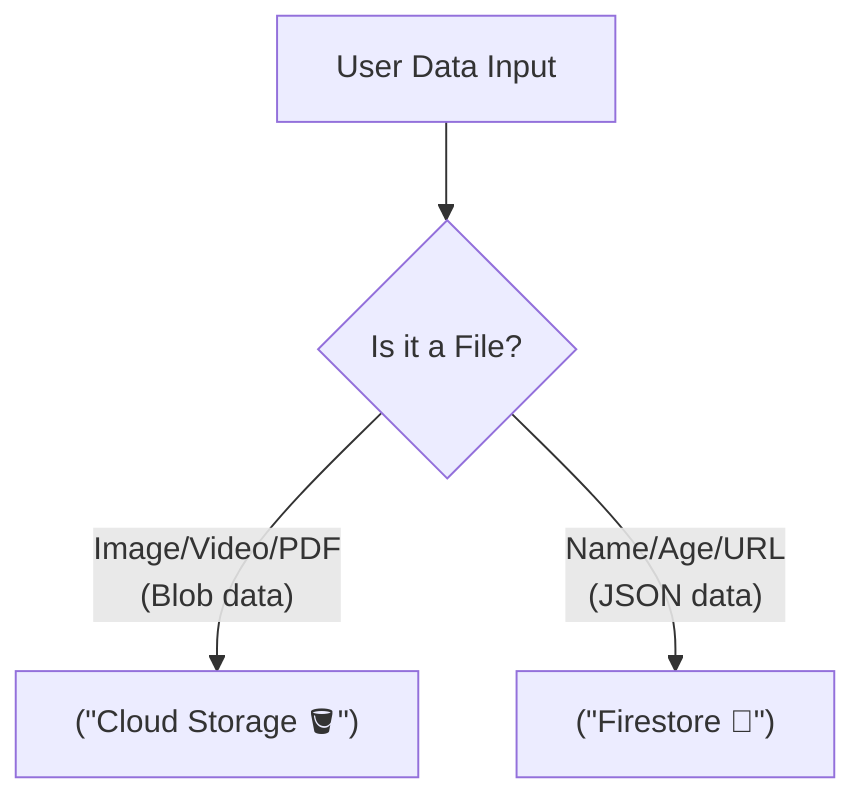
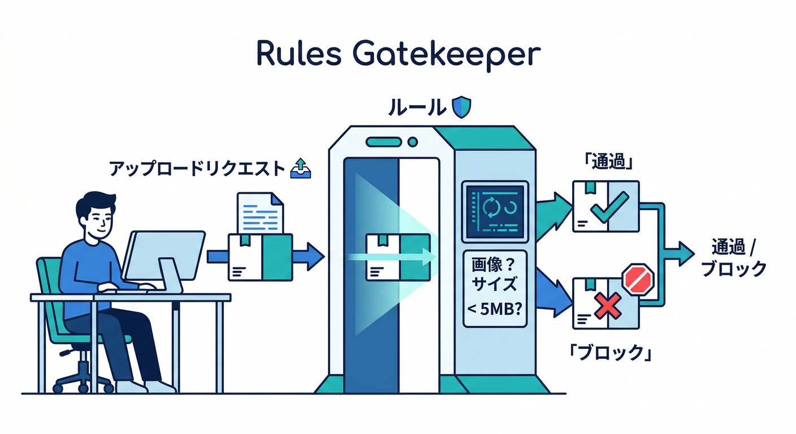
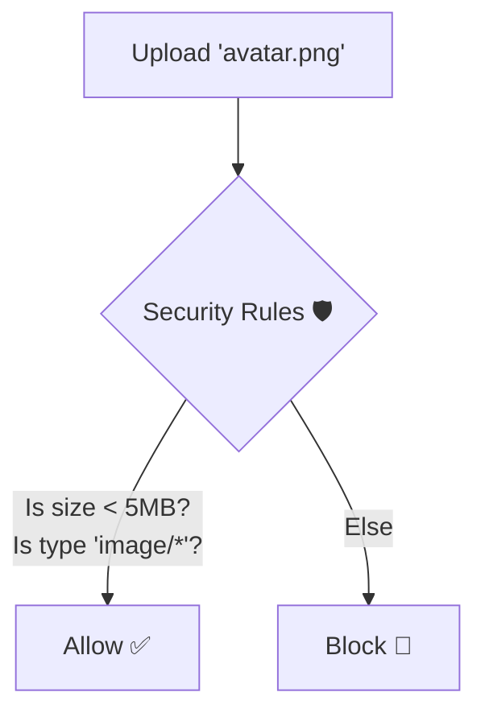
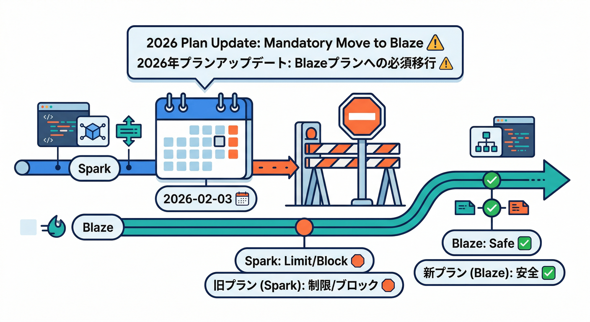
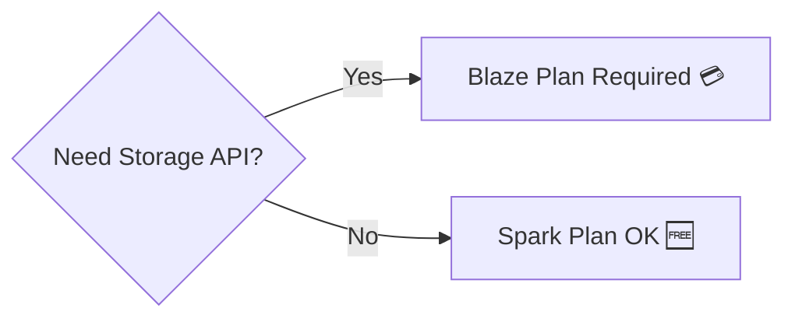
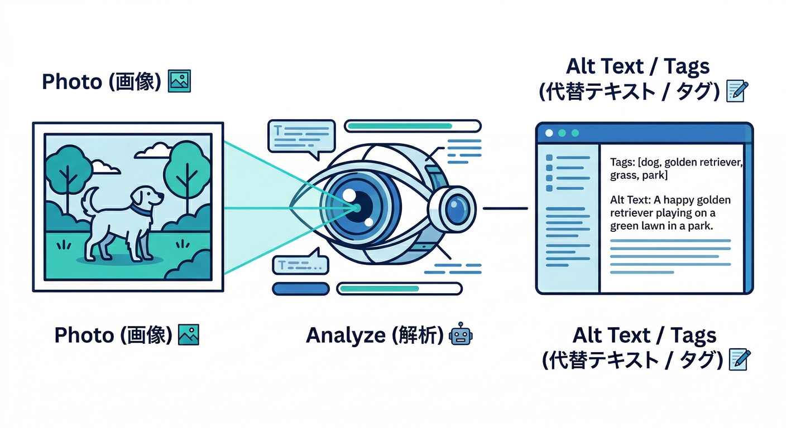
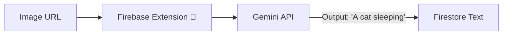

### 第1章：Storageって何？画像はどこに置かれる？📦

この章が終わると、こう言えるようになります👇
「画像みたいな**重いファイル**はStorageに置いて、プロフィールの**情報**はFirestoreに置く。で、Rulesで守る🛡️」✨

---

## 1) Storageは「ファイル専用の金庫」だよ🔐📷

FirebaseのStorage（正確には *Cloud Storage for Firebase*）は、写真・動画・PDFみたいな**ファイル（バイナリ）**を安全に置く場所です📦
中身は Google Cloud の仕組み（Cloud Storage）に乗っていて、速くて強いインフラを使えます⚡([Firebase][1])

---

## 2) 画像は「バケット→パス→ファイル」で置かれる🪣🗂️

Storageの世界は、ざっくりこの3点セットです👇

* **バケット（bucket）**🪣
  「Storageの箱」みたいなもの。プロジェクトに1つ（デフォルト）から始めるのが普通です。([Firebase][2])
* **パス（path）**🗂️
  箱の中の住所。例：`users/{uid}/profile/avatar.png` みたいなイメージ📍
* **ファイル（object）**📄
  実体の画像データそのもの📷

そして重要なのがコレ👇
**ファイル名＝ただの文字列じゃなくて「設計」**です🧠✨
（のちの章で「衝突しない命名」「履歴」「掃除」が超ラクになります🧹）

---

## 3) Firestoreとの役割分担が“現実アプリ感”の正体😎✨

ここ、めちゃ大事です🧠

* Storage：**画像ファイル本体**📷📦
* Firestore：**画像の情報（メタデータ）**🗃️
  例）`path` / `createdAt` / `status` / `altText` / `thumbの場所` …など

### なんで分けるの？🤔

Firestoreは「検索・並び替え・表示」のためのDBなので、画像本体みたいな重いデータを突っ込む場所じゃないんです🙅‍♂️
Storageに置いて、Firestoreには「どこにあるか」だけ持たせると、アプリが一気に綺麗になります✨

---

## 4) URLって何？「表示できるURL」は2種類あると思うと楽🔗🧠

Storageで画像を表示するとき、よく出てくるのが **ダウンロードURL** です🔗
Webだと `getDownloadURL()` で取れます（公式の基本ルート）([Firebase][3])

ただし！ここで“初心者ハマり”が起きやすい⚠️😵

### ✅ ざっくり覚え方（超重要）💡

* `ref(storage, "パス")`：**住所（参照）**📍
* `getDownloadURL(ref)`：**ブラウザでそのまま見れるURL**🔗([Firebase][3])

そして注意点👇
ダウンロードURLは「共有リンク」っぽい扱いになることが多いので、**うっかり公開しない**が基本です🙈🔗
（URL運用の落とし穴は後半の章でちゃんとやります⚠️）

### もう一歩：Rulesを効かせたいなら「SDKで直接ダウンロード」もある🧠

Web SDKは `getBlob()` / `getBytes()` みたいに **URLを経由せずSDKで取る方法**も用意していて、これだとRulesによる制御を効かせやすい、という整理になっています📌([Firebase][3])
（今は「そういう道もあるんだな〜」でOK🙆‍♂️）

---

## 5) Rulesは「サーバー側の門番」🛡️🚪

Storageは、**Rules（ルール）**で守ります🛡️
Rulesはサーバー側で動くので、クライアント側でズルしても通しません😤

代表的にできること👇

* **本人だけ書ける**（`request.auth.uid` を使う）🔐([Firebase][4])
* **画像だけ許可**（`contentType` をチェック）🖼️([Firebase][4])
* **サイズ制限**（`size` をチェック）📏([Firebase][4])

最初のうちは、こう覚えてOKです👇
「Storageは“置けちゃうと危険”だから、Rulesで守るのが前提」🛡️([Firebase][4])

---

## 6) 2026年の最新注意：Storageを触るならプラン周りも知っておく💸🧯

ここは“章2”で本格的にやるけど、**第1章でも地雷だけ先に回避**します😇

* 2024-10-30以降：新しくデフォルトバケットを用意するには **Blaze必須**💳([Firebase][5])
* そして超重要：**2026-02-03以降は、デフォルトバケット含むStorageリソースの利用維持にBlaze必須**（もう現在はこの状態）🔥([Firebase][5])
  ただし `*.appspot.com` のデフォルトバケットは、Blazeでも「今の無償利用レベルを維持」と説明されています🧾([Firebase][5])

さらに、バケットのロケーション次第で “Always Free” を使える地域の話もあります📍（例：`US-CENTRAL1` など）([Firebase][2])
👉 ここは章2で「事故らない」ように一緒に整理します🧯

---

## 7) AIを最初から絡める：画像アップロードは“AIの入口”🤖🖼️

画像が置けると、次の一手が一気に増えます🔥

### Firebase AI Logicでできること（イメージ）✨

* 画像の**説明文（altテキスト）**を自動生成📝🤖
* 画像の**タグ付け**（「城」「人物」「食べ物」みたいな）🏷️
* 画像の**不適切チェック**を“ゆるく”入れる🧿（最終判断は人でもOK）

Firebase AI Logicは、GeminiやImagenのモデルをアプリから使えるようにする仕組みとして案内されています🤖([Firebase][6])
このカテゴリ後半（第20章あたり）で「アップロード完了 → AIで説明文生成 → Firestoreへ保存」をやると一気に実務っぽくなります😎✨

### Gemini in Firebase：詰まりをAIに聞ける🧯

Firebaseコンソール右上から **Gemini in Firebase** を開いて、Rulesやエラー原因を相談できる導線が用意されています💬([Firebase][7])

### Antigravity / Gemini CLI：MCPで“Firebaseを操作・調査”🧩

Firebase MCP server は、Antigravity や Gemini CLI みたいなMCPクライアントからFirebaseを扱うための仕組みとして説明されています🧩([Firebase][8])
（このカテゴリでは「Rulesレビュー」「設計レビュー」「原因特定」をAIに投げて爆速にします🚀）

---

# 手を動かす：コンソールでStorageを“観察”しよう👀🧭

> まだコード書きません✋ まずは地図を見る回です🗺️✨

## ステップ1：Storage画面を開く📦

1. Firebaseコンソールを開く🌐
2. 左メニューの **Storage** をクリック📦
3. 「Get started」的な導線があれば進む🚶‍♂️([Firebase][2])

※ ここでプランの案内が出ることがあります（さっきの2026要件の影響）💸([Firebase][5])

## ステップ2：バケット名を確認する🪣

* だいたい `xxxx.appspot.com` みたいな名前が見えるはず👀
* これが「画像が置かれる箱」です🪣

## ステップ3：「Files」と「Rules」を眺める🗂️🛡️

* **Files**：実際のファイル一覧が出るところ📁
* **Rules**：門番ルールを書くところ🛡️([Firebase][4])

この段階でOKな理解👇
「Filesが倉庫、Rulesが入退室ゲート」🚪✨

---

# ミニ課題：一言で言ってみよう✍️💡

## お題🎯

「画像をDB（Firestore）じゃなくStorageに置く理由」を一言で！

### 例（模範っぽい答え）✅

* 「画像は重いファイルだから、**ファイル専用のStorage**に置くのが自然」📦
* 「Firestoreは検索・表示用の情報、Storageは実体ファイル。**役割分担**する」🧠
* 「Rulesで**本人だけアップロード**とか、**画像だけ許可**とか守れる」🛡️([Firebase][4])

---

# チェック✅（ここまで理解できた？）

* Storageは「ファイルの金庫」だと説明できる🔐📦
* バケット🪣 / パス🗂️ / ファイル📄 の3つがなんとなく分かる
* 「画像＝Storage、情報＝Firestore」の住み分けが言える🧠
* Rulesが“サーバー側の門番”で、`contentType` や `size` をチェックできるのを知った🛡️([Firebase][4])
* 2026-02-03以降はBlaze要件が効いているのを知った💸([Firebase][5])

---

次の第2章では、ここでチラ見した「プラン・クォータ・アラート」を、**事故らないための実践手順**に落とします💸🧯✨

[1]: https://firebase.google.com/docs/storage?utm_source=chatgpt.com "Cloud Storage for Firebase - Google"
[2]: https://firebase.google.com/docs/storage/web/start?utm_source=chatgpt.com "Get started with Cloud Storage on web - Firebase"
[3]: https://firebase.google.com/docs/storage/web/download-files?utm_source=chatgpt.com "Download files with Cloud Storage on Web - Firebase"
[4]: https://firebase.google.com/docs/storage/security?utm_source=chatgpt.com "Understand Firebase Security Rules for Cloud Storage"
[5]: https://firebase.google.com/docs/storage/faqs-storage-changes-announced-sept-2024?utm_source=chatgpt.com "FAQs about changes to Cloud Storage for Firebase pricing ..."
[6]: https://firebase.google.com/docs/ai-logic?utm_source=chatgpt.com "Gemini API using Firebase AI Logic - Google"
[7]: https://firebase.google.com/docs/ai-assistance/gemini-in-firebase?utm_source=chatgpt.com "Gemini in Firebase - Google"
[8]: https://firebase.google.com/docs/ai-assistance/mcp-server?utm_source=chatgpt.com "Firebase MCP server | Develop with AI assistance - Google"
