### 第3章：Reactで画像選択UI（プレビュー付き）🖼️✨

この章は「**アップロード前の気持ちいい体験**」を作る回だよ〜🙂
ユーザーが画像を選んだ瞬間に **丸いプレビューが出る**だけで、一気に“現実アプリ感”が出ます😎📷

---

## 1) 読む：この章のキモ🧠🔑

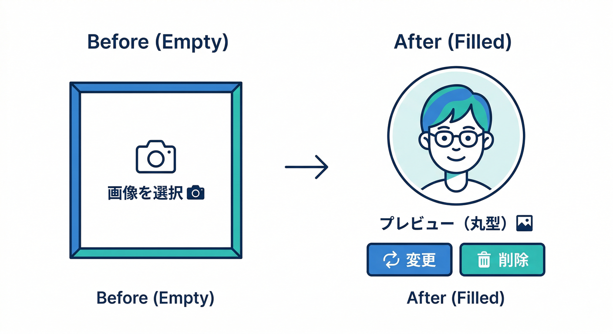

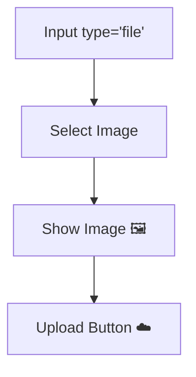

### ✅ 画像ファイルは `File` として取れる📄

`<input type="file">` で選ばれたものはブラウザの `File` で受け取れるよ👀（後の章で **そのまま Storage の upload に渡せる**のが強い！） ([Firebase][1])

### ✅ プレビューは `URL.createObjectURL(file)` が速い⚡

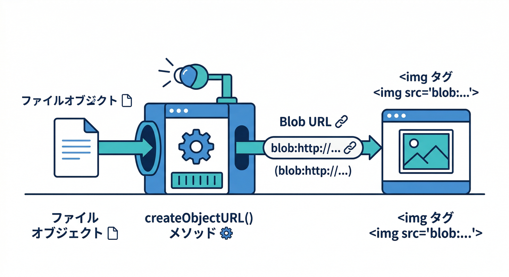

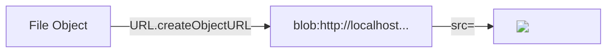

画像を base64 に変換しなくても、**一時URL**を作って `img src` に置けるよ🧠✨
使い終わったら `URL.revokeObjectURL()` で片付けるのが大事！（メモリリーク回避） ([MDN Web Docs][2])

### ✅ `accept="image/*"` は“入口フィルター”🚪

ファイル選択画面で画像以外を出しにくくできるけど、**これだけで安全になるわけじゃない**ので、アプリ側のチェックも一緒にやろう🙂 ([MDN Web Docs][3])

---

## 2) 手を動かす：プレビュー付き画像ピッカーを作る📷🪄

ここで作るのはこれ👇

* 画像を選ぶ（クリック）🖱️
* ドロップでも選べる（おまけ）🧲
* プレビュー表示👀✨
* PNG/JPEG/WebP だけ許可 & サイズ上限も先に弾く🚦
* 「別の画像」「取り消し」ボタン付き🔁🗑️

---

### 実装：`ProfileImagePicker.tsx` を作る🧩

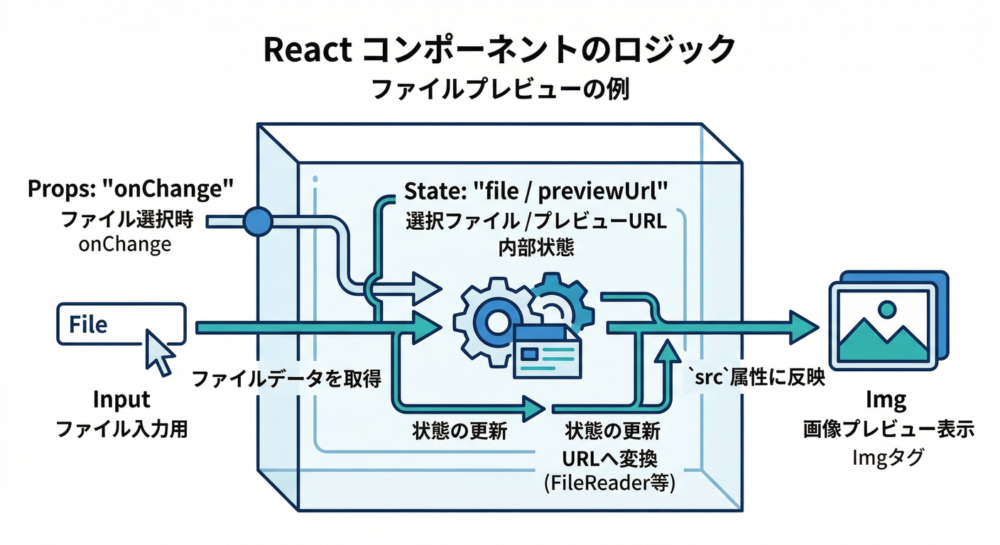

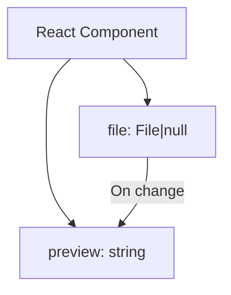

```tsx
import React, { useEffect, useRef, useState } from "react";

type Props = {
  value?: File | null;
  onChange?: (file: File | null) => void;
  maxBytes?: number; // 例: 5MB
};

const DEFAULT_MAX_BYTES = 5 * 1024 * 1024;

function formatMB(bytes: number) {
  return (bytes / 1024 / 1024).toFixed(2);
}

export function ProfileImagePicker({
  value = null,
  onChange,
  maxBytes = DEFAULT_MAX_BYTES,
}: Props) {
  const inputRef = useRef<HTMLInputElement | null>(null);

  const [file, setFile] = useState<File | null>(value);
  const [previewUrl, setPreviewUrl] = useState<string | null>(null);
  const [error, setError] = useState<string | null>(null);
  const [isDragging, setIsDragging] = useState(false);

  // 親から value が来たら追従（フォーム化しやすい）
  useEffect(() => setFile(value), [value]);

  // File → プレビューURL（使い終わったら revoke でお片付け）
  useEffect(() => {
    if (!file) {
      setPreviewUrl(null);
      return;
    }
    const url = URL.createObjectURL(file);
    setPreviewUrl(url);
    return () => URL.revokeObjectURL(url);
  }, [file]);

  function validate(f: File): string | null {
    // 入口：画像っぽいか（MIME）
    if (!f.type.startsWith("image/")) return "画像ファイルだけ選べるよ🖼️";

    // 今回は“よくある3種”に限定（あとで増やしてOK）
    const allowed = new Set(["image/png", "image/jpeg", "image/webp"]);
    if (!allowed.has(f.type)) return "PNG/JPEG/WebP だけにしよ🙂";

    // サイズ（例：5MB）
    if (f.size > maxBytes)
      return `サイズが大きいよ（最大 ${Math.round(maxBytes / 1024 / 1024)}MB）📦`;

    return null;
  }

  function pick(next: File | null) {
    if (!next) {
      setError(null);
      setFile(null);
      onChange?.(null);
      return;
    }
    const err = validate(next);
    if (err) {
      setError(err);
      setFile(null);
      onChange?.(null);
      return;
    }
    setError(null);
    setFile(next);
    onChange?.(next);
  }

  function openFileDialog() {
    inputRef.current?.click();
  }

  function onInputChange(e: React.ChangeEvent<HTMLInputElement>) {
    const f = e.target.files?.[0] ?? null;
    pick(f);

    // 同じファイルを選び直したい時、onChange が発火しないことがあるのでリセット
    e.target.value = "";
  }

  // DnD（おまけ）
  function prevent(e: React.DragEvent) {
    e.preventDefault();
    e.stopPropagation();
  }
  function onDrop(e: React.DragEvent<HTMLDivElement>) {
    prevent(e);
    setIsDragging(false);
    const f = e.dataTransfer.files?.[0] ?? null;
    pick(f);
  }

  return (
    <div>
      {/* “本物の input” は隠して、見た目は自由に作る */}
      <input
        ref={inputRef}
        type="file"
        accept="image/png,image/jpeg,image/webp"
        onChange={onInputChange}
        hidden
      />

      <div
        role="button"
        tabIndex={0}
        aria-label="プロフィール画像を選択"
        onClick={openFileDialog}
        onKeyDown={(e) => {
          if (e.key === "Enter" || e.key === " ") openFileDialog();
        }}
        onDragEnter={(e) => {
          prevent(e);
          setIsDragging(true);
        }}
        onDragOver={(e) => {
          prevent(e);
          setIsDragging(true);
        }}
        onDragLeave={(e) => {
          prevent(e);
          setIsDragging(false);
        }}
        onDrop={onDrop}
        style={{
          border: "2px dashed #bbb",
          borderRadius: 14,
          padding: 16,
          cursor: "pointer",
          background: isDragging ? "#f6f6f6" : "transparent",
        }}
      >
        {!previewUrl ? (
          <div>
            <div style={{ fontSize: 18, fontWeight: 800 }}>
              画像を選ぶ / ドロップする📷✨
            </div>
            <div style={{ opacity: 0.75, marginTop: 6 }}>
              PNG / JPEG / WebP（最大 {Math.round(maxBytes / 1024 / 1024)}MB）🙂
            </div>
          </div>
        ) : (
          <div style={{ display: "flex", gap: 16, alignItems: "center" }}>
            
            <div style={{ flex: 1 }}>
              <div style={{ fontWeight: 800 }}>{file?.name ?? "image"}</div>
              <div style={{ opacity: 0.75, marginTop: 4 }}>
                {formatMB(file?.size ?? 0)}MB ・ {file?.type}
              </div>

              <div style={{ display: "flex", gap: 8, marginTop: 10 }}>
                <button
                  type="button"
                  onClick={(e) => {
                    e.stopPropagation();
                    openFileDialog();
                  }}
                >
                  別の画像にする🔁
                </button>
                <button
                  type="button"
                  onClick={(e) => {
                    e.stopPropagation();
                    pick(null);
                  }}
                >
                  取り消し🗑️
                </button>
              </div>
            </div>
          </div>
        )}
      </div>

      {error && (
        <div style={{ color: "#c00", marginTop: 10 }}>
          {error}（この章は “選び直し” でOK👌）
        </div>
      )}
    </div>
  );
}
```

この「プレビューURL作って、`useEffect` の cleanup で `revoke`」が王道のやり方だよ🧠✨ ([MDN Web Docs][2])
`accept` の指定もここで入れておくと、選択体験が気持ちいい🙂 ([MDN Web Docs][3])

---

### 使ってみる：ページ側で表示する🧪👀

```tsx
import { useState } from "react";
import { ProfileImagePicker } from "./ProfileImagePicker";

export default function ProfilePage() {
  const [file, setFile] = useState<File | null>(null);

  return (
    <div style={{ maxWidth: 520, margin: "24px auto", padding: 16 }}>
      <h1>プロフィール画像🧑‍💻</h1>

      <ProfileImagePicker value={file} onChange={setFile} />

      <div style={{ marginTop: 14, opacity: 0.85 }}>
        {file ? (
          <>次章でアップロードするファイル：<b>{file.name}</b> 📦</>
        ) : (
          <>まだ未選択🙂</>
        )}
      </div>
    </div>
  );
}
```

ここまでで **「画像が画面に出る」**が達成🎉
次章でこの `File` をそのまま Storage に投げます⬆️（`uploadBytes()` が File を受け取れる） ([Firebase][1])

---

## 3) ミニ課題：UIを“それっぽく”分岐させよう🎨✨

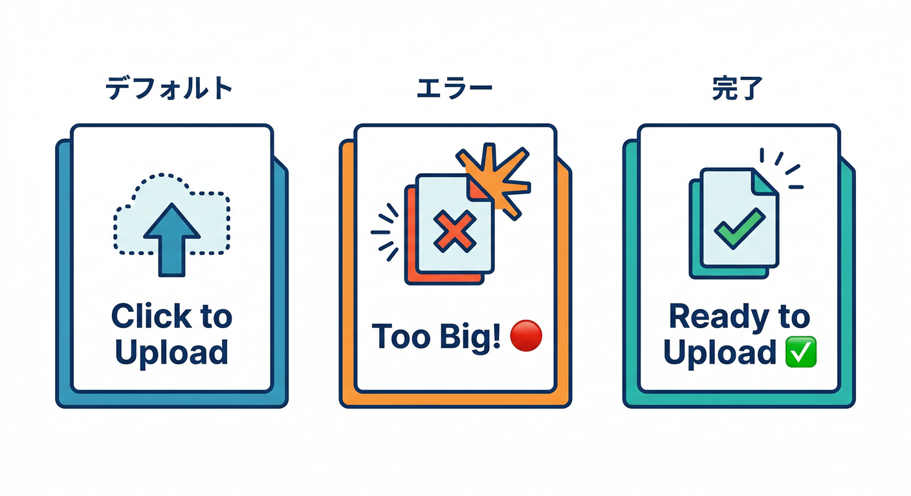

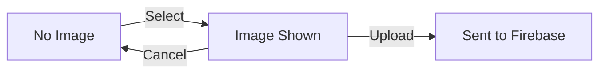

どれも小さいけど、効きます😎

* ✅ 未選択のときは「ここをクリックして選ぶ📷」を強調
* ✅ 選択済みのときは「保存はまだだよ（次章！）🙂」の文言を出す
* ✅ エラーのときは「どれがダメだったか」を1行で言う（サイズ？形式？）🚦

---

## 4) チェック：できたら合格✅🏁

* [ ] 画像を選ぶと丸いプレビューが出る🖼️
* [ ] 取り消しでプレビューが消える🗑️
* [ ] PNG/JPEG/WebP 以外は弾ける🚫
* [ ] 大きすぎる画像を弾ける📦
* [ ] 画像を何度も選び直しても重くならない（`revoke` できてる）🧹 ([MDN Web Docs][4])

---

## 5) よくあるハマりどころ💥（先に潰す）

### 🧨 同じファイルを選び直しても反応しない

ファイル入力は「前回と同じだと change 扱いにならない」ことがあるので、`e.target.value = ""` でリセットしてるよ👌

### 🧠 プレビューでメモリが増えていく

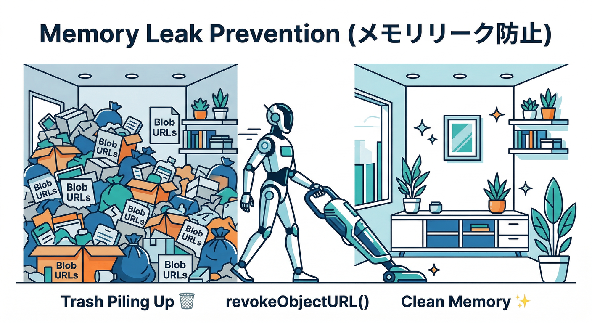

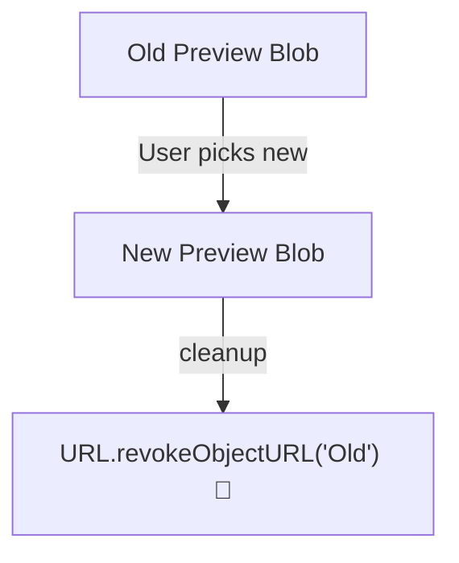

`createObjectURL()` は作りっぱなしだと残りやすいので、必ず `revokeObjectURL()` を cleanup で呼ぶのが安心✨ ([MDN Web Docs][2])

---

## 6) AIで“学習スピード”を上げる小技🤖🚀

### A) Antigravity / Gemini CLI に「UIレビュー」を投げる🕵️‍♂️✨

たとえばこう聞くと、改善案が一気に出るよ👇

* 「この画像選択UI、アクセシビリティ的に直すべき点ある？🧑‍🦯」
* 「エラーメッセージ、初心者に優しい文にして🙂」
* 「ドラッグ&ドロップの挙動、抜け漏れない？🧲」

さらに Firebase の MCP server を入れておくと、AIが **Rules やプロジェクト情報**まで文脈に入れて手伝える範囲が広がるよ🧩 ([Firebase][5])
（Gemini CLI は Firebase 拡張を入れるのが推奨、って公式に書いてある） ([Firebase][5])

---

### B) おまけ：選んだ画像から “altテキスト” をAIで作る📝🤖


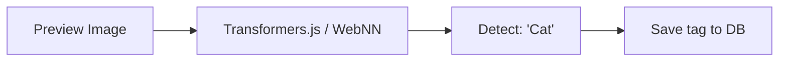

「アップロード前」でも、ローカル `File` を base64 にして **画像解析**できるよ（Firebase AI Logic の公式サンプルがまさにこの形） ([Firebase][6])

#### ① AIモデル初期化（例）

```ts
import { initializeApp } from "firebase/app";
import { getAI, getGenerativeModel, GoogleAIBackend } from "firebase/ai";

const firebaseApp = initializeApp({ /* ... */ });
const ai = getAI(firebaseApp, { backend: new GoogleAIBackend() });
const model = getGenerativeModel(ai, { model: "gemini-2.5-flash" });
```

この `firebase/ai` の初期化パターンは公式ドキュメントに載ってるよ。 ([Firebase][6])

#### ② File → inlineData に変換

```ts
async function fileToGenerativePart(file: File) {
  const base64 = await new Promise<string>((resolve, reject) => {
    const reader = new FileReader();
    reader.onloadend = () => resolve(String(reader.result).split(",")[1]);
    reader.onerror = () => reject(reader.error);
    reader.readAsDataURL(file);
  });

  return { inlineData: { data: base64, mimeType: file.type } };
}
```

これは公式サンプルと同じ形（FileReader→base64→inlineData）だよ。 ([Firebase][6])

#### ③ altテキスト生成

```ts
export async function makeAltText(file: File) {
  const imagePart = await fileToGenerativePart(file);
  const prompt =
    "この画像の内容を日本語で短く説明して。プロフィール画像のaltテキスト用。20文字くらい。";

  const result = await model.generateContent([prompt, imagePart]);
  return result.response.text();
}
```

`generateContent([prompt, imagePart])` の呼び方も公式に載ってるよ。 ([Firebase][6])

> ⚠️ 画像を inline で送ると base64 分サイズが増えるので、サイズが大きいとエラーになりやすい（上限に注意）📦 ([Firebase][6])
> ⚠️ あとモデル名は、古いのを指定してると期限で止まることがあるので注意！（例：一部モデルの retire 情報が明記されてる）🗓️ ([Firebase][6])

---

次の第4章では、この章で作った `File` を「Storage の ref（置き場所）」に結びつけていくよ📁🧭
第3章のコードに「見た目もうちょい今風にしたい😎」とかあれば、デザイン寄せた版も出せるよ〜🎨✨

[1]: https://firebase.google.com/docs/storage/web/upload-files "Upload files with Cloud Storage on Web  |  Cloud Storage for Firebase"
[2]: https://developer.mozilla.org/en-US/docs/Web/API/URL/createObjectURL_static?utm_source=chatgpt.com "URL: createObjectURL() static method - Web APIs - MDN"
[3]: https://developer.mozilla.org/en-US/docs/Web/HTML/Reference/Attributes/accept?utm_source=chatgpt.com "HTML attribute: accept - MDN"
[4]: https://developer.mozilla.org/en-US/docs/Web/URI/Reference/Schemes/blob?utm_source=chatgpt.com "blob: URLs - URIs - MDN - Mozilla"
[5]: https://firebase.google.com/docs/ai-assistance/mcp-server "Firebase MCP server  |  Develop with AI assistance"
[6]: https://firebase.google.com/docs/ai-logic/analyze-images "Analyze image files using the Gemini API  |  Firebase AI Logic"
