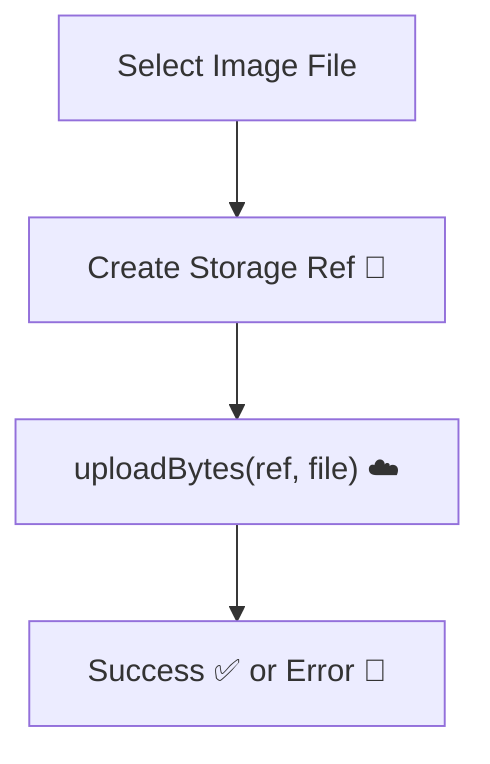
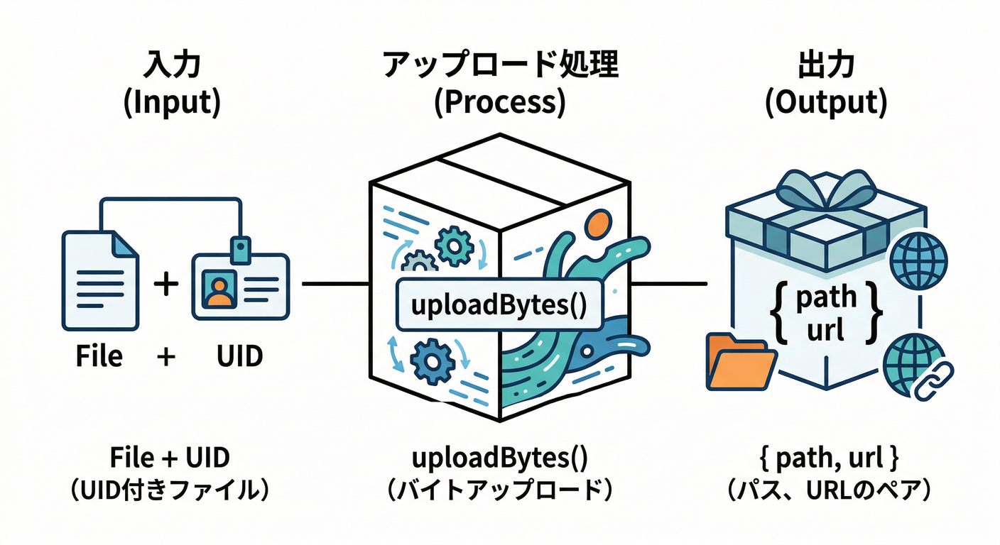
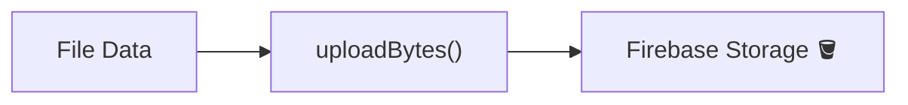
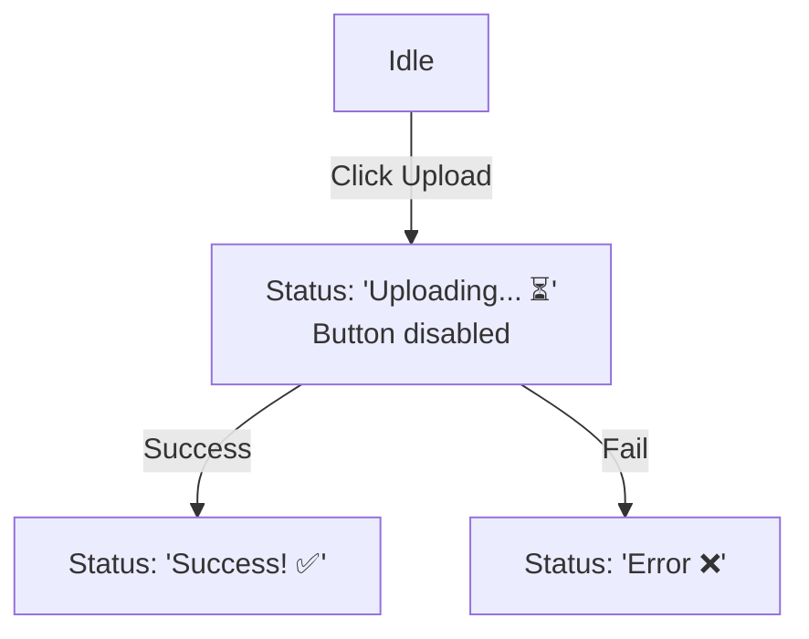
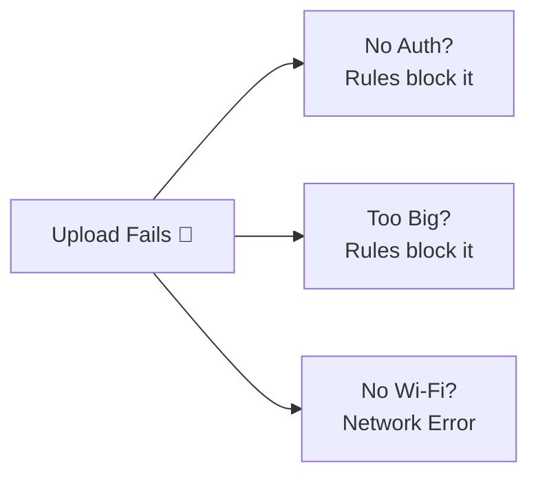
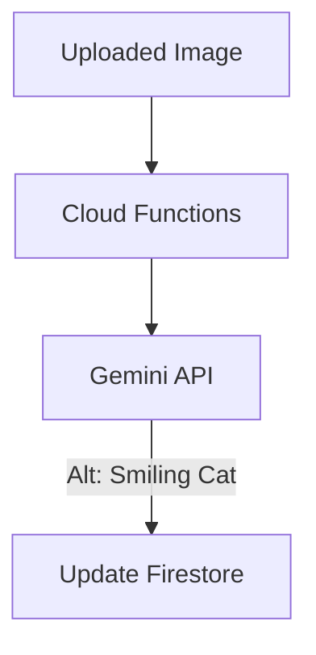

### 第5章：最小アップロード（upload → URL取得）⬆️🔗

この章は「**アップロードできた！→ 画像が画面に出た！**」まで一直線で行きます😆✨
やることは超シンプルで、基本はこの2つだけ👇

* `uploadBytes()` で Storage に上げる⬆️ ([Firebase][1])
* `getDownloadURL()` で表示用URLを取る🔗 ([Firebase][2])

---

## 1) まず頭に入れる“最小の流れ”🧠✨




1. 画像ファイル（`File`）を受け取る📎
2. 保存先のパス（`users/{uid}/profile/{fileId}`）を作る📁
3. `uploadBytes(ref, file, metadata)` でアップロード⬆️ ([Firebase][1])
4. `getDownloadURL(ref)` でURL取得🔗 ([Firebase][2])
5. `img src={url}` で表示🖼️✨

---

## 2) ハンズオン：最小アップロード関数を作る🧩

ポイントは2つだけ👇

* **ファイル名衝突を避ける**（毎回ユニークなIDにする）🧠
* **`contentType` は渡す**（あとから困りにくい）📎

#### 2-1. `uploadProfileImage.ts`（アップロードしてURLを返す）





```ts
import { getStorage, ref, uploadBytes, getDownloadURL } from "firebase/storage";

type UploadResult = { path: string; url: string };

export async function uploadProfileImage(file: File, uid: string): Promise<UploadResult> {
  const storage = getStorage();

  // できるだけ衝突しないファイルID
  const fileId = crypto.randomUUID();

  // 👇 第4章で決めた「ユーザー別パス」
  const path = `users/${uid}/profile/${fileId}`;

  const fileRef = ref(storage, path);

  // contentType を入れておくと、配信や判定で困りにくい
  await uploadBytes(fileRef, file, { contentType: file.type });

  const url = await getDownloadURL(fileRef);
  return { path, url };
}
```

`uploadBytes()` は `File` / `Blob` などをそのままアップロードできるのが強みです💪 ([Firebase][1])
`getDownloadURL()` は「ブラウザで見せる用のURL」を返してくれます🔗 ([Firebase][2])

---

## 3) ハンズオン：Reactで「アップロード → 反映」を一気に作る🚀

ここでは最低限👇

* 選んだ画像をプレビュー👀
* アップロードボタン押す⬆️
* 終わったらそのまま表示🖼️✨
* 成功/失敗メッセージ🙂

#### 3-1. `ProfileImageUploader.tsx`




```tsx
import { useEffect, useMemo, useState } from "react";
import { uploadProfileImage } from "./uploadProfileImage";

type Props = {
  uid: string; // Authの user.uid を渡す想定
};

export function ProfileImageUploader({ uid }: Props) {
  const [file, setFile] = useState<File | null>(null);
  const [uploading, setUploading] = useState(false);
  const [uploadedUrl, setUploadedUrl] = useState<string | null>(null);
  const [message, setMessage] = useState<string | null>(null);

  // プレビューURL（メモリリーク防止で後で revoke する）
  const previewUrl = useMemo(() => (file ? URL.createObjectURL(file) : null), [file]);
  useEffect(() => {
    return () => {
      if (previewUrl) URL.revokeObjectURL(previewUrl);
    };
  }, [previewUrl]);

  function onPickFile(e: React.ChangeEvent<HTMLInputElement>) {
    setMessage(null);
    setUploadedUrl(null);
    const f = e.target.files?.[0] ?? null;
    setFile(f);
  }

  async function onUpload() {
    if (!file) {
      setMessage("画像を選んでね🙂");
      return;
    }
    setUploading(true);
    setMessage("アップロード中…⬆️");
    try {
      const { path, url } = await uploadProfileImage(file, uid);
      setUploadedUrl(url);
      setMessage(`成功！✨ 保存先: ${path}`);
    } catch (e: any) {
      // Firebase Storage のエラーコードが入ってくることが多い
      const code = e?.code ? String(e.code) : "";
      setMessage(`失敗…😭 ${code || e?.message || "unknown error"}`);
    } finally {
      setUploading(false);
    }
  }

  return (
    <div style={{ display: "grid", gap: 12, maxWidth: 520 }}>
      <label style={{ display: "grid", gap: 6 }}>
        <div>プロフィール画像を選ぶ📷</div>
        <input type="file" accept="image/*" onChange={onPickFile} />
      </label>

      {previewUrl && (
        <div style={{ display: "grid", gap: 6 }}>
          <div>プレビュー👀</div>
          
        </div>
      )}

      <button onClick={onUpload} disabled={uploading || !file}>
        {uploading ? "アップロード中…" : "アップロード⬆️"}
      </button>

      {message && <div style={{ whiteSpace: "pre-wrap" }}>{message}</div>}

      {uploadedUrl && (
        <div style={{ display: "grid", gap: 6 }}>
          <div>アップロード後の表示🖼️✨</div>
          
          <small style={{ wordBreak: "break-all" }}>{uploadedUrl}</small>
        </div>
      )}
    </div>
  );
}
```

これで「Storageにファイルが増える」→「URLで表示できる」まで到達です🏁✨ ([Firebase][1])

---

## 4) つまずきポイント集（ここが“沼”😇）🧯




### 4-1. `storage/unauthenticated` / `storage/unauthorized`

* ログインしてない or ルールで弾かれてる系です🔐
* Cloud Storage は基本的に **認証が必要** な設計がデフォルトです（Rulesで例外は作れます）([Firebase][1])
* まずは「ログインできてる？」「パスがRulesの対象に合ってる？」を確認👀

### 4-2. 402 / 403 が返ってくる（急に動かない😭）

`*.appspot.com` のデフォルトバケットを使っていて、期限（**2026-02-03**）以降にプラン要件に引っかかると **402/403** が出るケースが明記されています🧨 ([Firebase][3])
「昨日まで動いたのに！」系はここが怪しいです👀

### 4-3. `storage/quota-exceeded`

容量や回数の上限系です📦
エラー一覧にちゃんと載ってます（原因切り分けに便利）🧾 ([Firebase][4])

---

## 5) ミニ課題（5〜10分）🧪✨

1. 成功時メッセージを **緑っぽい雰囲気**、失敗は **赤っぽい雰囲気** にしてみる🎨🙂
2. アップロード中はボタンを押せないようにする（今のコードはOK👌）
3. メッセージに「選んだファイルサイズ（KB）」も出す📏

---

## 6) チェック（合格ライン✅）

* [ ] アップロード後、Firebase Console の Storage にファイルが増える📦
* [ ] 画面にアップロード後の画像が表示される🖼️✨
* [ ] わざとログアウト/Rules変更で失敗させた時、メッセージが出る🙂🧯
* [ ] もう一度アップすると、別ファイルとして増える（衝突してない）📁✅

---

## 7) おまけ：AIで「画像の説明（altテキスト）」を自動生成🤖🖼️✨




ここ、めちゃ“現実アプリ感”が出ます😎
アップロード前に、選んだ画像を **Firebase AI Logic（Gemini）** に渡して「短い説明文」を作らせます✍️
（のちの章で Firestore に保存するともっと良い！）

Firebase AI Logic は Webから Gemini を直接呼べるSDKで、マルチモーダル（画像など）も扱えます🤖 ([Firebase][5])
※モデルの入れ替え注意も出ています（**2026-03-31** で一部モデル退役）ので、指定モデルは新しめ推奨です⚠️ ([Firebase][5])

### 7-1. 画像→説明文を作る関数（最小）

```ts
import { getAI, getGenerativeModel, GoogleAIBackend } from "firebase/ai";
import type { FirebaseApp } from "firebase/app";

async function fileToGenerativePart(file: File) {
  const base64EncodedData = await new Promise<string>((resolve) => {
    const reader = new FileReader();
    reader.onloadend = () => resolve(String(reader.result).split(",")[1]);
    reader.readAsDataURL(file);
  });

  return { inlineData: { data: base64EncodedData, mimeType: file.type } };
}

export async function generateAltText(firebaseApp: FirebaseApp, file: File) {
  const ai = getAI(firebaseApp, { backend: new GoogleAIBackend() });
  const model = getGenerativeModel(ai, { model: "gemini-2.5-flash" });

  const imagePart = await fileToGenerativePart(file);
  const prompt = "この画像を日本語で短く説明して。プロフィール画像のaltテキスト用。20文字〜40文字くらい。";

  const result = await model.generateContent([prompt, imagePart]);
  return result.response.text();
}
```

この形（`generateContent([prompt, imagePart])`）が「テキスト＋画像」の基本です🧠 ([Firebase][6])

---

## 8) Antigravity / Gemini CLI をここで使うと爆速になるやつ🚀🧠

この章でありがちな詰まりは「Rules」「パス」「エラーコード」の3つです😇
Firebase MCP server を使うと、Antigravity / Gemini CLI などから **プロジェクト情報・Rulesの理解・原因調査** を手伝わせやすいです🧩 ([Firebase][7])

コピペ用プロンプト例👇（そのまま投げてOK）

```txt
Storageに users/{uid}/profile/{fileId} で uploadBytes したら storage/unauthorized が出ます。
想定原因を3つに絞って、最短の切り分け手順を教えて。
（Rules・認証状態・パス設計の観点で）
```

---

次の第6章では、`uploadBytesResumable()` を使って **進捗バー📶** と **キャンセル🛑** を入れて、一気に“それっぽいUX”にしていきます😎✨

[1]: https://firebase.google.com/docs/storage/web/upload-files "Upload files with Cloud Storage on Web  |  Cloud Storage for Firebase"
[2]: https://firebase.google.com/docs/storage/web/download-files "Download files with Cloud Storage on Web  |  Cloud Storage for Firebase"
[3]: https://firebase.google.com/support/releases "Release Notes  |  Firebase"
[4]: https://firebase.google.com/docs/storage/web/handle-errors "Handle errors for Cloud Storage on Web  |  Cloud Storage for Firebase"
[5]: https://firebase.google.com/docs/ai-logic "Gemini API using Firebase AI Logic  |  Firebase AI Logic"
[6]: https://firebase.google.com/docs/ai-logic/analyze-images "Analyze image files using the Gemini API  |  Firebase AI Logic"
[7]: https://firebase.google.com/docs/ai-assistance/mcp-server "Firebase MCP server  |  Develop with AI assistance"
