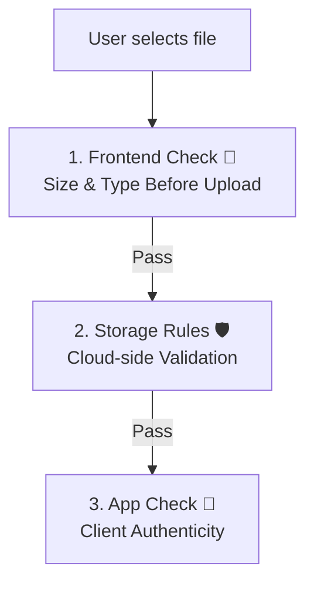
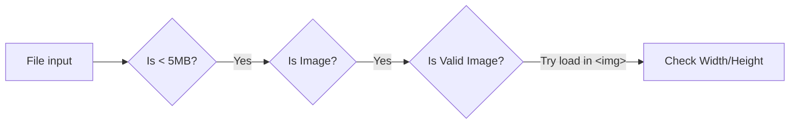
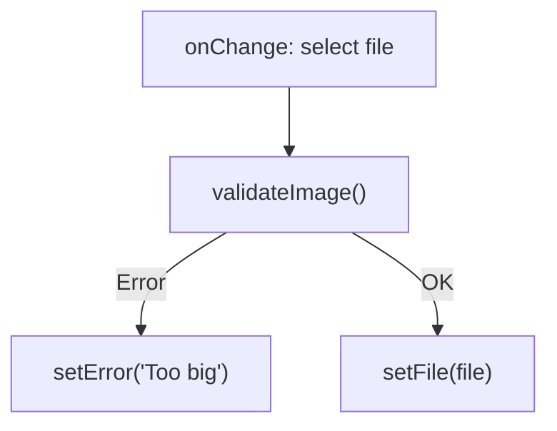
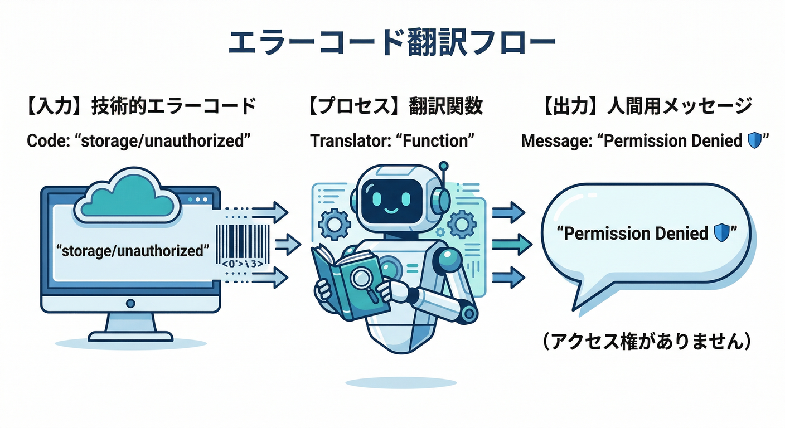
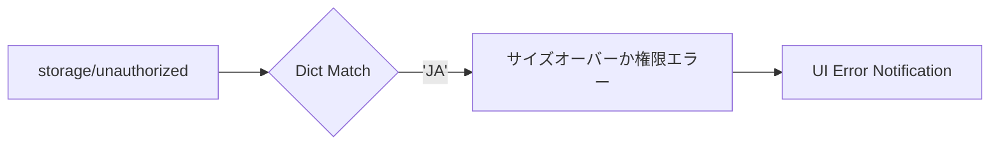
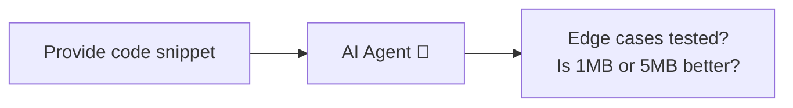

### 第7章：画像ファイルの事前チェック（弾く基準を決める）🚦🖼️

この章は「**アップロード前にヤバいファイルを止める**」がテーマだよ🙂
ただし大事なのは、**ここはUX（使いやすさ）担当**で、セキュリティの最終防衛ラインは **Storage Rules / App Check** 側ってこと！🛡️🧿（Rules では `request.resource.size` / `request.resource.contentType` でチェック可能）([Firebase][1])

---

#### 学ぶこと📚✨

* **許可する画像の種類（MIME）**を“拡張子じゃなく” **`file.type`（contentType）中心**で考える🧠
* **サイズ上限**を決めて、アップ前に弾く（通信もお金も守れる）💸🚫
* **「画像として読めるか」**を実際にデコードして確認する（かなり強い）💪
* 失敗したときの **わかりやすいエラーメッセージ**を作る🙂🧯
* （おまけ）Storage側のエラーコードも拾って、表示を親切にする🧑‍🍳([Firebase][2])

---

## 1) まず「弾く基準」を決めよう📏✅

プロフィール画像なら、だいたいこれが鉄板です👇

* 許可MIME：`image/jpeg`, `image/png`, `image/webp`

  * ⚠️ `image/svg+xml` は避けるのが無難（後で事故りやすい）💥
* 最大サイズ：5MB（まずはこれでOK）🧱
* （任意）縦横：最小 64px、最大 4096px くらい

  * 縦横は Rules では判定できないので、**クライアント or サーバー処理**担当になるよ🧠

---

## 2) React側：ファイル選択UIで “入り口フィルタ” をかける🚪🧩

### ✅ inputの時点で軽く絞る（でも過信しない）

`accept` は「ファイル選択ダイアログの候補」を絞るだけで、**セキュリティではない**よ🙂

```tsx
<input
  type="file"
  accept="image/jpeg,image/png,image/webp"
  onChange={onChange}
/>
```

---

## 3) 本命：validate関数を作る（ここが第7章の核心🔥）




ここでは **3段階チェック**にするよ👇

1. **サイズ**（デカすぎを止める）
2. **MIME**（許可リスト方式）
3. **デコードできるか**（画像っぽい偽装を落とす）




> Firebase JS SDK は 2026-02-05 時点で v12.9.0 が出てるので、今の流れは “modular API前提” でOKだよ🧩([Firebase][3])

### validate実装（コピペでOK）✂️

```ts
const ALLOWED_MIME = new Set(["image/jpeg", "image/png", "image/webp"]);
const MAX_BYTES = 5 * 1024 * 1024; // 5MB

type Ok = {
  ok: true;
  width: number;
  height: number;
};
type Ng = {
  ok: false;
  code:
    | "no-file"
    | "too-large"
    | "bad-type"
    | "decode-failed"
    | "too-small-dim"
    | "too-large-dim";
  message: string;
};

function formatBytes(bytes: number) {
  const mb = bytes / (1024 * 1024);
  return `${mb.toFixed(2)}MB`;
}

async function getImageSize(file: File): Promise<{ width: number; height: number }> {
  // まず createImageBitmap（速い＆簡単）
  if ("createImageBitmap" in window) {
    const bmp = await createImageBitmap(file);
    const size = { width: bmp.width, height: bmp.height };
    // close がある環境は閉じる（メモリ節約）
    (bmp as any).close?.();
    return size;
  }

  // フォールバック（古い環境向け）
  return await new Promise((resolve, reject) => {
    const url = URL.createObjectURL(file);
    const img = new Image();
    img.onload = () => {
      URL.revokeObjectURL(url);
      resolve({ width: img.naturalWidth, height: img.naturalHeight });
    };
    img.onerror = () => {
      URL.revokeObjectURL(url);
      reject(new Error("decode failed"));
    };
    img.src = url;
  });
}

export async function validateProfileImage(file: File | null): Promise<Ok | Ng> {
  if (!file) return { ok: false, code: "no-file", message: "ファイルが選ばれてないよ🙂" };

  // 1) サイズ
  if (file.size > MAX_BYTES) {
    return {
      ok: false,
      code: "too-large",
      message: `ファイルが大きすぎるよ😵（上限 ${formatBytes(MAX_BYTES)} / 今 ${formatBytes(file.size)}）`,
    };
  }

  // 2) MIME（拡張子ではなく、ここを基準にする）
  if (!ALLOWED_MIME.has(file.type)) {
    return {
      ok: false,
      code: "bad-type",
      message: `この形式は未対応だよ🙅‍♂️（JPEG/PNG/WebPだけOK！ 今: ${file.type || "不明"}）`,
    };
  }

  // 3) デコードできるか（＝ほんとに画像っぽいか）
  try {
    const { width, height } = await getImageSize(file);

    // 任意：縦横の最低/最高
    if (width < 64 || height < 64) {
      return {
        ok: false,
        code: "too-small-dim",
        message: `画像が小さすぎるよ🥺（最小 64px 以上にしてね）`,
      };
    }
    if (width > 4096 || height > 4096) {
      return {
        ok: false,
        code: "too-large-dim",
        message: `画像が大きすぎるよ😵（最大 4096px までにしてね）`,
      };
    }

    return { ok: true, width, height };
  } catch {
    return {
      ok: false,
      code: "decode-failed",
      message: "画像として読み込めなかったよ🧯（壊れてる/未対応形式かも）",
    };
  }
}
```

---

## 4) Reactに組み込む（エラー表示＋プレビュー）👀✨




```tsx
import React, { useEffect, useRef, useState } from "react";
import { validateProfileImage } from "./validateProfileImage";

export function ProfileImagePicker(props: { onValidFile: (file: File) => void }) {
  const [previewUrl, setPreviewUrl] = useState<string | null>(null);
  const [error, setError] = useState<string | null>(null);
  const inputRef = useRef<HTMLInputElement | null>(null);

  useEffect(() => {
    return () => {
      if (previewUrl) URL.revokeObjectURL(previewUrl);
    };
  }, [previewUrl]);

  async function onChange(e: React.ChangeEvent<HTMLInputElement>) {
    setError(null);

    const file = e.target.files?.[0] ?? null;

    // 以前のプレビューを片付ける
    if (previewUrl) URL.revokeObjectURL(previewUrl);
    setPreviewUrl(null);

    const v = await validateProfileImage(file);
    if (!v.ok) {
      setError(v.message);
      // 同じファイルを選び直しても onChange が発火するようにリセット
      if (inputRef.current) inputRef.current.value = "";
      return;
    }

    // OKならプレビュー
    const url = URL.createObjectURL(file!);
    setPreviewUrl(url);
    props.onValidFile(file!);
  }

  return (
    <div style={{ display: "grid", gap: 12 }}>
      <input
        ref={inputRef}
        type="file"
        accept="image/jpeg,image/png,image/webp"
        onChange={onChange}
      />

      {error && (
        <div style={{ padding: 12, border: "1px solid #ddd", borderRadius: 8 }}>
          <div>⚠️ {error}</div>
        </div>
      )}

      {previewUrl && (
        <div style={{ display: "grid", gap: 8 }}>
          <div>プレビュー👀</div>
          
        </div>
      )}
    </div>
  );
}
```

---

## 5) 失敗UXの“地雷”だけ先に潰す💣🧯

* **HEIC/HEIF**（スマホ写真）を選ばれると、ブラウザによっては `file.type` が想定外 or デコード失敗しがち📱💥
  → メッセージで「JPEGに変換してね🙂」って案内すると親切
* `accept="image/*"` は **SVG も入ってくる**ことがあるので、プロフィール画像は **明示的に許可リスト**が安全🛡️
* 事前チェックがOKでも、最後は **Storage Rules** が止める（これが正しい）✅
  Rules側でも `contentType` と `size` を必ず縛ろうね([Firebase][1])

---

## 6) （おまけ）Storageのエラーコードを人間語にする🧑‍🍳💬





アップロード後の失敗も、ちゃんと“言い換え”できると神UIになる✨
公式のエラーコード一覧があるよ。([Firebase][2])

```ts
import { FirebaseError } from "firebase/app";

export function storageErrorToMessage(err: unknown): string {
  if (err instanceof FirebaseError) {
    switch (err.code) {
      case "storage/unauthenticated":
        return "ログインが必要みたい🔐 いったんログインしてね！";
      case "storage/unauthorized":
        return "権限がないよ🛡️ Storage Rules を確認してね！";
      case "storage/canceled":
        return "アップロードをキャンセルしたよ🙂";
      case "storage/retry-limit-exceeded":
        return "通信が不安定かも📶 もう一回やってみて！";
      case "storage/quota-exceeded":
        return "容量やクォータ上限に当たったかも💸（プラン/上限を確認）";
      default:
        return `アップロード失敗😵 (${err.code})`;
    }
  }
  return "アップロード失敗😵（原因がわからない…）";
}
```

---

## 7) AIでラクする（Antigravity / Gemini CLI / MCP）🤖🚀




ここ、AIにやらせると速い😎
Firebase の **MCP server** は **Antigravity / Gemini CLI** みたいな “MCPクライアント” から使えるよ。([Firebase][4])

おすすめの頼み方例👇

* 「プロフィール画像の許可MIMEを *JPEG/PNG/WebP* にしたい。validate関数をTypeScriptで書いて、テストケースも出して」
* 「この validate と Storage Rules（第16章予定）が矛盾してないかレビューして。穴があったら指摘して」

さらに App Check を使う場合は、Webなら reCAPTCHA v3 から入るのが王道（導入ページあり）だよ🧿([Firebase][5])

---

## 手を動かす（やること）🛠️🔥

1. `validateProfileImage()` を追加して、**サイズ/MIME/デコード**で弾く✅
2. Reactの選択UIに組み込んで、**エラー表示＋プレビュー**を出す👀✨
3. NG例をわざと試す（デカい画像、拡張子だけ画像っぽいファイル、など）💥

---

## ミニ課題🎯🧩

* NGになったとき、**「どうすれば通るか」**がわかるメッセージにしてみて🙂
  例）「5MB以下にしてね」「JPEG/PNG/WebPにしてね」「画像を保存し直してね」など

---

## チェック✅✨

* 画像以外を選んだら **アップロード前に止まる**🚫
* デカすぎる画像は **アップロード前に止まる**🚫
* 壊れた画像（デコードできない）は **アップロード前に止まる**🚫
* OK画像は **プレビューが出て、次のアップロードに進める**➡️

---

次は第8章で「アップロード前に圧縮・リサイズ」して、**速くて軽い“それっぽいアプリ”**にしていこう🗜️🚀

[1]: https://firebase.google.com/docs/storage/security?hl=ja&utm_source=chatgpt.com "Cloud Storage 用の Firebase セキュリティ ルールを理解する"
[2]: https://firebase.google.com/docs/storage/web/handle-errors "Handle errors for Cloud Storage on Web  |  Cloud Storage for Firebase"
[3]: https://firebase.google.com/support/release-notes/js?utm_source=chatgpt.com "Firebase JavaScript SDK Release Notes - Google"
[4]: https://firebase.google.com/docs/ai-assistance/mcp-server?utm_source=chatgpt.com "Firebase MCP server | Develop with AI assistance - Google"
[5]: https://firebase.google.com/docs/app-check/web/recaptcha-provider?utm_source=chatgpt.com "Get started using App Check with reCAPTCHA v3 in web apps"
