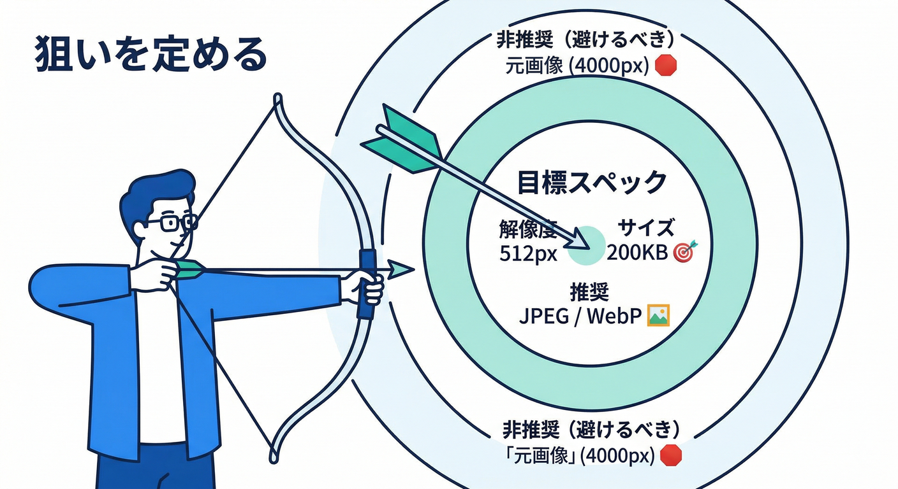
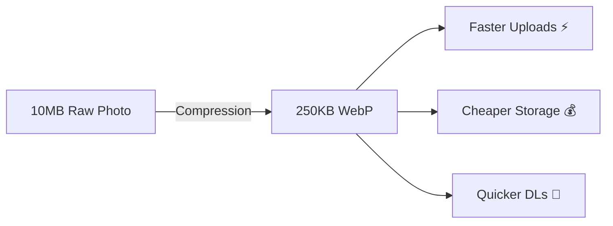
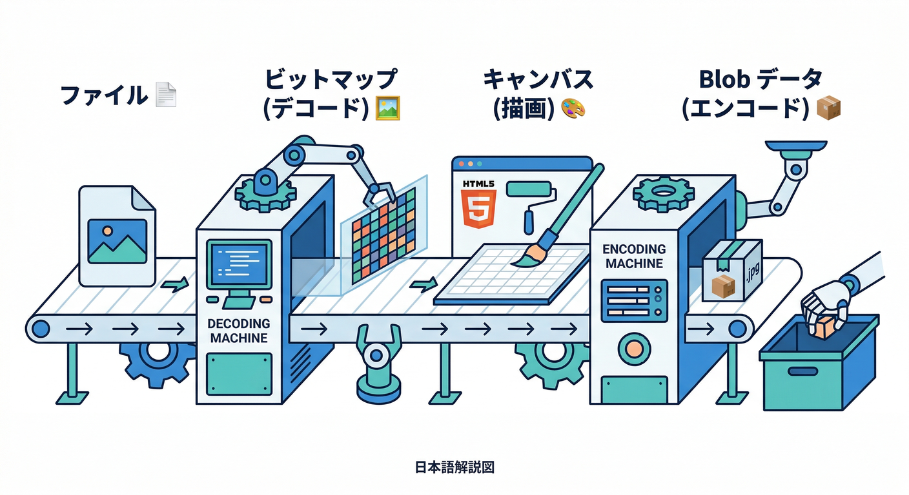
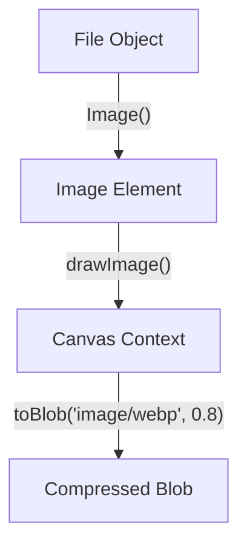
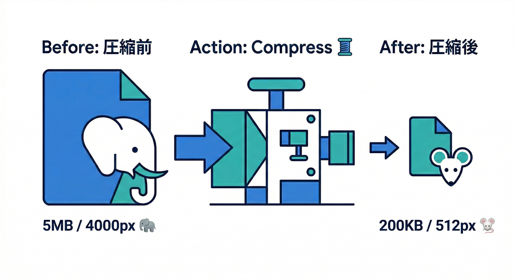
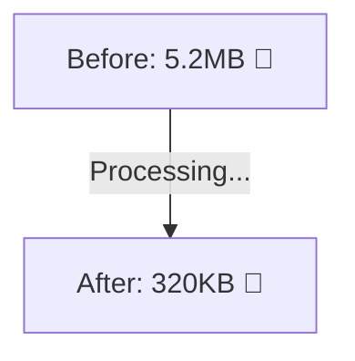
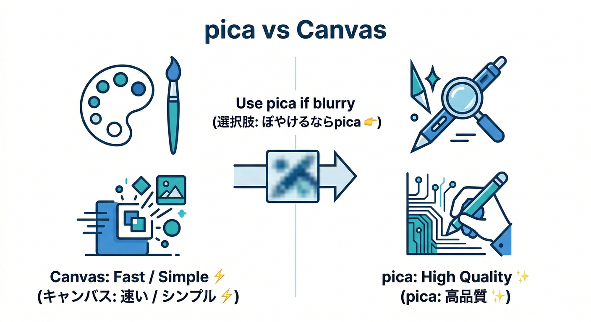
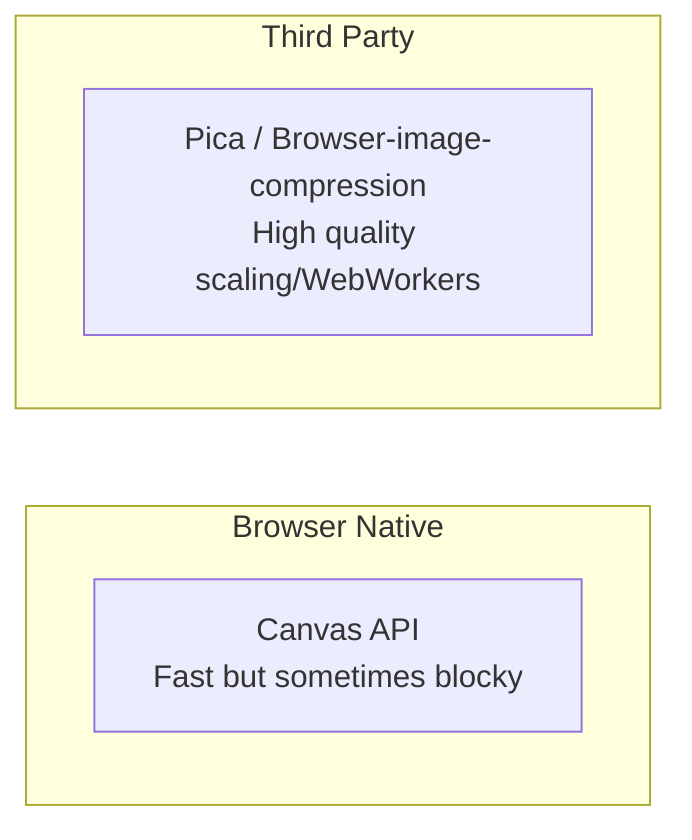
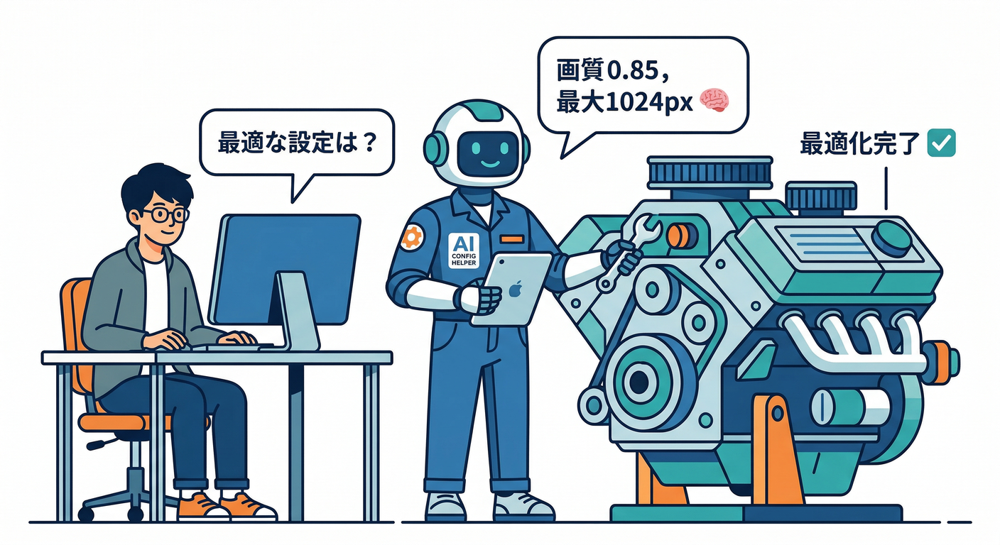
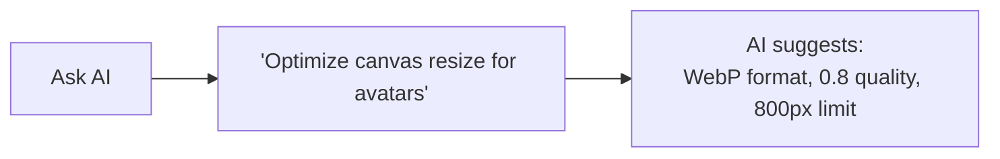

### 第8章：圧縮・リサイズ（アップロード前の軽量化）🗜️🖼️⚡

この章は「**アップロード前に**ブラウザ側で画像を軽くして、速くて気持ちいいUXにする」回です📶✨
Firebase の Storage は **Blob/File をそのままアップロード**できるので、圧縮後の Blob を渡せばOKです⬆️([Firebase][1])

---

## 1) なんで“先に軽くする”の？🤔💡

* **アップロードが速い**（待ち時間が減る）🚀
* **モバイル回線でも安心**📱
* **保存コストも下がる**💸
* 「プロフィール画像」みたいな用途だと、スマホの原寸（4000pxとか）は **ほぼ過剰**📸💦

---

## 2) まず“目標スペック”を決めよう🎯📏





プロフィール画像の定番目安（迷ったらコレ）👇

* 最大辺：**512px〜1024px**（まずは 512px 推し）🙂
* 形式：**JPEG**（写真向き） / **WebP**（軽くしたい時） / **PNG**（透過が必要な時）🧩
* 目標サイズ：**〜200KB〜500KB**（アプリの方向性で調整）📦

⚠️注意：透過PNGをJPEGにすると背景が変になることがあります（透過が消える）😵‍💫
→ 透過が要るなら **PNGかWebP** が安全寄り🛟

---

## 3) 実装①：ライブラリ無しでやる（Canvas版）🧰✨





ポイントはこの3つだけ👇

1. 画像を読み込む（**createImageBitmap** が速くて便利）🧠
2. 目的サイズに合わせて **Canvas に描画**🖌️
3. **toBlob()** で JPEG/WebP にして軽量化🗜️
   （toBlob は形式と画質を指定でき、画質は 0.0〜1.0 の範囲です）([html.spec.whatwg.org][2])

さらに、createImageBitmap には **EXIFの向き**を扱うオプションもあります（既定は “from-image”）📸🧭([MDN ウェブドキュメント][3])

---

### A. 圧縮・リサイズ関数（TypeScript）🧩

* **最大辺を maxSide に収める**
* 出力形式は基本 JPEG（透過が必要ならPNG/WebPへ）
* 既に小さいなら圧縮スキップ（ムダに劣化させない）👍

```ts
type CompressOptions = {
  maxSide: number;              // 例: 512
  quality: number;              // 例: 0.82 (JPEG/WebP向け)
  preferWebp?: boolean;         // WebPを優先するか
  keepPngIfHasAlpha?: boolean;  // 透過がありそうならPNGに逃がすか
};

function formatBytes(bytes: number): string {
  const units = ["B", "KB", "MB", "GB"];
  let v = bytes;
  let i = 0;
  while (v >= 1024 && i < units.length - 1) {
    v /= 1024;
    i++;
  }
  return `${v.toFixed(i === 0 ? 0 : 1)} ${units[i]}`;
}

async function supportsWebp(): Promise<boolean> {
  // 超軽量チェック: 1x1のcanvasでwebpがdataURLとして出せるか
  const c = document.createElement("canvas");
  c.width = 1; c.height = 1;
  const url = c.toDataURL("image/webp");
  return url.startsWith("data:image/webp");
}

async function canvasToBlob(
  canvas: HTMLCanvasElement,
  type: string,
  quality?: number
): Promise<Blob> {
  return await new Promise((resolve, reject) => {
    canvas.toBlob((b) => {
      if (!b) return reject(new Error("toBlob failed"));
      resolve(b);
    }, type, quality);
  });
}

export async function compressImageForUpload(
  file: File,
  opt: CompressOptions
): Promise<{ blob: Blob; info: string; outType: string }> {
  // 1) 画像デコード（EXIF向きは既定で from-image）
  const bitmap = await createImageBitmap(file, { imageOrientation: "from-image" });

  // 2) リサイズ寸法を計算（アスペクト維持）
  const srcW = bitmap.width;
  const srcH = bitmap.height;

  const scale = Math.min(1, opt.maxSide / Math.max(srcW, srcH));
  const dstW = Math.max(1, Math.round(srcW * scale));
  const dstH = Math.max(1, Math.round(srcH * scale));

  // 3) Canvasに描画
  const canvas = document.createElement("canvas");
  canvas.width = dstW;
  canvas.height = dstH;

  const ctx = canvas.getContext("2d");
  if (!ctx) throw new Error("2D context not available");

  ctx.imageSmoothingEnabled = true;
  ctx.imageSmoothingQuality = "high";
  ctx.drawImage(bitmap, 0, 0, dstW, dstH);

  // 4) 出力形式を決める
  //    - 基本はJPEG
  //    - WebPが使えて preferWebp なら WebP
  //    - 透過が必要なら PNG/WebP
  let outType = "image/jpeg";

  const webpOk = opt.preferWebp ? await supportsWebp() : false;
  if (webpOk) outType = "image/webp";

  // PNGのまま残したい要件があるなら、ここはアプリ方針で調整！
  // 透過検出はちゃんとやると少し重いので、この教材では「方針スイッチ」にしておく
  if (opt.keepPngIfHasAlpha && file.type === "image/png" && !webpOk) {
    outType = "image/png";
  }

  // 5) エンコード（PNGはqualityが効かないので省略）
  const blob =
    outType === "image/png"
      ? await canvasToBlob(canvas, outType)
      : await canvasToBlob(canvas, outType, opt.quality);

  // 6) すでに小さいなら「圧縮しない」判断もアリ（劣化を避ける）
  //    例: blobが元より大きくなったら元を使う、など
  const info =
    `before=${formatBytes(file.size)} (${srcW}x${srcH}) / ` +
    `after=${formatBytes(blob.size)} (${dstW}x${dstH}) / type=${outType}`;

  return { blob, info, outType };
}
```

✅ これで「縮小＋圧縮」できるようになります🎉
（Canvas→Blob は toBlob/quality の仕様に沿ってます）([html.spec.whatwg.org][2])

---

## 4) Reactで “元サイズ / 圧縮後サイズ” を見せるUI 🧑‍🍳📊





「軽くなった！」が目で分かると、学習もアプリも気持ちいいです😆✨

```tsx
import React, { useMemo, useState } from "react";
import { compressImageForUpload } from "./compressImageForUpload";

// 既存のアップロード関数（第5章で作ったやつ）に Blob を渡すための例
import { getStorage, ref, uploadBytes, getDownloadURL } from "firebase/storage";

async function uploadProfileImageBlob(blob: Blob, uid: string, contentType: string) {
  const storage = getStorage();
  const path = `users/${uid}/profile/${crypto.randomUUID()}`;
  const fileRef = ref(storage, path);

  await uploadBytes(fileRef, blob, { contentType }); // BlobでもOK👍
  const url = await getDownloadURL(fileRef);
  return { path, url };
}

function blobToObjectUrl(blob: Blob): string {
  return URL.createObjectURL(blob);
}

export default function ProfileImageCompressDemo(props: { uid: string }) {
  const [file, setFile] = useState<File | null>(null);
  const [compressed, setCompressed] = useState<{ blob: Blob; info: string; outType: string } | null>(null);
  const [status, setStatus] = useState<string>("");

  const originalUrl = useMemo(() => (file ? URL.createObjectURL(file) : ""), [file]);
  const compressedUrl = useMemo(() => (compressed ? blobToObjectUrl(compressed.blob) : ""), [compressed]);

  async function onPick(e: React.ChangeEvent<HTMLInputElement>) {
    const f = e.target.files?.[0] ?? null;
    setFile(f);
    setCompressed(null);
    setStatus("");
    if (!f) return;

    const r = await compressImageForUpload(f, {
      maxSide: 512,
      quality: 0.82,
      preferWebp: true,
      keepPngIfHasAlpha: true,
    });
    setCompressed(r);
  }

  async function onUpload() {
    if (!compressed) return;
    setStatus("アップロード中…⬆️");
    try {
      const res = await uploadProfileImageBlob(compressed.blob, props.uid, compressed.outType);
      setStatus(`完了🎉 url=${res.url}`);
    } catch (e: any) {
      setStatus(`失敗😭 ${e?.message ?? String(e)}`);
    }
  }

  return (
    <div style={{ display: "grid", gap: 12, maxWidth: 720 }}>
      <h2>第8章：圧縮・リサイズ体験🗜️</h2>

      <input type="file" accept="image/*" onChange={onPick} />

      {file && (
        <div style={{ display: "grid", gap: 8 }}>
          <div>元画像🧾: {file.name} / {Math.round(file.size / 1024)} KB / {file.type}</div>
          
        </div>
      )}

      {compressed && (
        <div style={{ display: "grid", gap: 8 }}>
          <div>圧縮後✅: {compressed.info}</div>
          
          <button onClick={onUpload}>この圧縮版をアップロード⬆️</button>
        </div>
      )}

      {status && <div>状態: {status}</div>}
    </div>
  );
}
```

Blob をそのまま Storage に上げられるのがめちゃ楽です⬆️😎([Firebase][1])

---

## 5) 実装②：画質をもっと良くしたい人向け（pica）🪄✨





Canvasの縮小は「端末やブラウザ差」で画質がブレることがあります🥲
**高品質リサイズ特化**なら **pica** が定番です（WebWorker / WebAssembly / createImageBitmap などを良い感じに使ってくれる方針）🧠⚙️([GitHub][4])

* “まずはCanvas版で理解 → 画質が気になったらpica” が学習的にもおすすめ📚✨

---

## 6) Antigravity / Gemini CLI で“設定決め”を爆速にする🚀🤖





ここ、AIが一番役に立ちます😆
「正解が1つじゃない」からです🎯

### 使えるネタ（プロンプト例）📝✨

* 「プロフィール画像、**最大辺512px** と **1024px** で、画質とサイズの落としどころどう決める？」🤔
* 「JPEG quality 0.8 / 0.85 / 0.9 の違いを、**人間が気づくライン**で説明して」👀
* 「透過PNGをJPEGにすると何が起きる？UIでどう注意書き出す？」⚠️

さらに Firebase の **MCP server** は、**Antigravity / Gemini CLI** など複数のMCPクライアントと連携できる前提が公式に書かれています🧩([Firebase][5])
→ 「実装しながら調べる」を短い往復で回せるのが強いです💻🔁

---

## 7) Firebase AI Logic もちょい絡めよう🤖🧠（この章のつなぎ）

第8章は“軽量化”が主役だけど、アップロードが速くなると **AI処理も気軽に足せる**ようになります✨
例えば、アップロード後に AI で「画像の短い説明文（alt）」を作って Firestore に保存…みたいな流れ📝

ちなみに Firebase AI Logic のドキュメントでは、特定モデルの **提供終了日**（例：2026-03-31）が明記されていて、移行先例も出ています📅⚠️([Firebase][6])
→ 教材・サンプルコードは「モデル名を固定しすぎない」設計が安心です🛟

---

## 8) よくある落とし穴（ここだけ読んでも得）⚠️😵‍💫

* **向きが90度ズレる**📸↪️
  → createImageBitmap の **imageOrientation** を意識（既定が from-image）🧭([MDN ウェブドキュメント][3])
* **透過が消える**（PNG→JPEG）🫥
  → 透過要るなら PNG/WebP に逃がす🛟
* **WebPが使えない環境がある**（超レアだけど）🧩
  → 「対応してたらWebP、ダメならJPEG」にすると安全
* **重すぎて固まる**🥶
  → 画像が巨大なら maxSide を小さめに（512/768）＋必要なら pica を検討🪄([GitHub][4])
* （発展）UIを固めたくないなら OffscreenCanvas を検討
  → convertToBlob でBlob化できるのが公式ドキュメントにあります🧰([MDN ウェブドキュメント][7])

---

## 9) ミニ課題🎒✨

1. maxSide を **512 / 1024** で切り替えられるUIを追加🎛️
2. 圧縮前後の

   * サイズ（KB）📦
   * 解像度（px）📐
   * 形式（JPEG/WebP/PNG）🧾
     を画面に表示👀
3. 「元より大きくなったら元を使う」判定を入れる（劣化＆逆効果防止）🛡️

---

## 10) チェック✅😄

* 画像を選ぶ → 圧縮 → **軽くなった数字**が見える📉
* Blob を Firebase Storage にアップできる⬆️([Firebase][1])
* 透過/向き/形式の落とし穴を説明できる🧠

---

次の第9章は、この圧縮版をアップする時に超効く「ContentType / cacheControl」あたりのメタデータ回に入ります📎✨（アップロード体験が一気に“実務っぽく”なります😎）

[1]: https://firebase.google.com/docs/storage/web/upload-files?utm_source=chatgpt.com "Upload files with Cloud Storage on Web - Firebase"
[2]: https://html.spec.whatwg.org/multipage/canvas.html?utm_source=chatgpt.com "Canvas Element"
[3]: https://developer.mozilla.org/ja/docs/Web/API/Window/createImageBitmap?utm_source=chatgpt.com "Window: createImageBitmap() メソッド - Web API | MDN"
[4]: https://github.com/nodeca/pica?utm_source=chatgpt.com "nodeca/pica: Resize image in browser with high quality ..."
[5]: https://firebase.google.com/docs/ai-assistance/mcp-server?utm_source=chatgpt.com "Firebase MCP server | Develop with AI assistance - Google"
[6]: https://firebase.google.com/docs/ai-logic/models?utm_source=chatgpt.com "Learn about supported models | Firebase AI Logic - Google"
[7]: https://developer.mozilla.org/en-US/docs/Web/API/OffscreenCanvas/convertToBlob?utm_source=chatgpt.com "OffscreenCanvas: convertToBlob() method - Web APIs - MDN"
