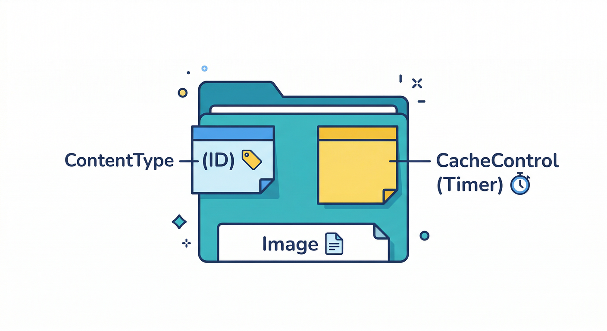
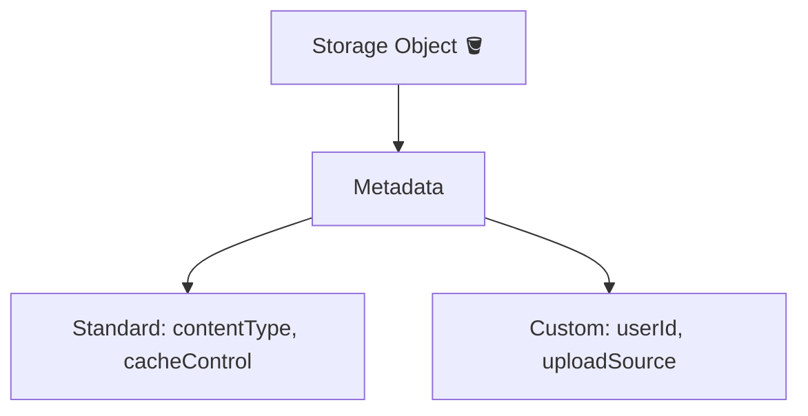
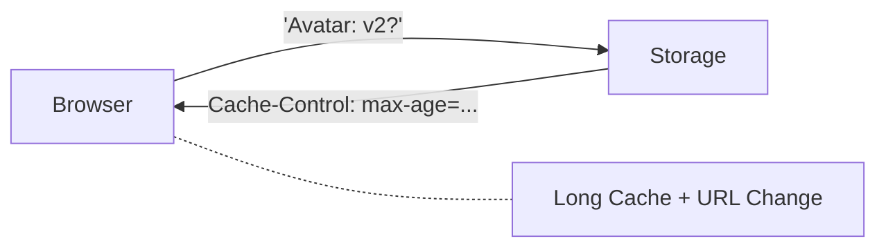
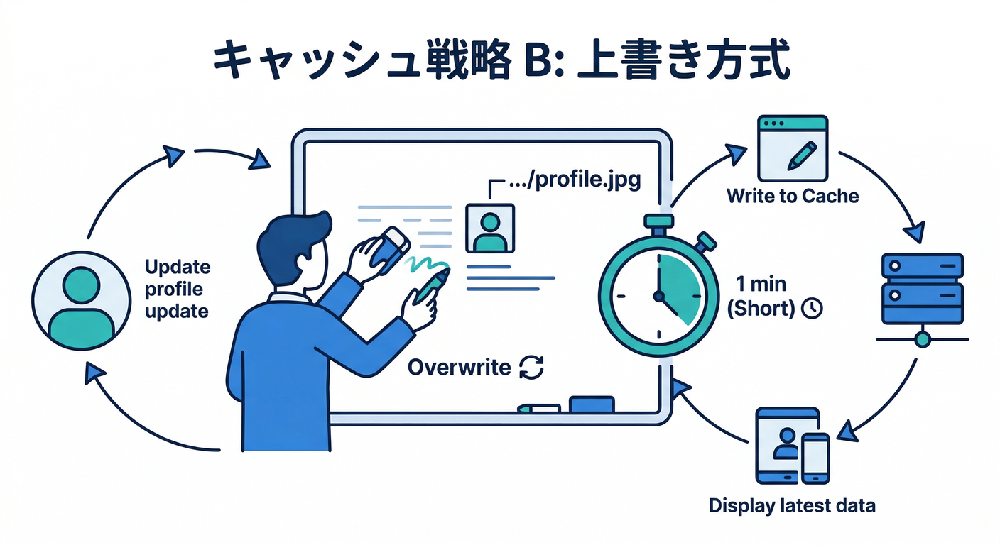
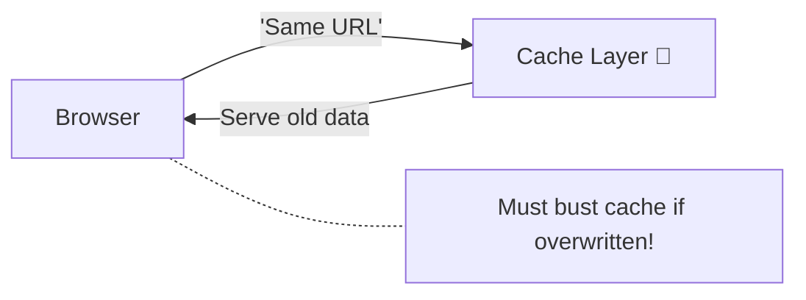
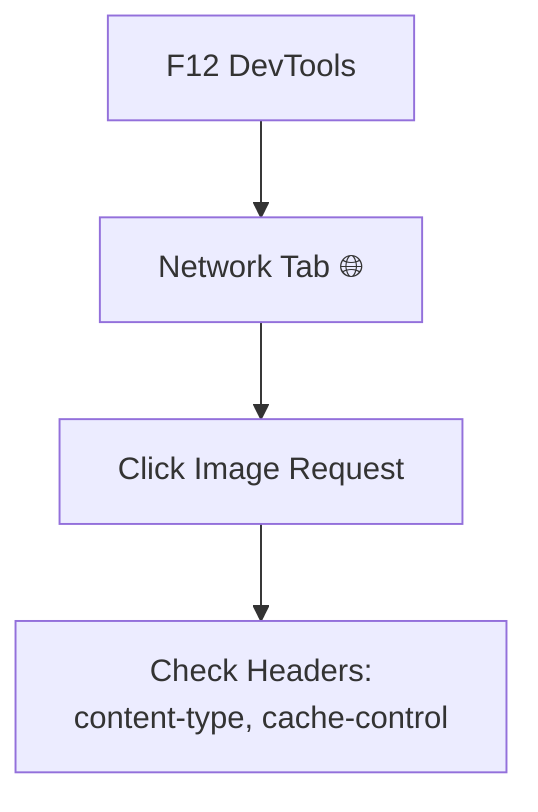
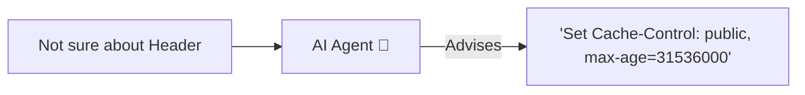

### 第9章：メタデータ入門（ContentType / cacheControl）📎🖼️

この章は「画像アップロードはできた！でも…**表示が変だったり、更新したのに古い画像が出たりする**💥」を卒業する回だよ〜🙂‍↕️✨
Storage の **メタデータ**をちゃんと付けるだけで、アプリの“現実感”が一気に上がる📷☁️

---

## 1) まず読む：メタデータって何？🤔📎





Storage のファイルは「中身（バイナリ）」だけじゃなくて、**一緒に“札（ふだ）”みたいな情報**を持てるよ〜🏷️
その札が **メタデータ**。Web だと特に重要なのがこの2つ👇

### ✅ `contentType`（MIMEタイプ）🧪

「これは画像です（image/jpeg など）」っていう宣言。
これがズレると、**ブラウザが画像として扱わずダウンロード扱いになったり**、表示が不安定になったりする😵‍💫
Firebase の Web SDK でも、アップロード時にメタデータとして指定できるよ。([Firebase][1])

> 補足：Cloud Storage 側はオブジェクトの `Content-Type` メタデータを持っていて、これが HTTP の `Content-Type` ヘッダーに反映されるイメージ🧠([Google Cloud Documentation][2])

---

### ✅ `cacheControl`（キャッシュのルール）🧊⚡

「この画像、どれくらいキャッシュしてOK？」を決めるやつ。
キャッシュが効くと速い🚀けど、設定ミスると **“更新したのに古い画像が出る”** が発生しやすい💥

* `Cache-Control` は、ブラウザや中間キャッシュに対する指示（`max-age` とか `no-store` とか）📦([MDN ウェブドキュメント][3])
* Cloud Storage には “built-in cache” もあって、`Cache-Control` の有無で挙動が変わる（未設定だとデフォルト値が使われる）🧠([Google Cloud Documentation][4])

---

## 2) ここが超重要：プロフィール画像の“正解”は2パターンある🎯🖼️

### パターンA：**毎回パスが変わる（履歴を残す設計）**📚✨ ← 今回のロードマップ寄り




例：`users/{uid}/profile/{uuid}.jpg`
この場合、**古いURLは古い画像専用**になるから、長期キャッシュが最強💪

* おすすめ：`public,max-age=31536000,immutable`（1年＋変わらない前提）📦🚀([web.dev][5])

### パターンB：**同じパスに上書き（常に profile.jpg）**♻️🫠





例：`users/{uid}/profile/profile.jpg`
この場合、**URLが同じなのに中身が変わる**ので、長期キャッシュは事故りやすい💥

* おすすめ：短め `public,max-age=60` とか、毎回再検証系（`no-cache` など）🧯([MDN ウェブドキュメント][3])

---

## 3) 手を動かす：アップロード時に metadata を付ける⬆️📎

ここでは「パターンA（毎回パス変わる）」でいくよ〜✨

#### ✅ やること

1. アップロード時に `contentType` と `cacheControl` を付ける
2. `getMetadata()` で確認
3. `updateMetadata()` で後から変更して挙動を観察🧪

> ファイルメタデータの取得・更新は Firebase 公式の “file metadata” ドキュメントにまとまってるよ。([Firebase][6])

```ts
import {
  getStorage,
  ref,
  uploadBytesResumable,
  getDownloadURL,
  getMetadata,
  updateMetadata,
} from "firebase/storage";

export async function uploadProfileImageWithMeta(file: File, uid: string) {
  const storage = getStorage();

  // “履歴を残す”前提：毎回パスを変える（= キャッシュ事故が起きにくい）
  const ext = guessExt(file);
  const fileId = `${crypto.randomUUID()}${ext}`;
  const path = `users/${uid}/profile/${fileId}`;
  const fileRef = ref(storage, path);

  // ✅ メタデータ付与（contentType / cacheControl）
  const metadata = {
    contentType: file.type || "image/jpeg",
    cacheControl: "public,max-age=31536000,immutable",
  };

  await new Promise<void>((resolve, reject) => {
    const task = uploadBytesResumable(fileRef, file, metadata);
    task.on("state_changed", undefined, reject, () => resolve());
  });

  const url = await getDownloadURL(fileRef);
  return { path, url };
}

function guessExt(file: File): string {
  switch (file.type) {
    case "image/png":
      return ".png";
    case "image/webp":
      return ".webp";
    case "image/jpeg":
      return ".jpg";
    default:
      return ""; // 不明でもOK（気になるなら第8章の変換後に決める）
  }
}
```

* Web SDK のアップロードは `uploadBytesResumable(..., metadata)` みたいにメタデータを一緒に渡せるよ。([Firebase][1])
* `cacheControl` の中身は HTTP の `Cache-Control` ルールそのもの（`max-age` や `immutable` など）📦([MDN ウェブドキュメント][3])

---

## 4) 手を動かす：メタデータを見て、後から変える🔍🧪

```ts
import { getStorage, ref, getMetadata, updateMetadata } from "firebase/storage";

export async function inspectMetadata(path: string) {
  const storage = getStorage();
  const r = ref(storage, path);
  const meta = await getMetadata(r);

  console.log("contentType:", meta.contentType);
  console.log("cacheControl:", meta.cacheControl);
  console.log("size:", meta.size);
  console.log("updated:", meta.updated);

  return meta;
}

export async function setShortCache(path: string) {
  const storage = getStorage();
  const r = ref(storage, path);

  // ✅ よくある：プロフィール画像を短めキャッシュ（上書き型なら特に）
  await updateMetadata(r, {
    cacheControl: "public,max-age=60",
  });
}

// おまけ：メタデータを“消す”こともできる（null で削除扱い）
export async function removeCacheControl(path: string) {
  const storage = getStorage();
  const r = ref(storage, path);

  await updateMetadata(r, {
    cacheControl: null,
  });
}
```

* `getMetadata()` / `updateMetadata()` は Firebase 公式で案内されてる操作だよ。([Firebase][6])
* “null でメタデータ削除”も公式に書かれてるやつ（地味に便利）🧽([Firebase][6])

---

## 5) 動作確認：キャッシュが効いてるかを目で見る👀⚡




一番ラクなのはブラウザの DevTools（F12）で確認する方法だよ🧰✨

### ✅ 確認ポイント

* Network タブで画像リクエストを見て、Response Headers に

  * `content-type: image/...`
  * `cache-control: ...`
    が付いてるかチェック👀📎
* 更新したのに変わらない場合は、**「キャッシュで古いのを見てる」**可能性が高い🧊💥
  `Cache-Control` のルール次第で「どれくらい古いのを使っていいか」が決まるよ。([MDN ウェブドキュメント][3])

---

## 6) ミニ課題（やると一気に理解が固まる）🧠✨

### 課題A：あなたのアプリはどっち？🧩

* **履歴を残す（パスが毎回変わる）** → 長期キャッシュ案を採用
* **上書き（パス固定）** → 短期キャッシュ or 再検証案を採用

そして、採用した `cacheControl` を1行で説明してみて✍️🙂
（例：「毎回パスが変わるから 1年キャッシュでも古い画像にならない」など）

### 課題B：わざと事故らせて直す🧯

1. `cacheControl: public,max-age=31536000` を付けて
2. **同じパスに上書き**した場合、どんな“ズレ”が起きるか観察👀💥
3. 解決策を2つ書く（例：パスを変える／max-ageを短くする）

---

## 7) チェック（言えたら勝ち🏆）✅😎

* `contentType` は **画像として扱わせるための宣言**（表示の安定）🖼️
* `cacheControl` は **速さと更新反映のバランス**（UXの命）⚡🧊
* 「履歴でパスが変わる」なら **長期キャッシュが最強**🚀
* 「上書き」なら **短期 or 再検証**に寄せる🧯

---

## 8) AIで“現実アプリ感”をさらに上げる🤖✨（この章と相性よい）

### ✅ アップロード直後に「altテキスト」を自動生成📝🖼️

* 画像アップロード完了
  → Firebase AI Logic で「短い説明文」を生成
  → Firestore に保存（表示・検索・アクセシビリティが一気に良くなる）🌈
  Firebase AI Logic は Gemini / Imagen をアプリから扱える仕組みとして公式に案内されてるよ。([Firebase][7])

### ✅ Antigravity / Gemini CLI で“メタデータ相談”を爆速に💻🚀




* Gemini CLI の Firebase 拡張を入れると、Firebase っぽい作業（初期化や AI 機能の導入など）を CLI から進めやすくなるよ。([Firebase][8])
* さらに Firebase MCP server を使うと、AI ツールが Firebase プロジェクトやコードベースを扱うための“道具”を持てる。([Firebase][9])

> ⚠️ ちょい安全メモ：AIコーディング系ツールは脆弱性が話題になったこともあるので、**ツール更新**と**怪しいリポジトリで実行しない**は徹底で🙏([TechRadar][10])

---

## 9) よくあるハマり集（先に潰す）🧯💡

* **画像なのに表示されずダウンロードっぽい**
  → `contentType` がズレてる可能性。アップロード時に明示する（or `updateMetadata` で修正）🖼️📎([Firebase][6])
* **更新したのに古い画像が出る**
  → `cacheControl` が長すぎる or パス固定で上書きしてる可能性。
  解決：①パスを変える（履歴方式）②短期キャッシュ ③再検証寄りにする🧊🧯([MDN ウェブドキュメント][3])
* **`updateMetadata` が Permission denied**
  → Rules 的には “メタデータ更新も write” 扱いになるので、書き込み権限が必要（第15〜16章の守りと繋がるやつ）🛡️([Firebase][6])

---

次の第10章は「カスタムメタデータはほどほど（DBと使い分け）」だけど、ここまでで **“表示の安定＋キャッシュ事故回避”** ができて、かなり実務っぽくなるよ〜😎📎✨

[1]: https://firebase.google.com/docs/storage/web/upload-files?utm_source=chatgpt.com "Upload files with Cloud Storage on Web - Firebase"
[2]: https://docs.cloud.google.com/storage/docs/metadata?utm_source=chatgpt.com "Object metadata | Cloud Storage"
[3]: https://developer.mozilla.org/ja/docs/Web/HTTP/Reference/Headers/Cache-Control?utm_source=chatgpt.com "Cache-Control ヘッダー - HTTP - MDN - Mozilla"
[4]: https://docs.cloud.google.com/storage/docs/caching?utm_source=chatgpt.com "Caching with Cloud Storage built-in cache"
[5]: https://web.dev/articles/http-cache?utm_source=chatgpt.com "Prevent unnecessary network requests with the HTTP Cache"
[6]: https://firebase.google.com/docs/storage/web/file-metadata?utm_source=chatgpt.com "Use file metadata with Cloud Storage on Web - Firebase"
[7]: https://firebase.google.com/docs/ai-logic?utm_source=chatgpt.com "Gemini API using Firebase AI Logic - Google"
[8]: https://firebase.google.com/docs/ai-assistance/gcli-extension?utm_source=chatgpt.com "Firebase extension for the Gemini CLI"
[9]: https://firebase.google.com/docs/ai-assistance/mcp-server?utm_source=chatgpt.com "Firebase MCP server | Develop with AI assistance - Google"
[10]: https://www.techradar.com/pro/security/google-gemini-security-flaw-could-have-let-anyone-access-systems-or-run-code?utm_source=chatgpt.com "Google Gemini security flaw could have let anyone access systems or run code"
