### 第10章：カスタムメタデータは“ほどほど”に（DBと使い分け）🧠📦

この章はズバリ…
**「Storageのカスタムメタデータは“ちょい足し”まで」**にして、**アプリの情報はFirestoreに置く**判断ができるようになる回です😎✨

---

## この章のゴール🎯

* Storageの**メタデータ**（`contentType` / `cacheControl` / `customMetadata`）の役割をつかむ📎
* 「これはStorage」「これはFirestore」って**置き場所を迷わなくなる**🧭
* Firestoreに **画像レコード（path / status / createdAt など）** を作って、アプリっぽい整合性を作る🗃️✨
* AI（Firebase AI Logic）で作った **説明文・タグ** を **Firestoreに保存**する流れを作る🤖📝

---

## まず結論🔥（ここ超大事）

**カスタムメタデータは便利だけど、アプリ情報を詰め込みすぎない！**
公式も「アプリ固有データはDB推奨」と明言しています。([Firebase][1])

理由はシンプル👇

* `customMetadata` は **文字列の key/value だけ**（型が弱い）([Firebase][1])
* **サイズ制限あり**（上限は “合計 8 KiB / オブジェクト”）([Google Cloud Documentation][2])
* しかも **ストレージコストがかかる**（メタデータも保存データ扱い）([Google Cloud Documentation][3])
* Firestoreみたいに「検索」「並び替え」「リアルタイム同期」が得意じゃない😵‍💫（＝アプリの状態管理に不向き）

だから運用方針はこう👇

✅ **Storage**：ファイル本体＋配信に効く最低限のメタデータ（`contentType`/`cacheControl` など）
✅ **Firestore**：アプリの意味を持つ情報（状態、説明、タグ、履歴、誰の何、公開範囲…）

---

## 使い分け早見表👀✨

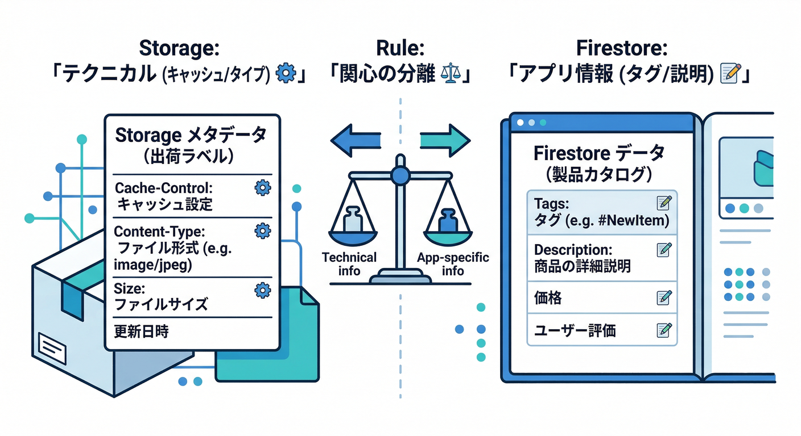

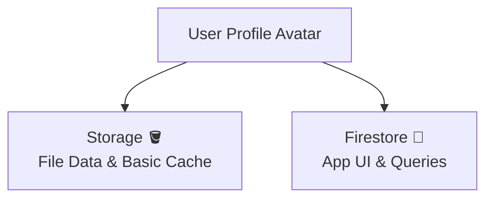

| 置き場所             | 何を置く？              | 例                                                                             |
| ---------------- | ------------------ | ----------------------------------------------------------------------------- |
| Storage（メタデータ）📦 | “配信・ブラウザ挙動”に効くもの中心 | `contentType`, `cacheControl`, （最小限の）`customMetadata`                         |
| Firestore 🗃️    | アプリが必要とする情報ぜんぶ     | `path`, `status`, `createdAt`, `size`, `tags`, `altText`, `currentPhotoPath`… |

> `updateMetadata()` は「指定した項目だけ更新」で、他はそのまま残ります🧠（地味に便利！）([Firebase][1])

---

## 今日のハンズオン🛠️：Firestoreに「画像レコード」を作ろう📷🗃️

### 作るデータ構造（おすすめ）🧱

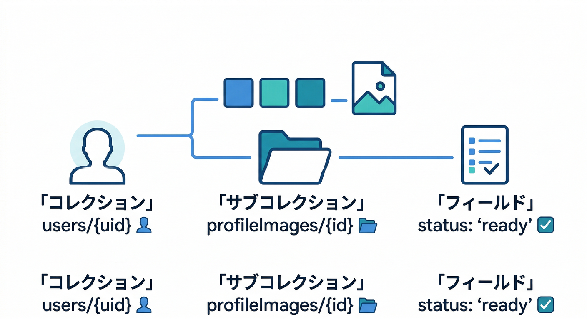

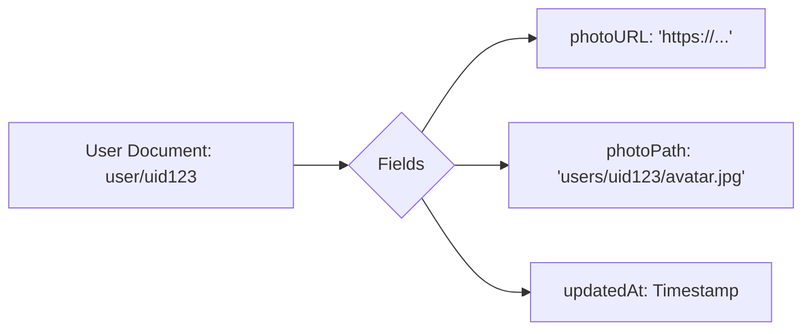

* `users/{uid}`（ユーザー本体）

  * `photoPath`：現在のプロフィール画像のStorageパス
  * `photoUpdatedAt`：更新時刻

* `users/{uid}/profileImages/{imageId}`（履歴・状態）

  * `path`：Storageパス（これが主キー感覚）
  * `status`：`uploading | ready | failed`
  * `createdAt`：作成時刻
  * `contentType` / `size`：表示やチェックに便利
  * `cacheControl`：設定したならメモしてもOK
  * `altText`：AIが生成した説明（後でUIの`alt`に使う）🤖
  * `tags`：AIタグ（検索・分類）🏷️

この形にすると、**「アップロード中…」表示**も、**失敗時の復旧**も、**履歴戻し**も全部やりやすくなります💪✨

---

## 実装例（TypeScript）🧩✨

> ここでは「Storageへアップロード → Firestoreに記録 → 現在のphotoPath更新」までやります🔁

#### 1) 画像レコード用の型🧠

```ts
export type ProfileImageStatus = "uploading" | "ready" | "failed";

export type ProfileImageRecord = {
  path: string;              // Storage path
  status: ProfileImageStatus;
  createdAt: unknown;        // serverTimestamp を入れる想定
  updatedAt: unknown;

  // あると便利
  contentType?: string;
  size?: number;

  // AI（後で追加）
  altText?: string;
  tags?: string[];
};
```

#### 2) アップロード→Firestore反映（本体）⬆️🗃️

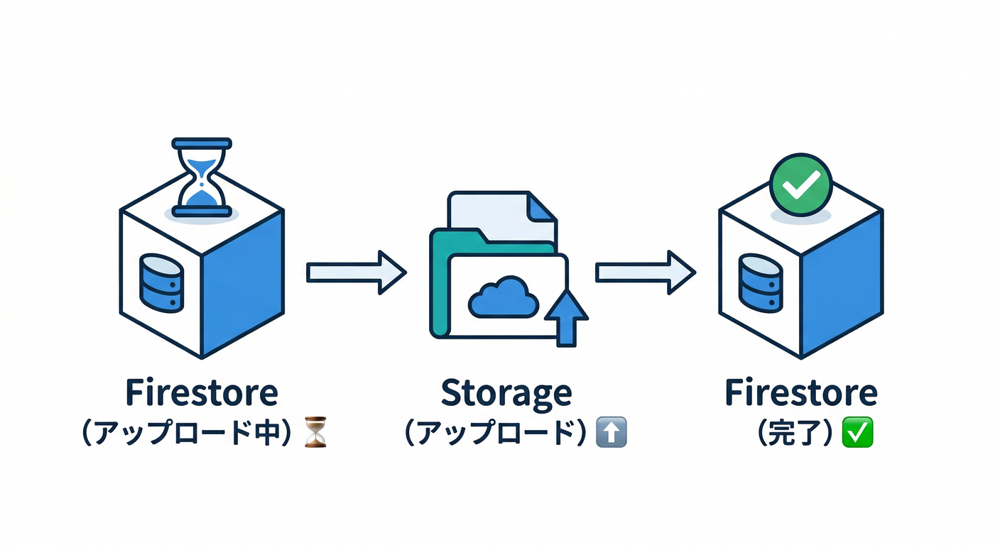

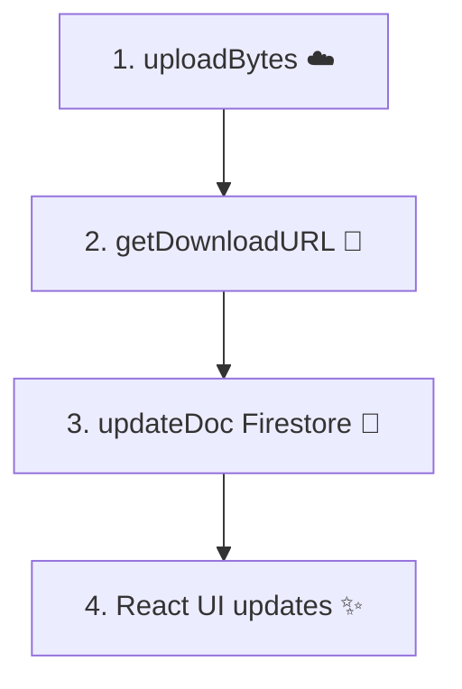

```ts
import { getStorage, ref, uploadBytes, getDownloadURL } from "firebase/storage";
import { getFirestore, doc, setDoc, updateDoc, serverTimestamp } from "firebase/firestore";

export async function uploadProfileImageAndRecord(params: {
  uid: string;
  file: File;
}) {
  const { uid, file } = params;

  const storage = getStorage();
  const db = getFirestore();

  // 画像ID（FirestoreのdocIdにも使う）
  const imageId = crypto.randomUUID();

  // できれば拡張子も付ける（デバッグが楽）
  const ext = file.type === "image/png" ? "png"
           : file.type === "image/webp" ? "webp"
           : "jpg";

  const path = `users/${uid}/profile/${imageId}.${ext}`;
  const fileRef = ref(storage, path);

  // Firestore: まず「uploading」で作る（UIが“それっぽく”なる😆）
  const recRef = doc(db, `users/${uid}/profileImages/${imageId}`);
  await setDoc(recRef, {
    path,
    status: "uploading",
    createdAt: serverTimestamp(),
    updatedAt: serverTimestamp(),
    contentType: file.type,
    size: file.size,
  });

  try {
    // Storageへアップロード（必要最小限のメタデータ）
    await uploadBytes(fileRef, file, {
      contentType: file.type,
      cacheControl: "public,max-age=300", // 例：5分キャッシュ（方針で調整）
      // customMetadata は “最小限”にするのがコツ（後述）
    });

    const url = await getDownloadURL(fileRef);

    // Firestore: 成功に更新
    await updateDoc(recRef, {
      status: "ready",
      updatedAt: serverTimestamp(),
    });

    // users/{uid}: 現在の画像を差し替え
    const userRef = doc(db, `users/${uid}`);
    await updateDoc(userRef, {
      photoPath: path,
      photoUpdatedAt: serverTimestamp(),
    });

    return { imageId, path, url };
  } catch (e) {
    // Firestore: 失敗を残す（あとで掃除もしやすい）
    await updateDoc(recRef, {
      status: "failed",
      updatedAt: serverTimestamp(),
    });
    throw e;
  }
}
```

---

## 「customMetadata を入れるなら」この程度でOK👌（入れすぎ注意⚠️）

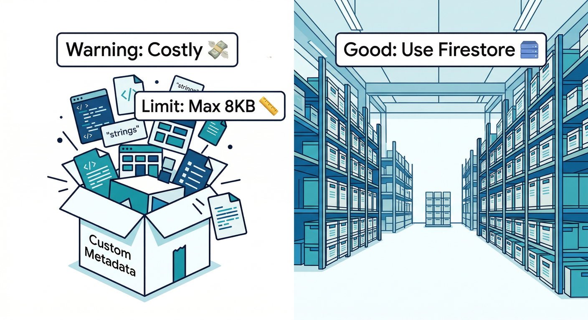

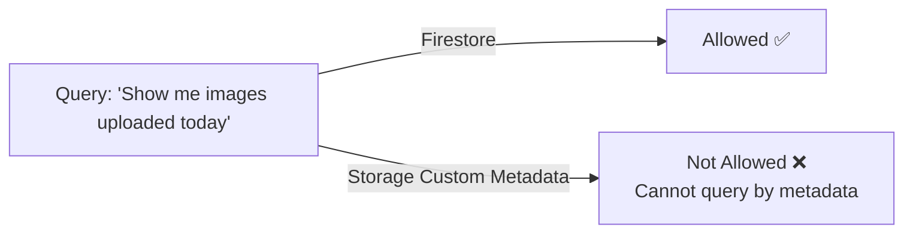

カスタムメタデータは、**検索や説明文の置き場じゃない**です🙅‍♂️
なぜなら **サイズ制限（8 KiB）**があり、さらに**ストレージコストもかかる**からです([Google Cloud Documentation][2])

入れるなら例はこんな感じ👇（“運用ラベル”くらい）

```ts
await uploadBytes(fileRef, file, {
  contentType: file.type,
  customMetadata: {
    kind: "profile",
    imageId: imageId,
  },
});
```

* ✅ `kind`：用途ラベル
* ✅ `imageId`：Firestoreの紐付けキー
* ❌ `altText` や `tags` を詰める（増えやすい＆更新頻繁で死ぬ💥）

---

## AIを絡める🤖✨：説明文（alt）とタグはFirestoreへ🗃️🏷️


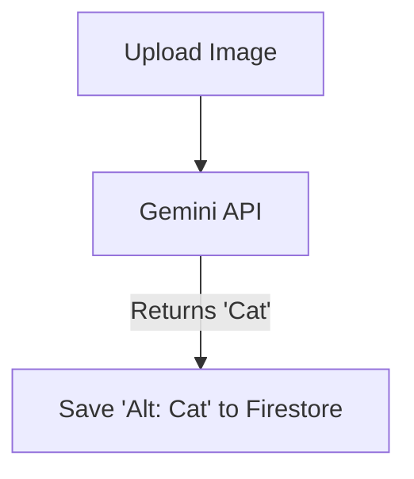

ここが「現実アプリ感」爆上がりポイントです🔥
アップロード後に、Firebase AI Logicで **“短い説明文”** を作って、Firestoreに保存します📝

Firebase AI Logic（Web）の初期化は公式だとこんな形です([Firebase][4])

```ts
import { initializeApp } from "firebase/app";
import { getAI, getGenerativeModel, GoogleAIBackend } from "firebase/ai";

const firebaseApp = initializeApp({ /* ... */ });
const ai = getAI(firebaseApp, { backend: new GoogleAIBackend() });
const model = getGenerativeModel(ai, { model: "gemini-2.5-flash" });
```

そして「画像URLを渡して説明文を作る」イメージ（※プロンプト例）👇
※実際のマルチモーダル入力の作り方は機能ページで変わりうるので、まずは **“URLを含めて説明生成”** を最小で試すのが安全です🧪

```ts
const prompt = `
次のプロフィール画像の alt テキストを日本語で1文で作って。
20文字〜40文字くらい。人の特定はしない。
画像URL: ${url}
`;

const result = await model.generateContent(prompt);
const altText = result.response.text();
```

生成できたら Firestore に保存✨

```ts
import { updateDoc } from "firebase/firestore";

await updateDoc(recRef, {
  altText,
  updatedAt: serverTimestamp(),
});
```

> こういう“アプリが必要な情報”を `customMetadata` に入れるのは非推奨です（DBへ！）([Firebase][1])

---

## Antigravity / Gemini CLI を「設計レビュー役」にする🧑‍🏫⚡


ここ、超ラクできます😆
Firebase MCP server を使うと、Antigravity や Gemini CLI などから **Firestore / Rules / プロジェクト操作**まで支援できるようになります([Firebase][5])

* Gemini CLI は `.gemini/settings.json` を使う([Firebase][5])
* Firebase Studio は `.idx/mcp.json` を使う([Firebase][5])

設定例（Gemini CLI）👇

```json
{
  "mcpServers": {
    "firebase": {
      "command": "npx",
      "args": ["-y", "firebase-tools@latest", "mcp"]
    }
  }
}
```

使い方（投げると強い質問）💬🔥

* 「このFirestore設計、履歴と現在参照の分離これでOK？」
* 「`failed` が残った時の掃除戦略を3案出して」
* 「StorageのcustomMetadataに入れるべき最小キー案は？」
* 「Rules的に“本人のみ書き込み”になってるか監査して」

---

## ミニ課題🎒✨

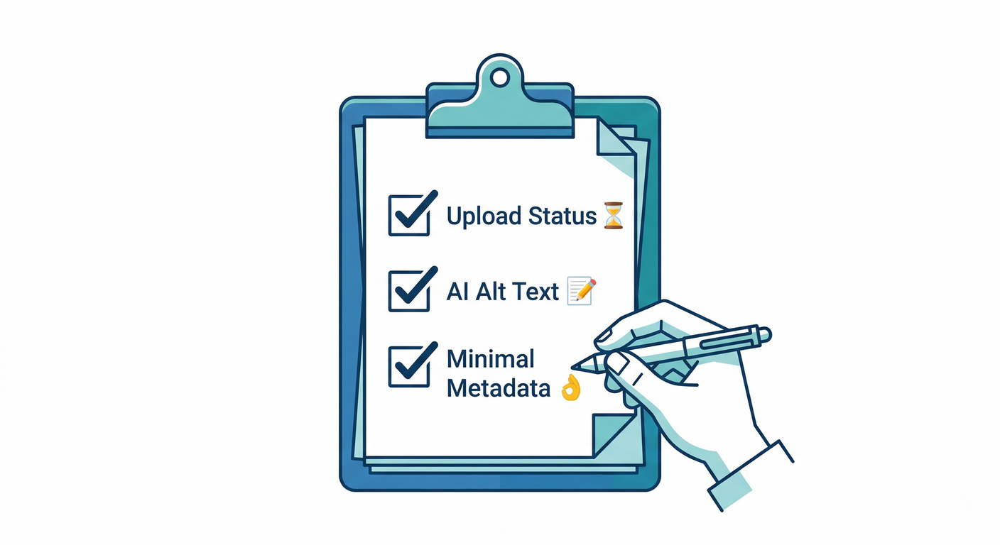

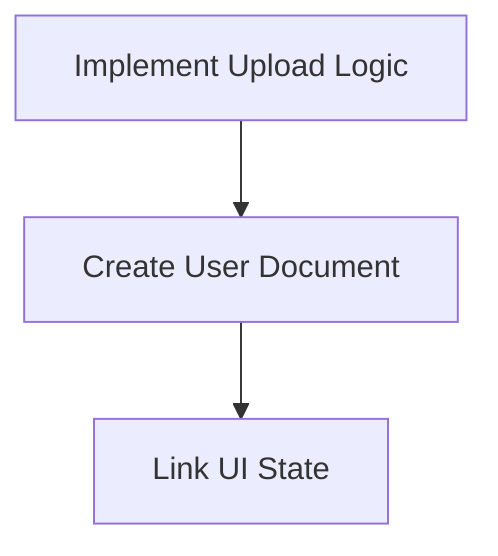

1. アップロード時に `profileImages/{imageId}` を `uploading` で作る🗃️
2. 成功したら `ready`、失敗したら `failed` に更新🔁
3. AIで `altText` を生成して Firestore に保存🤖📝
4. `customMetadata` は `kind` と `imageId` だけにしてみる（控えめ運用）👌

---

## チェック✅（できたら勝ち！🏁）

* `customMetadata` は **小さく**、アプリ情報は **Firestore**に置ける([Firebase][1])
* アップロード中/成功/失敗の状態が Firestore に残り、UIに反映できる📶
* AIの出力（alt/tags）を Firestore に保存できる🤖🗃️
* MCPを使って、設計レビューやRules相談が一気に楽になる([Firebase][5])

---

次の第11章（整合性の設計🧩🔁）に進むと、ここで作った「画像レコード」が本領発揮します🔥
もしよければ、次は **「photoPath を主にする / URLは必要なら再取得」** の運用ルールも、ミスりがちなパターン込みでガッツリ固めていきましょ😎✨

[1]: https://firebase.google.com/docs/storage/web/file-metadata "Use file metadata with Cloud Storage on Web  |  Cloud Storage for Firebase"
[2]: https://docs.cloud.google.com/storage/quotas "Quotas & limits  |  Cloud Storage  |  Google Cloud Documentation"
[3]: https://docs.cloud.google.com/storage/docs/metadata "Object metadata  |  Cloud Storage  |  Google Cloud Documentation"
[4]: https://firebase.google.com/docs/ai-logic/get-started "Get started with the Gemini API using the Firebase AI Logic SDKs  |  Firebase AI Logic"
[5]: https://firebase.google.com/docs/ai-assistance/mcp-server "Firebase MCP server  |  Develop with AI assistance"
