### 第11章：プロフィール画像の“正しいデータ設計”🧱📷✨

この章は「プロフィール画像を変えた瞬間に、アプリがちゃんと“それっぽく”動く」ための **Firestore設計と更新手順（順序が命！）** を固めます🧠🔥
ポイントは、**Storage＝ファイル置き場**、**Firestore＝アプリの真実（状態・参照）** にすることです📦🗃️

---

## 1) まず結論：この章の“勝ちパターン”🏆

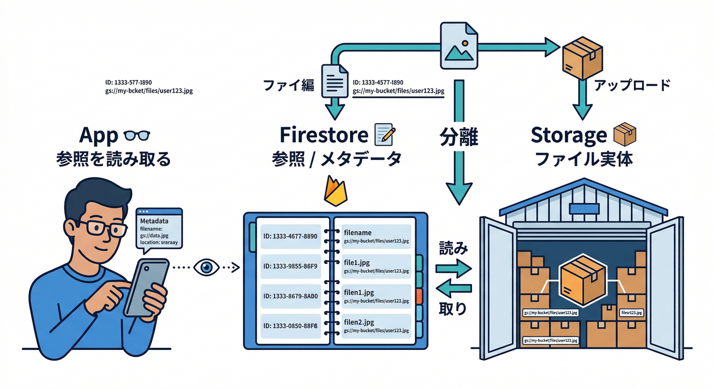

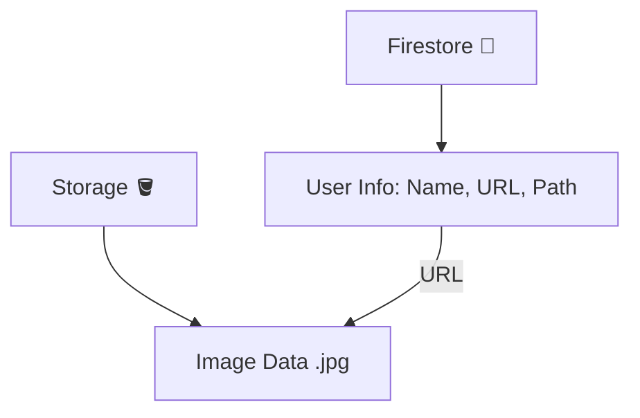

* 画像ファイル本体は Storage に置く📦
* Firestore の users/{uid} に「今のプロフィール画像の参照」を置く🧭
* **更新順序は必ずコレ**👇

  1. Storageへアップロード完了 ⬆️
  2. （必要なら）ダウンロードURL取得 🔗
  3. Firestore更新（photoPath等）🗃️
  4. 画面は Firestore のリアルタイム購読で自動反映🔁✨（onSnapshot）([Firebase][1])

※ Storage はデフォルトで認証が必要な前提の挙動が基本です🔐（Rulesで例外は作れます）([Firebase][2])

---

## 2) Firestoreのデータ設計：何を保存する？🧠🗃️

### ✅ users/{uid} に置くと強いフィールド例（“今の画像”だけ）🧩

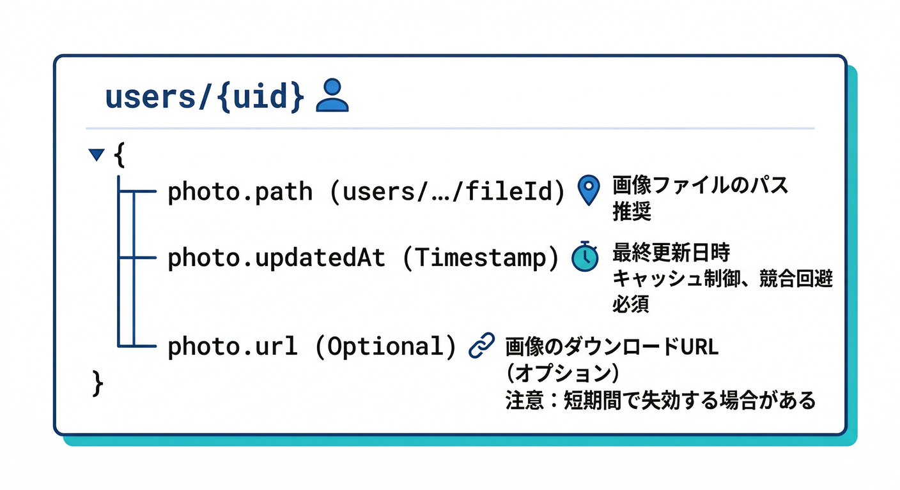

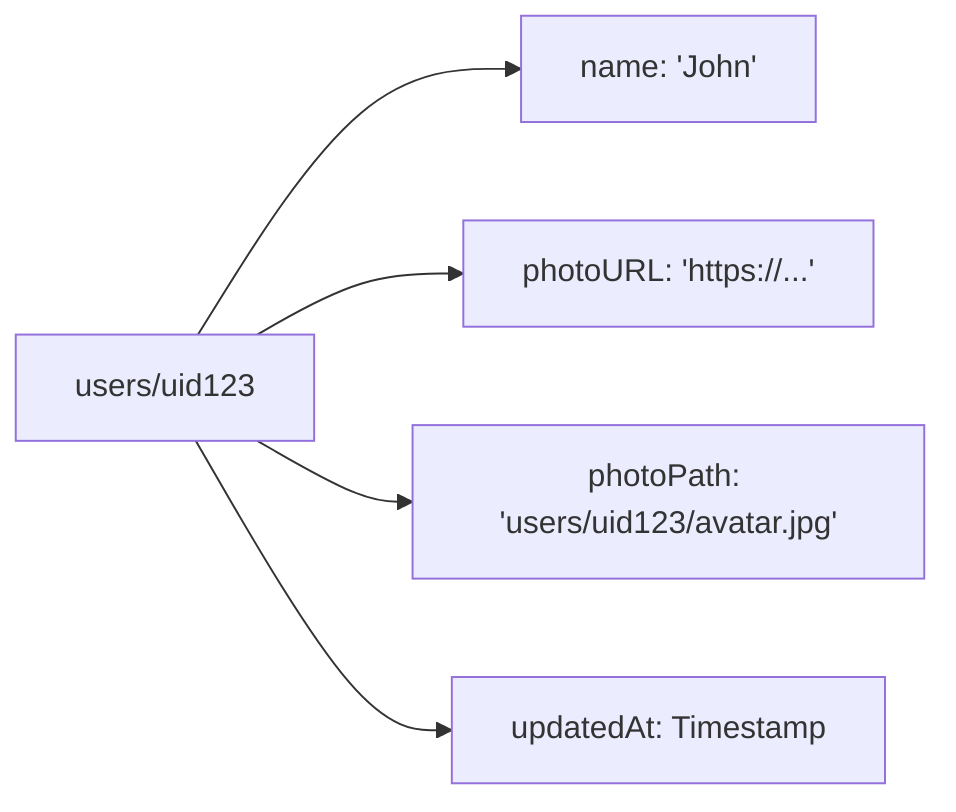

* photo.path（必須）: Storageのパス（例：users/{uid}/profile/{fileId}）📁
* photo.updatedAt（推奨）: 更新時刻（サーバー時刻）⏱️
* photo.contentType（推奨）: image/jpeg など🖼️
* photo.size（推奨）: バイト数📏
* photo.url（任意）: 表示用（ただし「主役」にしない）🔗⚠️

「updatedAt」は serverTimestamp を使うのが定番です⏱️([Firebase][3])

### ✅ 設計思想：path を主役にする理由👑

* ダウンロードURLは便利だけど「将来の扱い」が難しくなることがあるので、**まず path が真実**にすると安定します🧘‍♂️
* URLは「今すぐ画面に出したい」時の“表示用キャッシュ”くらいの立ち位置が安心です🙂

（URLの落とし穴は第14章でガッツリやる想定でOK👌）

---

## 3) 壊れない更新手順：順序を間違えると事故る💥

### ✅ 事故パターン（やりがち）😇

* Firestoreを先に更新 → その後アップロード失敗
  → アプリは「新しい画像を指してる」けど実体がなくて表示が壊れる😭🧨

### ✅ 正解パターン（この章の大事な型）🧠✨

* Storageアップロード成功 → Firestore更新
  → もし Firestore 更新が失敗しても「孤児ファイルが残る」だけ
  → 見た目が壊れない・直しやすい🧹💪

---

## 4) 手を動かす：アップロード成功→Firestore更新→UI反映🔁✨

ここから「実務っぽい一連」を作ります🔥

* 進捗バーは第6章でやった想定なので、ここでは“順序とデータ設計”に集中します🧠

---

### 4-1) 1本で完結する関数：アップロード→URL→Firestoreコミット🧩

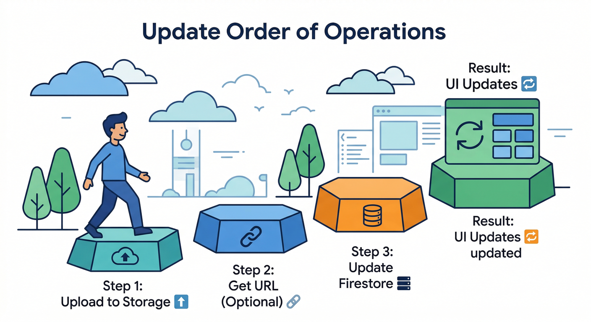

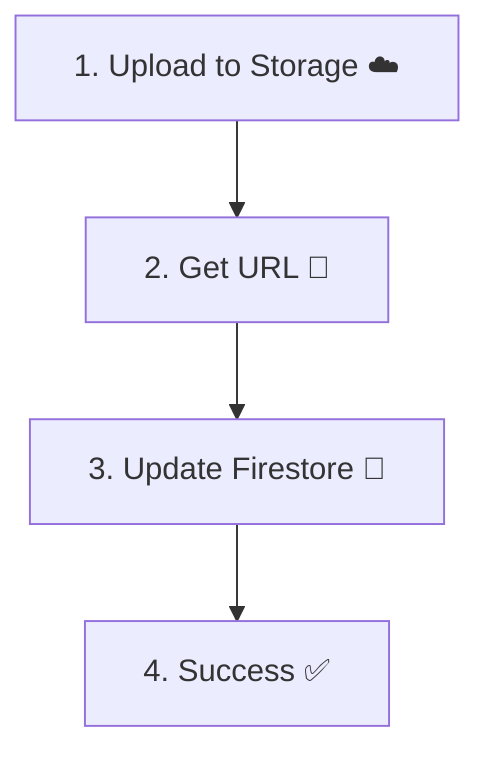

```ts
import { getAuth } from "firebase/auth";
import { getFirestore, doc, setDoc, serverTimestamp } from "firebase/firestore";
import { getStorage, ref, uploadBytesResumable, getDownloadURL } from "firebase/storage";

type ProgressFn = (pct: number) => void;

export async function updateMyProfileImage(file: File, onProgress?: ProgressFn) {
  const auth = getAuth();
  const user = auth.currentUser;
  if (!user) throw new Error("ログインが必要です");

  const uid = user.uid;
  const storage = getStorage();
  const db = getFirestore();

  // ✅ 衝突しないファイル名
  const fileId = crypto.randomUUID();
  const path = `users/${uid}/profile/${fileId}`;
  const fileRef = ref(storage, path);

  // 1) ✅ Storageへアップロード（まずここが成功してから！）
  const task = uploadBytesResumable(fileRef, file, {
    contentType: file.type,
    // cacheControl: "public,max-age=300", // 必要なら（第9章の復習）
  });

  await new Promise<void>((resolve, reject) => {
    task.on(
      "state_changed",
      (snap) => {
        if (!onProgress) return;
        const pct = Math.round((snap.bytesTransferred / snap.totalBytes) * 100);
        onProgress(pct);
      },
      reject,
      () => resolve()
    );
  });

  // 2) 表示用にURLも取る（getDownloadURL）
  const url = await getDownloadURL(task.snapshot.ref);

  // 3) ✅ Firestoreへ“今の画像”をコミット（pathを主役に）
  await setDoc(
    doc(db, "users", uid),
    {
      photo: {
        path,
        url, // 任意：表示用
        contentType: file.type,
        size: file.size,
        updatedAt: serverTimestamp(),
      },
    },
    { merge: true }
  );

  return { path, url };
}
```

* getDownloadURL でダウンロードURLを取れるのが基本動線です🔗([Firebase][4])
* updatedAt は serverTimestamp が便利です⏱️([Firebase][3])

---

### 4-2) UIを“現実アプリ感”にするコツ：Firestoreを購読して自動反映🔁👀


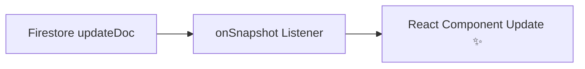

「アップロードが終わったら setState で頑張る」より、**users/{uid} を購読**して、変化が来たらUIが勝手に更新される形が強いです💪✨（別タブでも同期されて気持ちいい）

```ts
import { useEffect, useState } from "react";
import { getFirestore, doc, onSnapshot } from "firebase/firestore";

type Photo = {
  path?: string;
  url?: string;
  contentType?: string;
  size?: number;
  updatedAt?: unknown;
};

export function useUserPhoto(uid?: string) {
  const [photo, setPhoto] = useState<Photo | null>(null);
  const [loading, setLoading] = useState(true);

  useEffect(() => {
    if (!uid) return;

    const db = getFirestore();
    const unsub = onSnapshot(doc(db, "users", uid), (snap) => {
      const data = snap.data() as any;
      setPhoto(data?.photo ?? null);
      setLoading(false);
    });

    return () => unsub();
  }, [uid]);

  return { photo, loading };
}
```

onSnapshotでドキュメントをリアルタイム購読できます🔁([Firebase][1])

---

## 5) 失敗しても壊れないための“実務メモ”🧯

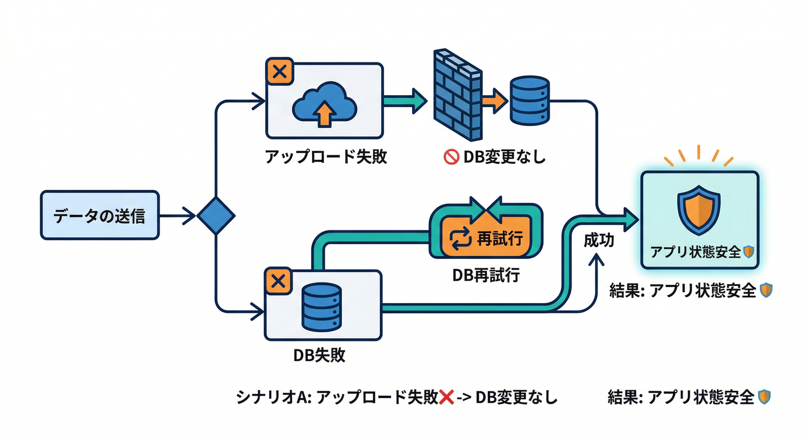

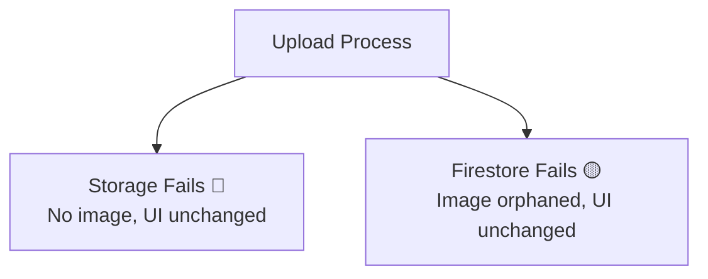

### ✅ 失敗時の振る舞いテンプレ🙂

* **アップロード失敗**：Firestoreは絶対更新しない（UIにエラー表示）🚫
* **Firestore更新失敗**：

  * 画像はStorageにあるので、**「反映に失敗しました。再試行」** ができる✨
  * 返ってきた path を保持しておいて、Firestore更新だけリトライすればOK🔁

### ✅ “孤児ファイル”は後で掃除できる🧹

この章では「壊れないのが優先」なのでOK👌
掃除の設計は第13章でやるとキレイに繋がります🧼✨

---

## 6) セキュリティの最低ライン：本人しか更新できないようにする🛡️

### Storage側（復習ポイント）🧿

Storage Rules では **サイズ上限やcontentType** みたいな検証ができます🛡️([Firebase][5])
（第15〜16章で本格的にやるやつ）

### Firestore側（この章の意識）🔐

「users/{uid} の photo を更新できるのは本人だけ」にするのが基本です✅
さらに「フィールド単位で制御」もできます（大事なフィールドを守る）🧱([Firebase][6])

---

## 7) AIで“現実アプリ感”をもう一段上げる🤖🖼️✨

せっかくプロフィール画像が入ったなら、AIで👇みたいなのを自動生成すると急に実務っぽいです😎

* 画像の短い説明（altテキスト）📝
* ざっくりタグ（例：屋外/人物/動物…）🏷️
* “要レビュー”判定の下準備🚦

Firebase AI Logicはテキストだけじゃなく **画像などのマルチモーダル入力** を扱える前提で組めます🧠([Firebase][7])
また、サイズが大きくてリクエストが重くなる場合は **StorageのURLで渡す** 方式が案内されています📦🔗([Firebase][8])

> ⚠️ なお、古いモデル指定のままだと期限で使えなくなる注意が明記されています（例：gemini-2.0-flashは2026-03-31以降サポート外、など）ので、モデル名は最新ドキュメントに合わせるのが安全です🧯([Firebase][7])

（AIの実装は第20章で合体技としてやるのが本筋だけど、この章では“設計の座席”だけ用意しておく感じが◎）

---

## 8) Antigravity / Gemini CLIで設計レビューを爆速にする🚀🧩


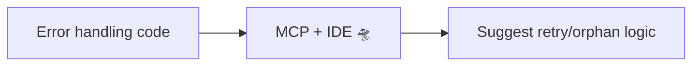

ここ、**本当に強い**です💥
Firebase MCP server を使うと、AIツールが Firebase プロジェクトや Firestore/Rules を扱えるようになります🧩([Firebase][9])

### MCP server でできること例🛠️

* Firestoreのデータを見ながら設計レビュー🗃️
* Firestore/StorageのRulesを理解・改善🛡️
* Firebaseプロジェクト管理やAuthユーザー管理なども（対応範囲あり）🧰([Firebase][9])

しかも MCP server は **Firebase CLIが使ってるのと同じ資格情報** で動きます🔐([Firebase][9])

---

### 8-1) Antigravity での導入（超ざっくり）🧩

AntigravityのAgentペインから MCP Servers を開いて Firebase を入れる流れが案内されています🧩([Firebase][9])
設定は内部的に mcp_config.json に書かれ、実体は npx で firebase-tools@latest を呼びます🚀([Firebase][9])

---

### 8-2) Gemini CLI での導入（おすすめ）💻✨

Gemini CLI は Firebase用extensionを入れるのが推奨されています👇([Firebase][9])

```bash
gemini extensions install https://github.com/gemini-cli-extensions/firebase/
```

設定ファイルを自前で書く場合は .gemini/settings.json を使う案内があります🧾([Firebase][9])

---

### 8-3) “使い方”のイメージ：スラッシュコマンド🪄

Firebase MCP server はプロンプト集があって、Gemini CLI だとスラッシュコマンドとして出てくる例が示されています（例：/firebase:init）⚡([Firebase][9])

---

### 8-4) Firebase Studio で使う場合🧰

* interactive chat は .idx/mcp.json
* Gemini CLI は .gemini/settings.json
  という区別が案内されています🧩([Firebase][10])

---

## 9) ミニ課題🧪🎯

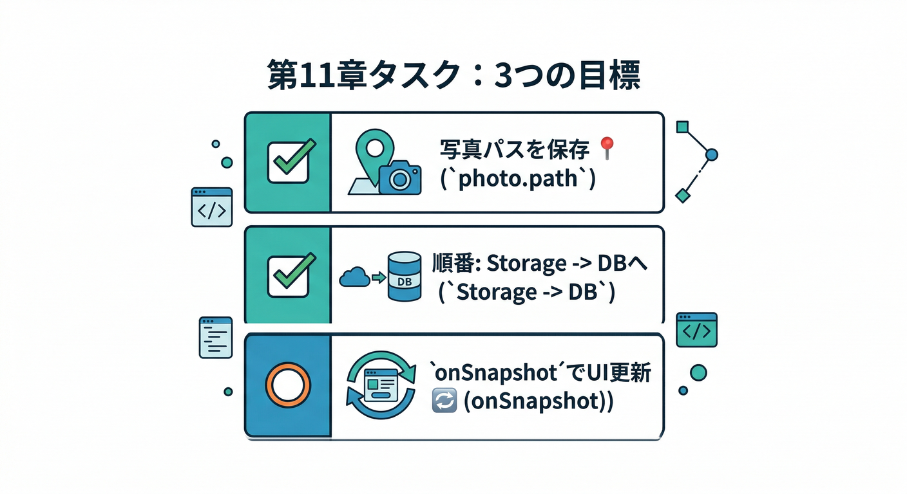

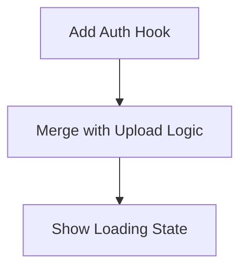

1. users/{uid} の photo に、最低でも photo.path と photo.updatedAt を保存する設計にする🧱
2. “更新順序”を守る（Storage成功 → Firestore更新）🔁
3. Firestore購読（onSnapshot）でUIが勝手に反映されるのを確認👀✨([Firebase][1])

---

## 10) チェック✅✨

* Storageに上がってから Firestore が更新される順序になってる？⬆️→🗃️
* Firestoreのphoto.pathが主役になってる？👑
* UIはFirestore購読で自動反映になってる？🔁
* 失敗時に「Firestoreを更新しない」分岐が入ってる？🧯
* （余裕）Firestore側も“本人だけ更新”の方向に寄ってる？🛡️([Firebase][6])

---

次の第12章は、この設計をそのまま拡張して「履歴（巻き戻し）」を入れていきます🕰️↩️
第11章のコードをベースに、**履歴用サブコレクションへバッチ書き込み**まで繋げると一気に実務感が出ます🔥（トランザクション/バッチは公式で“原子性”として整理されています）([Firebase][11])

[1]: https://firebase.google.com/docs/firestore/query-data/listen?utm_source=chatgpt.com "Get realtime updates with Cloud Firestore - Firebase"
[2]: https://firebase.google.com/docs/storage/web/upload-files?utm_source=chatgpt.com "Upload files with Cloud Storage on Web - Firebase"
[3]: https://firebase.google.com/docs/firestore/manage-data/add-data "Add data to Cloud Firestore  |  Firebase"
[4]: https://firebase.google.com/docs/storage/web/download-files?utm_source=chatgpt.com "Download files with Cloud Storage on Web - Firebase"
[5]: https://firebase.google.com/docs/storage/security?utm_source=chatgpt.com "Understand Firebase Security Rules for Cloud Storage"
[6]: https://firebase.google.com/docs/firestore/security/rules-fields?utm_source=chatgpt.com "Control access to specific fields | Firestore - Firebase - Google"
[7]: https://firebase.google.com/docs/ai-logic/get-started?utm_source=chatgpt.com "Get started with the Gemini API using the Firebase AI Logic ..."
[8]: https://firebase.google.com/docs/ai-logic/solutions/cloud-storage?utm_source=chatgpt.com "Include large files in multimodal requests and ... - Firebase"
[9]: https://firebase.google.com/docs/ai-assistance/mcp-server "Firebase MCP server  |  Develop with AI assistance"
[10]: https://firebase.google.com/docs/studio/mcp-servers "Connect to Model Context Protocol (MCP) servers  |  Firebase Studio"
[11]: https://firebase.google.com/docs/firestore/manage-data/transactions?utm_source=chatgpt.com "Transactions and batched writes | Firestore - Firebase - Google"
