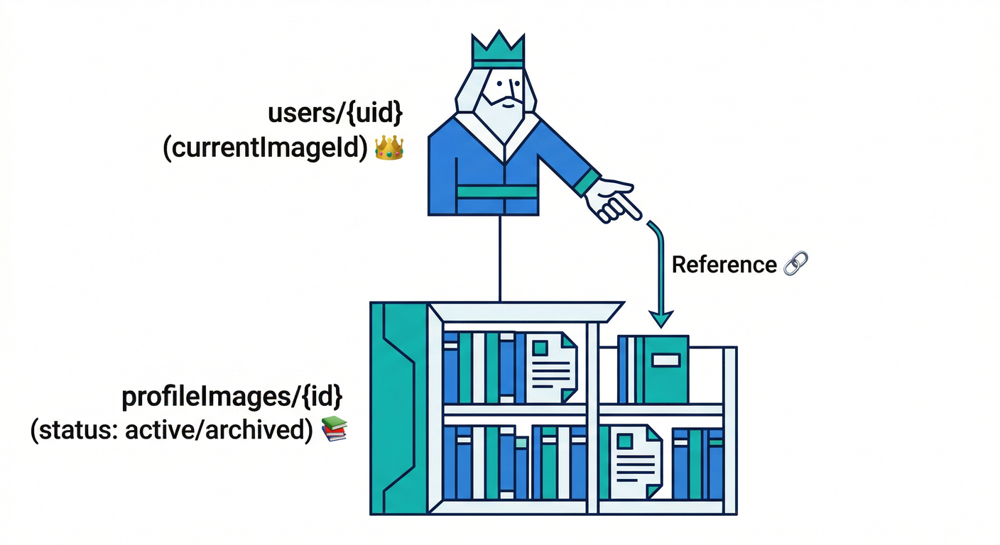
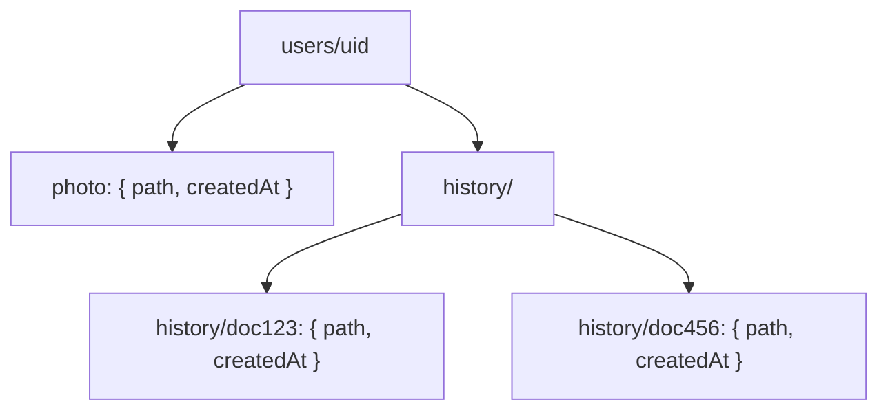
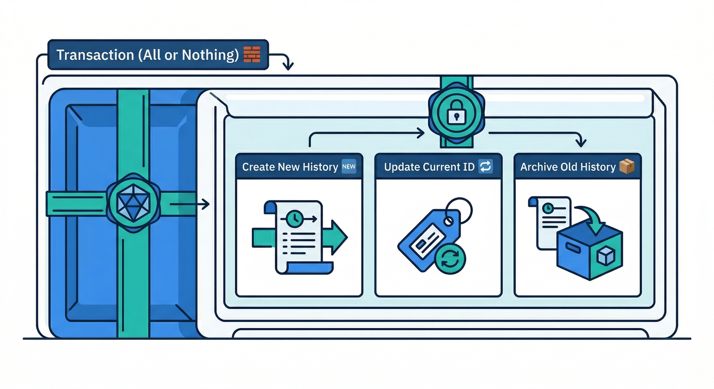
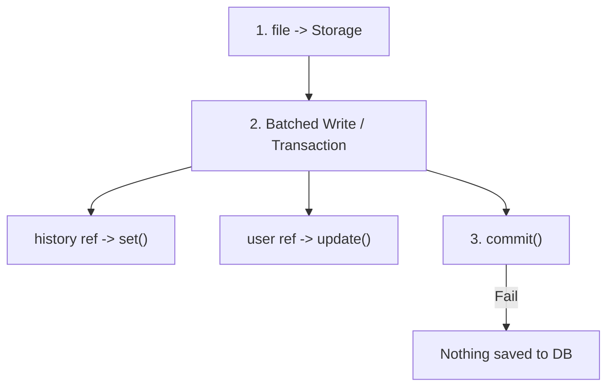
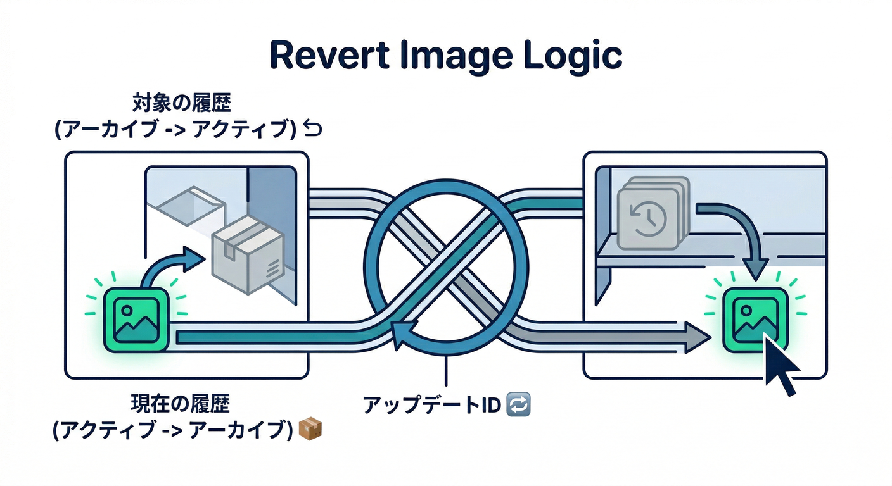
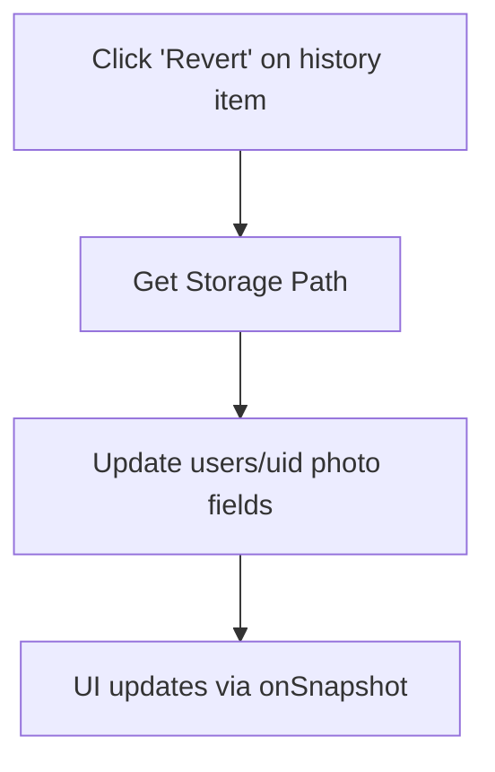
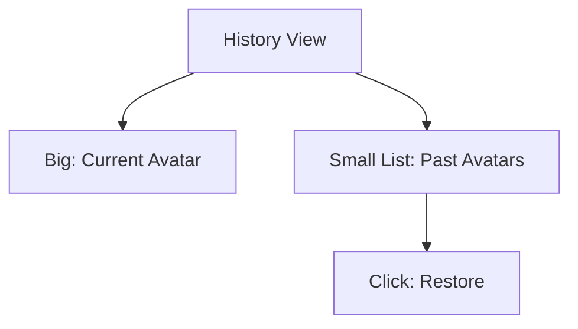
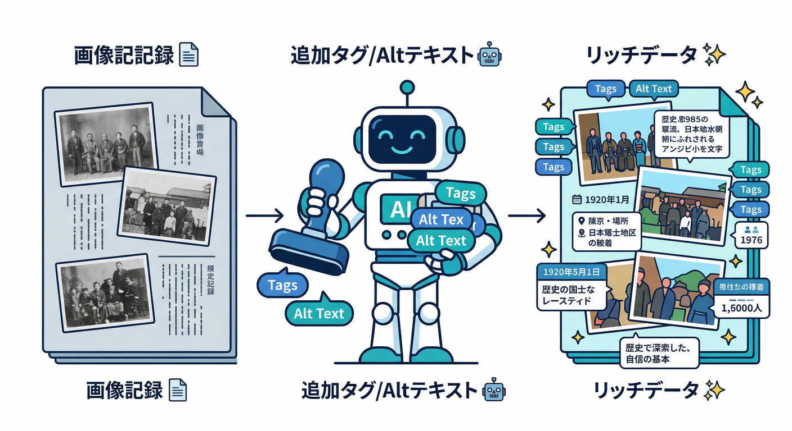
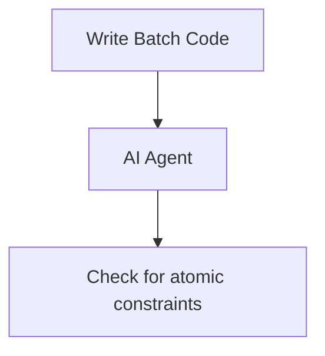
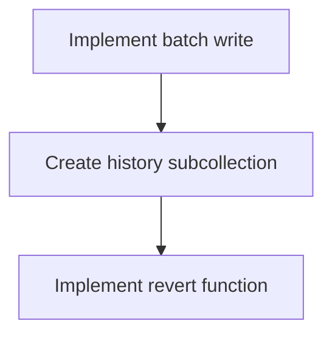

### 第12章：履歴を残す（巻き戻せる安心）🕰️↩️✨

この章では「プロフィール画像を変えたけど、やっぱ前のが良かった…😇」を**ワンタップで戻せる**ようにします！
ついでに、あとでサムネ生成やAIタグ付けにも伸ばせる“実務っぽい”土台を作ります🔥

---

## この章でできるようになること 🎯

* プロフィール画像の**履歴（history）**をFirestoreに残す📚✨
* 「いま使ってる画像」と「過去の画像」を安全に切り替える🔁
* 「元に戻す」ボタンで、**巻き戻し**できるUIを作る↩️🖼️
* Firestoreの**トランザクション**で“整合性が崩れない更新”をする🧱🛡️ ([Firebase][1])

---

## まず設計！どこに何を保存する？🧠📦

画像本体は Cloud Storage for Firebase に置き、
履歴や「現在どれが選ばれてるか」は Cloud Firestore に置きます。

### ✅ Firestoreのおすすめ構造（シンプル＆強い）💪





* `users/{uid}`（ユーザーの本体）

  * `currentImageId`: 今の画像のID（履歴ドキュメントのID）
  * `photoPath`: Storageのパス（URLじゃなく“住所”）
  * `photoURL`: 表示用にキャッシュ（任意）
  * `photoUpdatedAt`: 更新日時

* `users/{uid}/profileImages/{imageId}`（履歴）

  * `path`: Storageパス（主）📍
  * `url`: ダウンロードURL（任意のキャッシュ）🔗
  * `contentType`: `image/jpeg` など
  * `size`: バイト数
  * `status`: `"active"` or `"archived"`（今のやつ/過去のやつ）
  * `createdAt`: 作成日時
  * `archivedAt`: 過去化した日時（任意）

> URLは便利だけど、削除や差し替え時に困りやすいので「**pathを主にする**」のが扱いやすいです。
> path から `getDownloadURL()` はいつでも取れます🔗 ([Firebase][2])

---

## なぜトランザクション？🤔💥





プロフィール画像の切り替えって、実は「複数の更新」がセットです👇

1. 新しい履歴ドキュメントを作る
2. `users/{uid}` の `currentImageId` を新しいものに差し替える
3. 以前の履歴を `"archived"` にする（あれば）

これをバラバラにやると、途中で落ちたときに
「currentは新しいのに履歴がない😱」みたいな事故が起きます。

だから Firestore の**トランザクション**で“一括で成功/失敗”にします🧱✨ ([Firebase][1])

---

## 実装①：アップロード→履歴追加→現在差し替え（全部つなげる）⬆️🗃️🔁

ここでは **Storageへのアップロード完了後**に、Firestore側をトランザクションで確定させます。

> Storage と Firestore は“完全な同時コミット”はできないので、
> **Firestoreが失敗したら Storage 画像を消す**（補償）で事故を減らします🧯

#### ✅ 1つにまとめた関数（TypeScript）🧩

```ts
import { initializeApp } from "firebase/app";
import { getFirestore, doc, collection, runTransaction, serverTimestamp } from "firebase/firestore";
import { getStorage, ref, uploadBytes, getDownloadURL, deleteObject } from "firebase/storage";

export type ProfileImageHistory = {
  path: string;
  url?: string;              // 任意（UI用のキャッシュ）
  contentType: string;
  size: number;
  status: "active" | "archived";
  createdAt: any;
  archivedAt?: any;
};

export async function uploadAndCommitProfileImage(params: {
  firebaseApp: ReturnType<typeof initializeApp>;
  uid: string;
  file: File;
}) {
  const { firebaseApp, uid, file } = params;

  const db = getFirestore(firebaseApp);
  const storage = getStorage(firebaseApp);

  // 履歴ID＝ファイル名にも使う（衝突しない）
  const imageId = crypto.randomUUID();
  const path = `users/${uid}/profile/${imageId}`;

  const fileRef = ref(storage, path);

  try {
    // 1) Storageへアップロード
    await uploadBytes(fileRef, file, { contentType: file.type });

    // 2) URL取得（UI用。path主義なら無理に保存しなくてもOK）
    const url = await getDownloadURL(fileRef);

    // 3) Firestoreをトランザクションで確定
    const userRef = doc(db, "users", uid);
    const historyRef = doc(collection(userRef, "profileImages"), imageId);

    await runTransaction(db, async (tx) => {
      const userSnap = await tx.get(userRef);
      const prevImageId = userSnap.exists() ? userSnap.data().currentImageId : undefined;

      // 新しい履歴を作る（active）
      const history: ProfileImageHistory = {
        path,
        url, // 任意
        contentType: file.type || "application/octet-stream",
        size: file.size,
        status: "active",
        createdAt: serverTimestamp(),
      };
      tx.set(historyRef, history);

      // users/{uid} の current を更新
      tx.set(
        userRef,
        {
          currentImageId: imageId,
          photoPath: path,
          photoURL: url, // 任意（UIが楽）
          photoUpdatedAt: serverTimestamp(),
        },
        { merge: true }
      );

      // 以前の履歴があれば archived にする
      if (prevImageId) {
        const prevRef = doc(collection(userRef, "profileImages"), prevImageId);
        tx.set(
          prevRef,
          { status: "archived", archivedAt: serverTimestamp() },
          { merge: true }
        );
      }
    });

    return { imageId, path, url };
  } catch (e) {
    // Firestore側で失敗したら Storageを掃除（オーブン化防止）
    try {
      await deleteObject(fileRef);
    } catch {
      // ここは最悪消せなくても続行（次章の「掃除設計」で回収できる）
    }
    throw e;
  }
}
```

* `getDownloadURL()` / `uploadBytes()` などの基本は公式のWeb向け手順に沿っています📘 ([Firebase][2])
* 「複数ドキュメントを安全にまとめて更新」はトランザクションの王道です🧱 ([Firebase][1])

---

## 実装②：「元に戻す」ボタン用の巻き戻し関数↩️🖲️





やることはシンプル👇

* 対象の `imageId` を “active” にする
* 今の active を “archived” にする
* `users/{uid}` の current を差し替える

#### ✅ 巻き戻し（TypeScript）

```ts
import { getFirestore, doc, collection, runTransaction, serverTimestamp } from "firebase/firestore";
import { getStorage, ref, getDownloadURL } from "firebase/storage";

export async function revertProfileImage(params: {
  firebaseApp: any;
  uid: string;
  targetImageId: string;
}) {
  const { firebaseApp, uid, targetImageId } = params;

  const db = getFirestore(firebaseApp);
  const storage = getStorage(firebaseApp);

  const userRef = doc(db, "users", uid);
  const historyCol = collection(userRef, "profileImages");
  const targetRef = doc(historyCol, targetImageId);

  await runTransaction(db, async (tx) => {
    const userSnap = await tx.get(userRef);
    if (!userSnap.exists()) throw new Error("user doc not found");

    const currentImageId = userSnap.data().currentImageId as string | undefined;

    const targetSnap = await tx.get(targetRef);
    if (!targetSnap.exists()) throw new Error("target history not found");

    const targetPath = targetSnap.data().path as string;
    const url = await getDownloadURL(ref(storage, targetPath)); // path→URLへ復元 :contentReference[oaicite:7]{index=7}

    // target を active に
    tx.set(targetRef, { status: "active", archivedAt: null }, { merge: true });

    // 今の active を archived に
    if (currentImageId && currentImageId !== targetImageId) {
      const currentRef = doc(historyCol, currentImageId);
      tx.set(currentRef, { status: "archived", archivedAt: serverTimestamp() }, { merge: true });
    }

    // users/{uid} を差し替え
    tx.set(
      userRef,
      {
        currentImageId: targetImageId,
        photoPath: targetPath,
        photoURL: url,
        photoUpdatedAt: serverTimestamp(),
      },
      { merge: true }
    );
  });
}
```

> URLを保存してても、壊れたときに **pathから復元できる**のが強いです💪
> path → `StorageReference` → `getDownloadURL()` の流れが基本になります🔗 ([Firebase][2])

---

## 実装③：React UI（履歴一覧＋戻すボタン）🖼️📜↩️




UIはこんな感じが鉄板です👇

* 上：いまのプロフィール画像（`users/{uid}` の `photoURL`）
* 下：履歴一覧（`profileImages` を `createdAt desc`）
* 各履歴カードに「これに戻す」ボタン

#### ✅ 超ざっくりUI例（考え方）

```tsx
import { useEffect, useState } from "react";
import { getFirestore, collection, query, orderBy, onSnapshot, doc, onSnapshot as onDocSnapshot } from "firebase/firestore";
import { revertProfileImage } from "./revertProfileImage";

type HistoryItem = {
  id: string;
  url?: string;
  path: string;
  status: "active" | "archived";
  createdAt?: any;
};

export function ProfileImageHistoryPanel({ firebaseApp, uid }: { firebaseApp: any; uid: string }) {
  const db = getFirestore(firebaseApp);

  const [currentUrl, setCurrentUrl] = useState<string | undefined>();
  const [items, setItems] = useState<HistoryItem[]>([]);
  const [busyId, setBusyId] = useState<string | null>(null);

  useEffect(() => {
    const userRef = doc(db, "users", uid);
    const unsubUser = onDocSnapshot(userRef, (snap) => {
      setCurrentUrl(snap.data()?.photoURL);
    });

    const q = query(collection(userRef, "profileImages"), orderBy("createdAt", "desc"));
    const unsubHist = onSnapshot(q, (qs) => {
      setItems(qs.docs.map((d) => ({ id: d.id, ...(d.data() as any) })));
    });

    return () => { unsubUser(); unsubHist(); };
  }, [db, uid]);

  return (
    <div style={{ display: "grid", gap: 12 }}>
      <div>
        <div style={{ fontWeight: 700 }}>いまのプロフィール画像 ✨</div>
        {currentUrl ?  : <div>未設定🙂</div>}
      </div>

      <div>
        <div style={{ fontWeight: 700 }}>履歴 📚</div>
        <div style={{ display: "grid", gap: 8 }}>
          {items.map((it) => (
            <div key={it.id} style={{ display: "flex", alignItems: "center", gap: 12, padding: 8, border: "1px solid #ddd", borderRadius: 12 }}>
              
              <div style={{ flex: 1 }}>
                <div>status: {it.status}</div>
                <div style={{ fontSize: 12, opacity: 0.7 }}>{it.id}</div>
              </div>
              <button
                disabled={busyId === it.id || it.status === "active"}
                onClick={async () => {
                  setBusyId(it.id);
                  try {
                    await revertProfileImage({ firebaseApp, uid, targetImageId: it.id });
                  } finally {
                    setBusyId(null);
                  }
                }}
              >
                {it.status === "active" ? "使用中✅" : busyId === it.id ? "切替中…" : "これに戻す↩️"}
              </button>
            </div>
          ))}
        </div>
      </div>
    </div>
  );
}
```

---

## AIを絡めて“現実アプリ感”を爆上げする🤖✨




履歴ドキュメントに、AIで作った情報を足すと一気に実務っぽくなります🔥

### 例1：altテキスト自動生成 📝🤖

アップロード後に Firebase AI Logic で
「この画像の短い説明」を作って `profileImages/{imageId}` に保存！
（Gemini/Imagenへ安全にアクセスできるのが売りです） ([Firebase][3])

### 例2：タグ付け＆簡易チェック 🏷️🧪

Genkit を使うと、AI処理を“フロー”として整理しやすくなります🧰
（Firebase公式のGenkit概要） ([Firebase][4])

---

## Antigravity / Gemini CLI / MCP を“この章”でどう使う？🧑‍💻🚀




「今の設計、穴ない？😇」をAIレビューさせるのが超効きます。

* Firebase MCP server は Antigravity や Gemini CLI などのツールからFirebaseを扱う“橋”になります🧩 ([Firebase][5])
* 「このトランザクション更新で整合性崩れない？」
* 「履歴のstatus設計、他に良いパターンある？」
* 「将来、サムネ生成（Functions/Extensions）に繋げるならフィールド何を追加すべき？」

このへんを投げるだけで、学習速度が体感2〜3倍になります🔥

---

## ミニ課題 🧪🏁




### ミニ課題1：履歴を“10件まで”にする（表示だけでOK）🔟

* UI側で `items.slice(0, 10)` して「最新10件だけ表示」にする📚✨

### ミニ課題2：「元に戻す」実装を完成させる↩️

* `active` のときボタン無効✅
* 切替中は “切替中…” 表示⌛

### ミニ課題3：AI altテキスト欄を追加📝🤖

* `profileImages/{imageId}` に `aiAltText` を入れる（最初は手入力でもOK🙂）
* 余裕があればAI Logicで自動生成に挑戦🔥 ([Firebase][3])

---

## チェックリスト ✅✨

* [ ] `users/{uid}` に current 情報が入っている
* [ ] `profileImages` に履歴が増える
* [ ] 画像変更すると前の履歴が archived になる
* [ ] 「これに戻す↩️」で current が差し替わる
* [ ] 途中で失敗してもデータが変になりにくい（トランザクション） ([Firebase][1])

---

次の章（第13章）は、この履歴運用の“落とし穴”💥
**古い画像をいつ/どう消すか（事故らない削除タイミング）🧹🗑️** を設計して、さらに現実アプリに寄せます🔥

[1]: https://firebase.google.com/docs/firestore/manage-data/transactions?utm_source=chatgpt.com "Transactions and batched writes | Firestore - Firebase - Google"
[2]: https://firebase.google.com/docs/storage/web/upload-files?utm_source=chatgpt.com "Upload files with Cloud Storage on Web - Firebase"
[3]: https://firebase.google.com/docs/ai-logic?utm_source=chatgpt.com "Gemini API using Firebase AI Logic - Google"
[4]: https://firebase.google.com/docs/genkit/overview?authuser=0&hl=ja&utm_source=chatgpt.com "Genkit | Firebase - Google"
[5]: https://firebase.google.com/docs/ai-assistance/mcp-server?utm_source=chatgpt.com "Firebase MCP server | Develop with AI assistance - Google"
